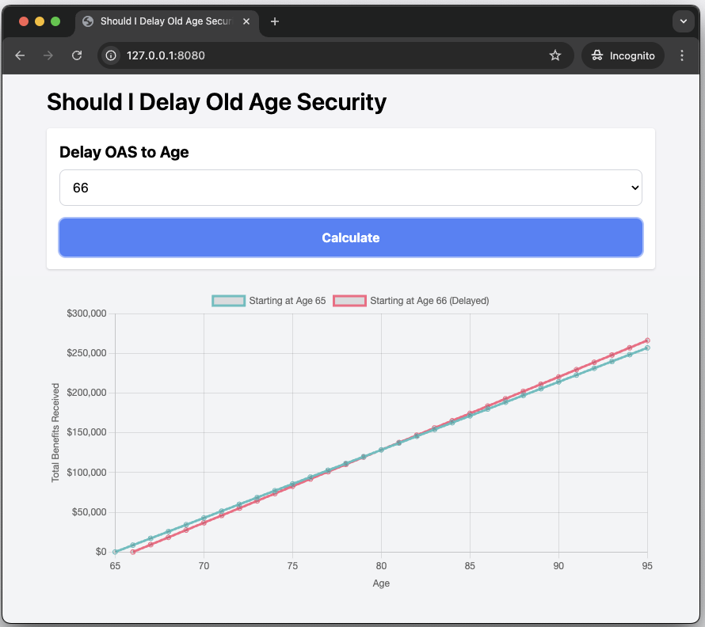
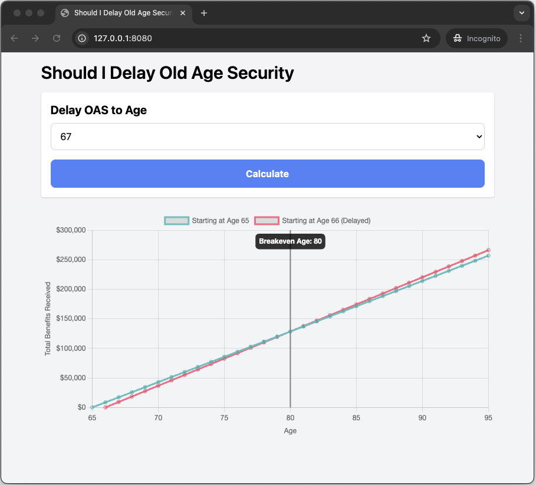
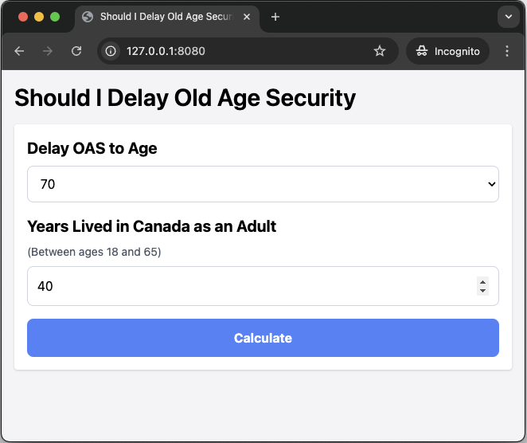
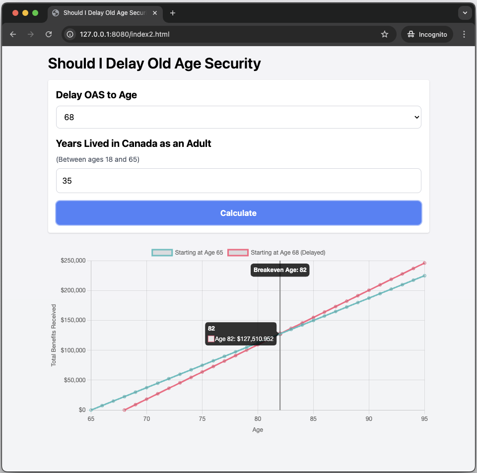
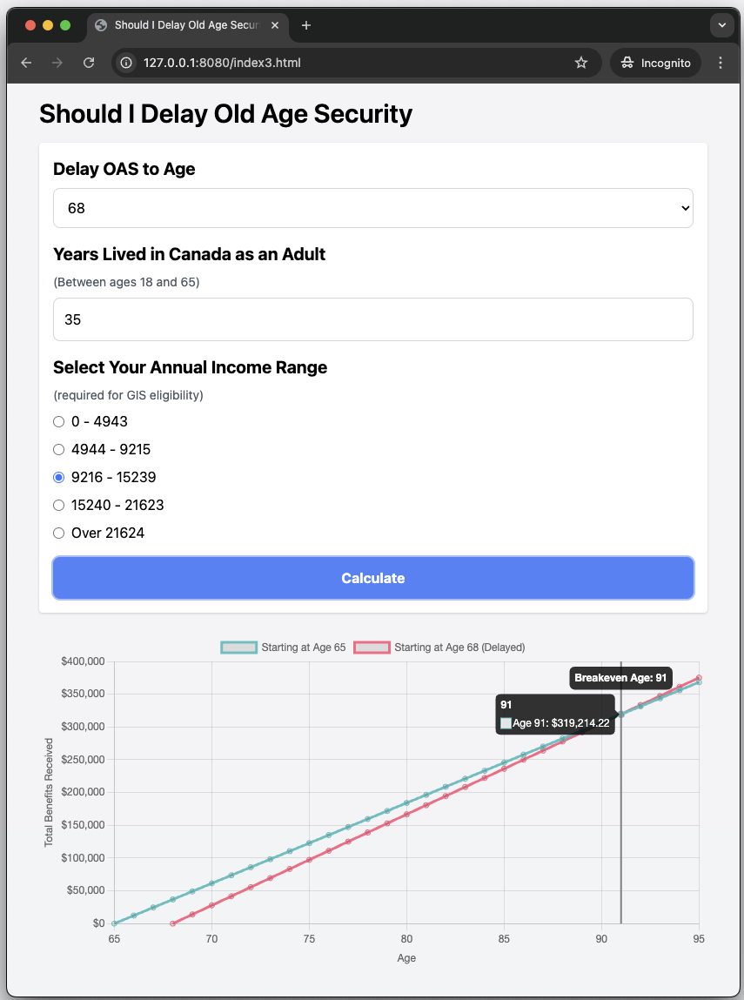
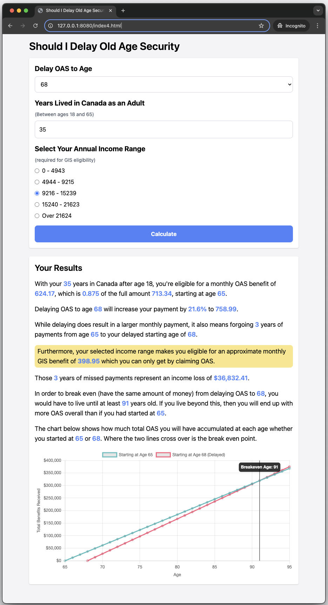
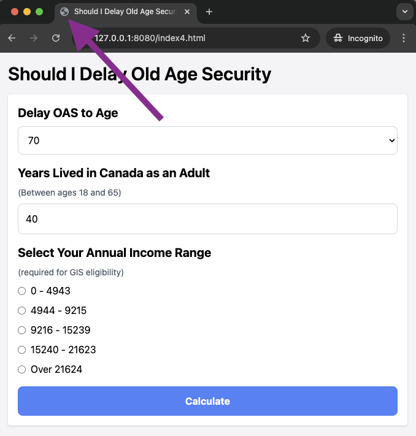
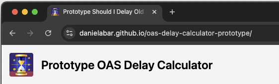

This is the second of a two-part series on rapid prototyping with ChatGPT. The [first part](../rapid-prototype-chatgpt-oas-breakeven-part1) covered the foundational steps in building an Old Age Security (OAS) breakeven calculator - a tool designed to help low-income Canadian seniors decide whether to delay their OAS pension. The OAS pension is a monthly payment for Canadians aged 65 and older, and the decision to delay it can have a significant impacts, especially for those eligible for the Guaranteed Income Supplement (GIS).

In part one, I introduced the problem, defined the business rules, and, with the help of ChatGPT, built an initial visualization for comparing different retirement scenarios. Throughout the development process, ChatGPT has acted as a valuable pairing partner, assisting with problem-solving and streamlining prototyping decisions. Now, with the core calculations in place, we’ll dive into the next phase: enabling users to interact with the tool by inputting their own data, such as the age they plan to start receiving OAS, their years of residency, and income range for GIS eligibility. Once again, ChatGPT will be used to assist at each step. The final prototype is available [here](https://danielabar.github.io/oas-delay-calculator-prototype/).

**Disclaimer:** The content in this post is for informational purposes only and should not be considered financial advice. The OAS pension breakeven calculator prototype is a tool designed to illustrate potential outcomes based on specific scenarios. Individual financial situations vary, and it’s important to consult with a qualified financial advisor or professional before making any decisions regarding Old Age Security (OAS) or other financial matters.

## User Input Form

Where we left off in Part 1, there was a functional visualization comparing the effects of taking OAS at age 65 (the default age), versus delaying it to age 70:


The next step is to add user input. For example, what if a user wants to delay to age 68 rather than 70, how would that impact the break even age? The code up to this point was hard-coded assuming a user would be delaying to age 70.

Starting with the UI, I asked ChatGPT to generate a responsive form using TailwindCSS styles with a dropdown for which age to delay taking OAS. The dropdown should have values between 66 and 70, and a submit button.  I told it to make the field required, and default to 70.

<aside class="markdown-aside">
Why not delay past age 70? There's no benefit to delaying beyond age 70 because the 0.6% increase per month of delay maxes out at 60 months delay, i.e. 5 years from age 65 which is 70. See the "Applying to delay your first payment" section of the <a class="markdown-link" href="https://www.canada.ca/en/services/benefits/publicpensions/cpp/old-age-security/benefit-amount.html">OAS Benefit Amount</a> for more details.
</aside>

ChatGPT added the following form to the markup, just above the chart, contained in a panel with a subtle shadow:

```htm
<!-- Added a panel for the form -->
<div class="bg-white p-4 rounded shadow mb-6">
  <form id="oas-form">
    <!-- Age taking OAS: 66, 67, 68, 69, 70 -->
    <div class="mb-4">
      <label for="age-taking-oas" class="block text-xl font-bold mb-2">Delay OAS to Age</label>
      <select id="age-taking-oas" name="age_taking_oas"
        class="w-full p-3 border border-gray-300 rounded-lg focus:outline-none focus:ring-2 focus:ring-blue-500" required>
        <option value="66">66</option>
        <option value="67">67</option>
        <option value="68">68</option>
        <option value="69">69</option>
        <option value="70" selected>70</option>
      </select>
    </div>

    <!-- Submit Button -->
    <div class="text-center">
      <button type="submit"
        class="w-full bg-blue-500 text-white font-bold py-3 px-4 rounded-lg hover:bg-blue-700 focus:outline-none focus:ring-2 focus:ring-blue-500 focus:ring-opacity-50">
        Calculate
      </button>
    </div>
  </form>
</div>

<!-- Existing chart element -->
<canvas id="myChart"></canvas>
```

Which looks like this:


## Responding to User Input

I then asked ChatGPT to add a form submit event listener. This listener should extract the age at which the user selected to take OAS, and use that instead of the hard-coded age 70 when calculating the delayed income stream. I explained that for each month of delay, there's a 0.6% increase in the payment amount.

It modified the code as follows:

```javascript
// Form submit handler to intercept regular form submission
document.getElementById('oas-form').addEventListener('submit', calculate);

// Modify data generation to take dynamic starting age into account
const generateChartDataDelayed = (ageTakingOas) => {
  const recommendedAge = 65
  const finalAge = 95;
  const originalMonthlyAmount = 713.34

  // Use user-provided age rather than hard-coded age 70 to determine the delay period
  const delayedMonths = (ageTakingOas - recommendedAge) * 12
  const multiplier = 1 + (delayedMonths * 0.006); // 0.6% increase per month
  const monthlyAmount = originalMonthlyAmount * multiplier;

  let dataPoints = [];
  dataPoints.push({ x: ageTakingOas, y: 0 })

  for (let age = ageTakingOas + 1; age <= finalAge; age++) {
    let totalBenefit = (age - ageTakingOas) * 12 * monthlyAmount;
    dataPoints.push({ x: age, y: totalBenefit });
  }

  return dataPoints;
};

// Add a calculate method as target of event listener to run every time form is submitted
function calculate(evt) {
  // Prevent regular form submission because this is a client side only app
  evt.preventDefault();

  // Extract user selected value for when they plan to start OAS
  const ageTakingOas = Number(document.getElementById('age-taking-oas').value);

  // Build data for chart, passing in user provided `ageTakingOas` for delayed income stream
  const data = {
    datasets: [
        {
          label: 'Starting at Age 65',
          data: generateChartData(),
          borderColor: 'rgb(75, 192, 192)',
          tension: 0.1,
          fill: false
        },
        {
          label: `Starting at Age ${ageTakingOas} (Delayed)`,
          data: generateChartDataDelayed(ageTakingOas),
          borderColor: 'rgb(255, 99, 132)',
          tension: 0.1,
          fill: false
        }
      ]
  }

  // Now we generate the chart here in the calculate function so it will be
  // updated every time user submits the form
  const breakEvenAge = findBreakevenAge()
  const options = {...}
  const myChart = new Chart(ctx, {
    type: 'line',
    data: data,
    options: options
  });
}
```

Now that the chart generation has moved inside the calculate function, when first landing on the page, it looks like this:


Let's try it out, selecting to delay just one year to age 66 - notice that the ChatGPT generated code also updated the chart label to show the user selected age:



This time we can see the lines are closer together, and they crossover earlier (at around age 80 rather than 84), than the previous example when delaying to age 70. It makes sense that the lines are closer together (compared to delaying to age 70) because delaying by only one year results in an increased monthly payment of just 0.6% * 12 = 7.2%.

## Bug No Breakeven

However, ChatGPT introduced a bug - the breakeven chart annotation is no longer being displayed. The issue is that the `findBreakevenAge` function is still using the hard-coded age 70 to compare income streams, and so it will not find a match when the user provides a different age. After explaining the issue to ChatGPT it corrected the code by passing in the user selected age to the `findBreakevenAge` function.

Here are the portions of the code it modified - notice it did not update the variable names such as `data70` or `benefitAt70`, but it did update the logic:

```javascript

// Modified `findBreakevenAge` to take the user selected age
const findBreakevenAge = (ageTakingOas) => {
  const data65 = generateChartData();

  // Pass in user selected age to the delayed income stream calculation
  const data70 = generateChartDataDelayed(ageTakingOas);

  let breakevenAge = null;

  // Start at user selected age because the second dataset only starts there
  for (let age = ageTakingOas; age <= 95; age++) {
    const benefitAt65 = data65.find(item => item.x === age)?.y || 0;
    const benefitAt70 = data70.find(item => item.x === age)?.y || 0;

    if (Math.abs(benefitAt70 - benefitAt65) <= 2000) {
      breakevenAge = age;
      break;
    }
  }

  return breakevenAge;
};

function calculate(evt) {
  // ...

  // Pass the user selected age to the `breakEvenAge` function
  const ageTakingOas = Number(document.getElementById('age-taking-oas').value);
  const breakEvenAge = findBreakevenAge(ageTakingOas)

  // ...
}
```

With the break even logic updated to take into account user selected starting age, the breakeven annotation is displayed:


## Bug Breakeven Incorrect

However, this reveals a new issue - its showing a breakeven age of 77 when the lines actually cross over at age 80. This is because the original heuristic of finding the first data point where the differences in income is $2000 or less isn't quite right for a smaller delay age, because in this case, the differences in income are smaller (as can be seen by the lines being closer together in slope).

I explained the issue to ChatGPT and asked it to modify the break even logic to determine the absolute minimum difference between the two data streams rather than comparing to $2000. Here's the modified function:

```javascript
// Find the age at which the difference between the two income streams is the smallest
const findBreakevenAge = (ageTakingOas) => {
  const data65 = generateChartData();
  const data70 = generateChartDataDelayed(ageTakingOas);

  let minDifference = Infinity;
  let breakevenAge = null;

  // Start at ageTakingOas because the second dataset only starts there
  for (let age = ageTakingOas; age <= 95; age++) {
    const benefitAt65 = data65.find(item => item.x === age)?.y || 0;
    const benefitAt70 = data70.find(item => item.x === age)?.y || 0;

    const difference = Math.abs(benefitAt70 - benefitAt65);

    if (difference < minDifference) {
      minDifference = difference;
      breakevenAge = age;
    }
  }

  return breakevenAge;
};
```

With that change in place, we can see the correct breakeven age of 80 displayed on the chart, when user selects age 66 to delay:


This is proving to be interesting already, note that the breakeven age for just a one year delay is lower, age 80, compared to the 5 year delay which puts the breakeven age at 84.

## Bug Can't Change Age

The next thing the user might want to do is to select a different age for delaying OAS, to see the effect on the income streams and break even age. However, this reveals another bug, which is that nothing seems to happen when selecting a different age, given that the chart is already rendered from the first selection.

For example, given that we just calculated for delay age of 66, then try to select age 67:


The age 67 is shown in the dropdown, but after clicking the Calculate button, the chart doesn't change, it's still showing the results for age 66, not 67:



Opening the browser developer tools and inspecting the Console tab reveals a JavaScript error:

```
chart.js@3.7.0:13 Uncaught
Error: Canvas is already in use. Chart with ID '0' must be destroyed before the canvas can be reused.
    at new dn (chart.js@3.7.0:13:90904)
    at HTMLFormElement.calculate ((index):220:23)
```

Currently the context for the canvas on which Chart.js draws is defined as a constant outside of any functions. The chart is redefined each time as part of the `calculate` function, which is called every time the user submits the form. The error message about being unable to reuse the Canvas element is coming the `calculate` function where it tries to instantiate a new chart for the second time:

```javascript
const ctx = document.getElementById('myChart').getContext('2d');
// ...

function calculate(evt) {
  // ...

  // Error from this line:
  // Canvas is already in use. Chart with ID '0' must be destroyed before the canvas can be reused.
  const myChart = new Chart(ctx, {
    type: 'line',
    data: data,
    options: options
  });
}
```

I gave ChatGPT the error message, and it corrected the code by defining a variable outside of the calculate function for the chart. Then it moved the context declaration inside the `calculate` function. It then modified the code to check if the `myChart` variable is already defined, and if so, it calls `destroy()` on it before attempting to re-use it for another chart:

```javascript
// Keep a reference to the chart because we need to check if its already populated
// when attempting to re-render
let myChart = null
// ...

function calculate(evt) {
  // Canvas context needed for rendering the chart
  const ctx = document.getElementById('myChart').getContext('2d');
  // ...

  // If a chart instance already exists, destroy it
  if (myChart) {
    myChart.destroy();
  }

  // Now we can safely generate another chart
  myChart = new Chart(ctx, {
    type: 'line',
    data: data,
    options: options
  });
```

At this point, the code is functional, the user can keep selecting different delay ages, click the Calculate button, and see the chart rendered with two streams of income and the breakeven age updated.

However, the results are only accurate for someone who is eligible for the full pension amount, which means they've lived for 40 years in Canada by the time they turn 65. Recall one of the goals of this calculator is to encourage immigrant seniors with less than 40 years to apply for OAS at age 65 rather than delaying. For this, the tool needs to take years of residency into account. Let's deal with this next.

## Less than 40 years in Canada

If someone has lived in Canada for less than 40 years as an adult (i.e. after age 18) by the time they turn 65, then they're eligible for a fraction of the pension amount rather than the full amount. For example, if someone has lived for 35 years in Canada after age 18, then they would be eligible for 35/40ths of the full pension amount: $713.34 * (35/40) = 624.17. i.e. the fraction they're eligible for is based on how many 40ths of years of residency they have.

There's a common, but mistaken belief that delaying OAS in this case will have multiple benefits: Firstly the 0.6% per month of delay increase, *and* an increase of 1/40th the pension amount for every year of delay due to the residency increase. For example, someone who has 35 years in Canada at age 65, and delays OAS to age 68, may believe that this would qualify them for an extra 3/40ths of the full pension amount because they delayed for 3 years and now have 3 more qualifying residency years, in addition to the 0.6% increase per month of delay.

However, the benefits of delaying do not "stack". What the government of Canada does is "fix" the pension amount to however many years the person has in Canada by age 65. Then if the person chooses to delay, the government calculates the 0.6% per month increase on the "fixed" pension amount.

In our example of someone that has 35 years in Canada, if they were to start at age 65, they would qualify for $713.34 * (35/40) = $624.17 per month. Then if they were to delay for 3 years, i.e. 36 months, this would increase the monthly amount to $624.17 * (1 + (36 * 0.006)) = $758.99. i.e. the 0.6% increase per month of delay is applying to the 35/40th fraction of the full pension amount.

<aside class="markdown-aside">
Technically the person could write in a request to the government asking to use the residency increase INSTEAD OF the monthly increase. However, the monthly 0.6% increase (aka actuarially adjusted amount) always results in a greater amount than the residency fraction increase, so in practice, this is never done.
</aside>

I explained the above rules to ChatGPT and asked it to update the form with an input for years lived in Canada between ages 18 and 65, that could be an integer between 1 and 40 years, and update the calculation to extract this value from the form upon submission, and use it to determine the monthly OAS amount.

Here's how it updated the input form, notice it maintained the existing look and feel, and added a subtle help text for the years in Canada field.

```htm
<form id="oas-form">
  <!-- ... -->

  <!-- NEW: Years Lived in Canada as an Adult -->
  <div class="mb-4">
    <label for="years-in-canada" class="block text-xl font-bold mb-2">Years Lived in Canada as an Adult</label>
    <p class="text-gray-600 text-sm mb-2">(Between ages 18 and 65)</p>
    <input type="number" id="years-in-canada" name="years_in_canada"
      class="w-full p-3 border border-gray-300 rounded-lg focus:outline-none focus:ring-2 focus:ring-blue-500" min="1"
      max="40" required value="40">
  </div>

  <!-- ... -->
</form>
```



Then it made a number of changes in the JavaScript code. Firstly, it recognized that the base pension amount of `713.34`was repeated in several places, and extracted it as a constant at the beginning of the script:

```javascript
const fullPensionAmount = 713.34;
// ...
```

Then it introduced a new function for calculating the fractional base pension amount, based on how many years in Canada. For someone with a full 40 years in Canada, this would still return 713.34 because it would be multiplying 713.34 * 1:

```javascript
// Function to calculate the base monthly amount based on years in Canada
const calculateBaseAmount = (yearsInCanada) => {
  return fullPensionAmount * (yearsInCanada / 40);
};
```

Then it modified both chart data functions to accept a new parameter `yearsInCanada`, and to call the new `calculateBaseAmount` rather than using the hard-coded `713.34`. Notice that in the delayed function, it *first* calculates the base amount using the number of years in Canada, and *then* calculates the percentage increase due to months of delaying upon this fractional base amount:

```javascript
// Function to generate data for starting at age 65
const generateChartData = (yearsInCanada) => {
  const initialAge = 65;
  const finalAge = 95;

  // NEW: Consider how many years in Canada
  const baseAmount = calculateBaseAmount(yearsInCanada);

  let dataPoints = [];
  // ...
};

// Function to generate data for starting at a delayed age
const generateChartDataDelayed = (ageTakingOas, yearsInCanada) => {
  const recommendedAge = 65;
  const finalAge = 95;

  // NEW: Consider how many years in Canada
  const baseAmount = calculateBaseAmount(yearsInCanada);

  const delayedMonths = (ageTakingOas - recommendedAge) * 12;
  const multiplier = 1 + (delayedMonths * 0.006); // 0.6% increase per month
  const monthlyAmount = baseAmount * multiplier;

  let dataPoints = [];
  // ...
};
```

It recognized that since the `findBreakevenAge` function calls the chart generation functions, it would also need a new parameter `yearsInCanada` to pass this through:

```javascript
// MODIFIED to accept `yearsInCanada` and pass to chart generation functions
const findBreakevenAge = (ageTakingOas, yearsInCanada) => {
  const data65 = generateChartData(yearsInCanada);
  const data70 = generateChartDataDelayed(ageTakingOas, yearsInCanada);
  // ...
}
```
Finally, it modified the `calculate` function to extract the `yearsInCanada` value from the form, and pass it to the functions that generate the chart data:

```javascript
function calculate(evt) {
  //...

  // Extract user selected value for when they plan to start OAS
  const ageTakingOas = Number(document.getElementById('age-taking-oas').value);

  // NEW: Extract years in Canada
  const yearsInCanada = Number(document.getElementById('years-in-canada').value);

  // NEW: Pass in yearsInCanada to all functions that need it
  const data = {
    datasets: [
      {
        label: 'Starting at Age 65',
        data: generateChartData(yearsInCanada),
        // ...
      },
      {
        label: `Starting at Age ${ageTakingOas} (Delayed)`,
        data: generateChartDataDelayed(ageTakingOas, yearsInCanada),
        // ...
      }
    ]
  };

  const breakEvenAge = findBreakevenAge(ageTakingOas, yearsInCanada);
  // ...
}
```

With the code in place, we can now run the analysis for someone with 35 years in Canada who wants to see if its worth it to start OAS at 68 rather than 65. The results below show the break even age to be 82:



What's interesting is that even for someone with a full 40 years of residency, delaying to age 68 puts the breakeven age at 82 as well. And notice that the slopes and distances between the two lines are similar as with only 35 years in Canada (although the absolute amount of OAS will be different):


This shows that there's no extra benefit to delaying for people that don't have the full residency amount.

## GIS Eligibility

A factor that should influence the decision to delay OAS is eligibility for the [Guaranteed Income Supplement](https://www.canada.ca/en/services/benefits/publicpensions/cpp/old-age-security/guaranteed-income-supplement.html) (GIS). GIS is a non-taxable benefit provided to low-income seniors in Canada who are already receiving OAS. It's designed to top up their income, ensuring that people with minimal financial resources can maintain a basic standard of living.

It's important for the prototype calculator to take GIS into account because it can significantly increase the monthly payment amounts that a person could receive starting at age 65. If this person were to delay taking OAS, they are necessarily also delaying GIS, because GIS is only available to those claiming OAS. This additional income can make a crucial difference to the standard of living for someone who is low income. And yet, many low income seniors are delaying OAS.

Accurately determining the amount of GIS a person is eligible for depends on many [factors](https://www.canada.ca/en/services/benefits/publicpensions/cpp/old-age-security/guaranteed-income-supplement/eligibility.html). For the prototype, I simplified the approach by downloading the latest GIS lookup table (which was Apr. 2024 at the time of this writing) for a single person from [Open Government Canada](https://open.canada.ca/data/en/dataset/dfa4daf1-669e-4514-82cd-982f27707ed0). The GIS lookup table is a csv file that contains rows for income ranges and the monthly GIS amount for a person whose annual income falls in that range. It's sorted from the lowest to highest income that's eligible.

Here are a few example rows from the GIS lookup csv file:

```
income_range_from,income_range_to,monthly_gis
0,23.99,1065.47
24,47.99,1064.47
48,71.99,1063.47
...
8664,8671.99,566.47
8672,8687.99,565.47
8688,8711.99,564.47
...
21552,21575.99,2.43
21576,21599.99,1.43
21600,21623.99,0.43
```

At the lowest end, if someone is aged 65 or above and claiming OAS, and their annual income is between $0.00 and $23.99, then they are eligible for an additional $1,065.47 in GIS (in addition to their OAS amount). For an annual income between $8,664 and $8,671.99, monthly GIS is 566.47. As income goes up, the GIS amount is reduced. People with incomes above $21,623.99 are not eligible for GIS.

<aside class="markdown-aside">
The OAS amount does not count as income when determining GIS. However, other sources such as (but not limited to) CPP (Canada Pension Plan), private pension plans, withdrawals from registered retirement accounts, and employment income does.
</aside>

The entire file is over 1000 lines long, and as far as I know, there is no publicly accessible API to access this information. To make use of this data, I decided on a heuristic.

I provided ChatGPT with the minimum and maximum income ranges from the CSV as well as a sampling from roughly around the first quarter, middle, and last quarter. I asked ChatGPT to divide these into quartiles, and to create four radio button options for income ranges in the form, and an additional radio button for over the maximum range. Here is the markup it added to the form:

```htm
<!-- Annual Income -->
<div class="mb-4">
  <label for="income_range" class="block text-xl font-bold mb-2">Select Your Annual Income Range</label>
  <p class="text-gray-600 text-sm mb-2">(required for GIS eligibility)</p>
  <div class="flex flex-col space-y-2">
    <label class="inline-flex items-center">
      <input type="radio" name="income_range" id="income_range" value="0-4943" class="form-radio text-blue-500" required>
      <span class="ml-2">0 - 4943</span>
    </label>
    <label class="inline-flex items-center">
      <input type="radio" name="income_range" value="4944-9215" class="form-radio text-blue-500">
      <span class="ml-2">4944 - 9215</span>
    </label>
    <label class="inline-flex items-center">
      <input type="radio" name="income_range" value="9216-15239" class="form-radio text-blue-500">
      <span class="ml-2">9216 - 15239</span>
    </label>
    <label class="inline-flex items-center">
      <input type="radio" name="income_range" value="15240-21623" class="form-radio text-blue-500">
      <span class="ml-2">15240 - 21623</span>
    </label>
    <label class="inline-flex items-center">
      <input type="radio" name="income_range" value="Over 21624" class="form-radio text-blue-500">
      <span class="ml-2">Over 21624 </span>
    </label>
  </div>
</div>
```

Here is the updated form - notice how it kept the overall look and feel consistent:


I then asked ChatGPT to modify the logic as follows:
* When the form is submitted, extract the income range.
* Create a subset of the csv rows around the quartile income ranges to determine the GIS amount without requiring all 1000+ lines.
* Wite a new function to determine the GIS amount by finding the GIS amount for the min and max of the user selected range, and taking an average of these.
* If the user selects the "Over" range, then the GIS amount is 0.
* Pass in the GIS amount to the chart data generation functions and add it to the previously calculated amount.

Here are the JavaScript changes ChatGPT generated:

```javascript
// NEW: Subset of lookup data from the csv file,
// converted to JSON for easier wrangling in JavaScript
const gisDataRows = [
  { annualIncomeFrom: 0, annualIncomeTo: 23.99, totalMonthlyGIS: 1065.47 },
  { annualIncomeFrom: 4928, annualIncomeTo: 4943.99, totalMonthlyGIS: 799.47 },
  { annualIncomeFrom: 4944, annualIncomeTo: 4967.99, totalMonthlyGIS: 798.47 },
  { annualIncomeFrom: 9200, annualIncomeTo: 9215.99, totalMonthlyGIS: 532.47 },
  { annualIncomeFrom: 9216, annualIncomeTo: 9239.99, totalMonthlyGIS: 531.47 },
  { annualIncomeFrom: 15216, annualIncomeTo: 15239.99, totalMonthlyGIS: 266.43 },
  { annualIncomeFrom: 15240, annualIncomeTo: 15263.99, totalMonthlyGIS: 265.43 },
  { annualIncomeFrom: 21600, annualIncomeTo: 21623.99, totalMonthlyGIS: 0.43 }
];

// NEW: Function to determine approximate GIS amount, given user selected income range
// I added a temporary console.log to see what it calculated
function determineGisAmount(incomeRange) {
  if (incomeRange.startsWith('Over')) {
    return 0; // Not eligible for GIS
  }

  const [minIncome, maxIncome] = incomeRange.split('-').map(value => parseFloat(value.trim()));
  const minRow = gisDataRows.find(row => minIncome >= row.annualIncomeFrom && minIncome <= row.annualIncomeTo);
  const maxRow = gisDataRows.find(row => maxIncome >= row.annualIncomeFrom && maxIncome <= row.annualIncomeTo);

  if (minRow && maxRow) {
    const averageGIS = (minRow.totalMonthlyGIS + maxRow.totalMonthlyGIS) / 2
    console.log(`=== DETERMINED GIS: ${averageGIS}`)
    return averageGIS
  } else {
    console.error(`Could not find rows for income range ${incomeRange}`)
    return 0
  }
}

// MODIFIED: Chart data generation to add gisAmount (which could be 0)
const generateChartData = (yearsInCanada, gisAmount) => {
  const monthlyAmount = determineOasAmount(yearsInCanada, minAge) + gisAmount
  // ...
};
const generateChartDataDelayed = (ageTakingOas, yearsInCanada, gisAmount) => {
  // ...
  const monthlyAmount = (baseAmount * multiplier) + gisAmount;
  // ...
}

// MODIFIED: Calculate function to extract income range from form, determine GIS amount,
// and pass it to chart generation.
function calculate(evt) {
  // ...
  const gisRange = document.querySelector('input[name="income_range"]:checked').value;
  const gisAmount = determineGisAmount(gisRange)
  // ...
  const data = {
    // ...
    data: generateChartData(yearsInCanada, gisAmount),
    // ...
    data: generateChartDataDelayed(ageTakingOas, yearsInCanada, gisAmount),
  }
  const breakEvenAge = findBreakevenAge(ageTakingOas, yearsInCanada, gisAmount);
  // ...
}
```

With the GIS code changes in place, we can run the tool again for someone with 35 years in Canada and considering delaying taking OAS to age 68, but this time, select the income range of $9,216 - $15,239. Recall that before taking GIS into account, the breakeven age for this case was 82, at an accumulated OAS income of ~145K. Let's see what happens now:



Whoa! The breakeven age has jumped up to 91, at an accumulated OAS + GIS income of ~319K. Given the Statistics Canada life expectancy of age 85 (for combined male/female having reached age 65), delaying looks more like a losing proposition in this case.

You can also see that the two income streams (start at 65 vs start at 68) are closer together compared to the previous case with no GIS, showing that the delayed start has negligible benefit even beyond age 91.

The reason for this dramatic result is GIS eligibility.  The console output is showing `=== DETERMINED GIS: 398.95`. This (approximate) amount is added to the monthly OAS amount. This greatly increases the amount of income missed during the first 3 years, and is greater in magnitude than the percentage increase in monthly payments due to the delayed start. This means it's going to take longer for the smaller monthly increase to make up for three years of missed regular OAS and the GIS combined.

This demonstrates that delaying OAS is probably not a good idea for someone eligible for GIS.

## Explanatory Text

At this point I was satisfied with the interaction and visuals of the tool. But it needed some explanatory text so the user could follow along with how their input was used for the calculations. I wanted to have the effect of someone getting personalized advice. In the case of the person with 35 years in Canada, eligible for GIS and considering delaying OAS to age 68, it would be nice to show them specific details like this:

```
With your 35 years in Canada after age 18,
you're eligible for a monthly OAS benefit of 624.17,
which is 0.875 of the full amount 713.34, starting at age 65.

Delaying OAS to age 68 will increase your payment by 21.6% to 758.99.

While delaying does result in a larger monthly payment,
it also means forgoing 3 years of payments
from age 65 to your delayed starting age of 68.

Furthermore, your selected income range makes you eligible for an
approximate monthly GIS benefit of 398.95
which you can only get by claiming OAS.

Those 3 years of missed payments represent an income loss of $36,832.41.

In order to break even (have the same amount of money) from delaying OAS to 68,
you would have to live until at least 91 years old. If you live beyond this,
then you will end up with more OAS overall than if you had started at 65.

The chart below shows how much total OAS you will have accumulated at each age
whether you started at 65 or 68.
Where the two lines cross over is the break even point.
```

This is where a templating solution from any of the JavaScript frameworks would come in handy, but since this was still a prototype, I didn't want to commit to a framework decision at this point.

I explained to ChatGPT that I wanted:
* A results panel with the above content, initially hidden, to be displayed after the form is submitted.
* All the numbers had to be calculated or extracted from the form and placed into the panel.
* Money values should be formatted using dollars and cents, and rounded to two decimal places.
* Dynamic value should be rendered in a different style to make it stand out.
* The GIS sentence should only be shown if the calculated `gisAmount` is > 0.
* Since GIS is so crucial, use a yellow highlight style on this sentence if it is being rendered.
* Add a new function to update the dynamic portions of the results panel, to be called after form is submitted.

It updated the markup to add the results panel with the [hidden](https://developer.mozilla.org/en-US/docs/Web/HTML/Global_attributes/hidden) attribute. All the numeric values were represented as `<span>` elements with an id and TailwindCSS styles to render as medium blue and a little bolder than the regular text.

```htm
<div id="resultsPanel" hidden class="bg-white p-4 rounded shadow mb-6">
  <div id="explanation">
    <h2 class="text-2xl font-semibold mb-4">Your Results</h2>
    <p class="mb-4 text-lg">
      With your <span class="text-blue-500 font-semibold" id="resultsYearsInCanada"></span> years in Canada after
      age 18, you're eligible for a monthly OAS benefit of
      <span class="text-blue-500 font-semibold" id="resultsOasAt65"></span>, which is
      <span class="text-blue-500 font-semibold" id="resultsCanadaMultiplier"></span>
      of the full amount <span class="text-blue-500 font-semibold" id="resultsOasFullAmount"></span>,
      starting at age <span class="text-blue-500 font-semibold" id="resultsDefaultAge"></span>.
    </p>
    <p class="mb-4 text-lg">
      Delaying OAS to age <span class="text-blue-500 font-semibold" id="resultsDelayAge"></span> will increase
      your payment by <span class="text-blue-500 font-semibold" id="resultsPercentageIncrease"></span>
      to <span class="text-blue-500 font-semibold" id="resultsOasDelayed"></span>.
    </p>
    <p class="mb-4 text-lg">
      While delaying does result in a larger monthly payment, it also means forgoing <span
        class="text-blue-500 font-semibold" id="resultsYearsMissed"></span> years of payments
      from age <span class="text-blue-500 font-semibold" id="resultsDefaultAge"></span> to your delayed starting
      age of <span class="text-blue-500 font-semibold" id="resultsDelayAge"></span>.
    </p>

    <!-- This should only be shown if GIS eligible -->
    <div id="gisPanel" hidden>
      <p class="mb-4 text-lg">
        <span class="bg-yellow-200 inline-block px-2 py-1 rounded-lg">
          Furthermore, your selected income range makes you eligible for an approximate monthly GIS benefit of
          <span class="text-blue-500 font-bold" id="resultsGisAmount"></span>
          which you can only get by claiming OAS.
        </span>
      </p>
    </div>

    <p class="mb-4 text-lg">
      Those <span class="text-blue-500 font-semibold" id="resultsYearsMissed"></span> years of missed payments
      represent an income loss of <span class="text-blue-500 font-semibold" id="resultsOasDuringYearsMissed"></span>.
    </p>

    <p class="mb-4 text-lg">
      In order to break even (have the same amount of money) from delaying OAS to <span
        class="text-blue-500 font-semibold" id="resultsDelayAge"></span>, you would have to
      live until at least <span class="text-blue-500 font-semibold" id="resultsBreakevenAge"></span> years old. If
      you live beyond this, then you will end up with more OAS
      overall than if you had started at <span class="text-blue-500 font-semibold" id="resultsDefaultAge"></span>.
    </p>

    <p class="mb-4 text-lg">
      The chart below shows how much total OAS you will have accumulated at each age whether you started at
      <span class="text-blue-500 font-semibold" id="resultsDefaultAge"></span> or <span
        class="text-blue-500 font-semibold" id="resultsDelayAge"></span>.
      Where the two lines cross over is the break even point.
    </p>

    <canvas id="myChart"></canvas>
  </div>
</div>
```

It then added a few functions to update the results panel with a `results` object, and constructed this results object in the `calculate` function:

```javascript
// NEW: Update all elements matching `selector` with `value`
function updateContent(selector, value) {
  const elements = document.querySelectorAll(`#${selector}`)
  elements.forEach(element => {
    element.textContent = value
  });
}

// NEW: Update results panel with a `results` object and remove hidden attribute
function updateResults(results) {
  updateContent('resultsYearsInCanada', results.yearsInCanada);
  updateContent('resultsOasAt65', `${results.oasAt65.toFixed(2)}`);
  updateContent('resultsCanadaMultiplier', `${results.canadaMultiplier.toFixed(3)}`);
  updateContent('resultsOasFullAmount', `${713.34.toFixed(2)}`);
  updateContent('resultsDefaultAge', minAge);
  updateContent('resultsDelayAge', results.delayAge);
  updateContent('resultsPercentageIncrease', `${(results.percentageIncrease * 100).toFixed(1)}%`);
  updateContent('resultsOasDelayed', `${results.oasDelayed.toFixed(2)}`);
  updateContent('resultsYearsMissed', results.yearsMissed);
  updateContent('resultsBreakevenAge', results.breakEvenAge);
  updateContent('resultsOasDuringYearsMissed', results.oasDuringYearsMissed.toLocaleString('en-CA', { style: 'currency', currency: 'CAD' }));


  document.getElementById('resultsPanel').removeAttribute('hidden');

  if (results.gisAmount > 0) {
    document.getElementById('gisPanel').removeAttribute('hidden');
    updateContent('resultsGisAmount', `${results.gisAmount.toFixed(2)}`);
  } else {
    document.getElementById('gisPanel').setAttribute('hidden', true);
  }
}

// MODIFIED: Added calculations and construction of results object
function calculate(evt) {
  // ...

  // Calculate the required values
  const oasAt65 = determineOasAmount(yearsInCanada, 65)
  const oasDelayed = determineOasAmount(yearsInCanada, ageTakingOas)
  const percentageIncrease = (oasDelayed - oasAt65) / oasAt65;
  const yearsMissed = ageTakingOas - 65;
  const oasDuringYearsMissed = yearsMissed * 12 * (oasAt65 + gisAmount)

  // Construct results object
  const results = {
    yearsInCanada,
    oasAt65,
    canadaMultiplier: yearsInCanada / 40,
    oasFullAmount: fullOasAmount,
    defaultAge: minAge,
    delayAge: ageTakingOas,
    percentageIncrease,
    oasDelayed,
    yearsMissed,
    breakEvenAge,
    gisAmount,
    oasDuringYearsMissed
  };

  // Update the UI with results
  updateResults(results);
  // ...
}
```

Note that the first attempt at the above, had some repeated calculations for determining the OAS amount. There was another iteration where I told ChatGPT to extract a common function `determineOasAmount(yearsInCanada, ageTakingOas)` to reduce the duplication.

Finally putting all this together, we now have a functioning input form, with the results containing both a visualization and a customized explanation of the results



## Bonus: Logo Generation

To add a final touch to the prototype, I wanted a custom logo for the header and favicon, rather than the default grey globe in the browser tab:



Generative AI proved useful here as well. Using [Stable Diffusion](https://en.wikipedia.org/wiki/Stable_Diffusion) with the [Draw Things](https://drawthings.ai/) app, I began by asking ChatGPT for a logo prompt. Here’s what it suggested:

```
An elegant and modern logo design featuring a stylized hourglass
with a dollar sign inside, symbolizing time and financial planning.

The hourglass should have a smooth, clean look with a minimalistic approach.
Incorporate shades of blue and green to represent trust and growth.

The overall style should be flat and vector-like,
suitable for use as both a logo and a favicon.
```

Initially, simply pasting this prompt into Draw Things didn’t yield the desired results. Here are some of the early attempts:


To improve the outcome, I found guidance from this [post](https://openaijourney.com/stable-diffusion-illustration-prompts/) and downloaded a LoRA optimized for vector illustrations. After tweaking the prompt and settings, I settled on the following configuration:

| Parameter         | Value                                                                                                                     |
| ----------------- | ------------------------------------------------------------------------------------------------------------------------- |
| **Positive**      | (Masterpiece:1.2, high quality), vector illustration of an hourglass on a desk, gold coins scattered on the desk          |
| **Negative**      | ((disfigured)), ((bad art)), ((deformed)), ((poorly drawn)), ((extra limbs)), ((close up)), ((b&w)), weird colors, blurry |
| **Model**         | Generic (Stable Diffusion v1.5)                                                                                           |
| **LoRA**          | [flat_illustration (SD v1.x)](https://civitai.com/models/108841/niji-flatillustration)                                    |
| **Image Size**    | 512 x 512                                                                                                                 |
| **Steps**         | 104                                                                                                                       |
| **Text Guidance** | 15.0                                                                                                                      |
| **Sampler**       | DPM++ 2M Karras                                                                                                           |
| **Shift**         | 1.00                                                                                                                      |

<aside class="markdown-aside">
LoRA (Low-Rank Adaptation) is a technique that fine-tunes large pre-trained models with a smaller dataset, significantly reducing computational costs. It's particularly useful for adapting models to specific tasks, styles, or domains with limited data.
</aside>

After several iterations, I finally achieved this result:


To integrate the logo into the header, I used this HTML snippet generated by ChatGPT:

```htm
<div class="flex items-center mb-4">
  
  <h1 class="text-center text-2xl font-semibold">Prototype OAS Delay Calculator</h1>
</div>
```

I then used [Favicon Generator](https://realfavicongenerator.net/) to create the favicon, resulting in this:



## Prototype is Done

That concludes the prototype development. You can try it out [here](https://danielabar.github.io/oas-delay-calculator-prototype/).

The prototype has successfully visualized and explained the impact of delaying OAS under different circumstances, showing:

* For someone with the full residency requirement, delaying by a few years results in a break even age is very close to average life expectancy.
* For someone with less than the full residency requirement, delaying doesn't provide additional benefit over and above what someone with full residency would get from delaying.
* For someone who is entitled to GIS, delaying is likely to be sub-optimal.
* In all cases, delaying results in missing out on significant pension income that could have been useful in the early retirement years.

There's still significant work required to transform it into a fully-fledged product. For example it could be more illustrative to have the Statistics Canada life expectancy layered on the chart. The lines should also "bend" at age 75 to account for an [increased amount](https://www.canada.ca/en/services/benefits/publicpensions/cpp/old-age-security/benefit-amount.html#h2.2) as per government policy since 2022. It might also be better to round all the numbers to the nearest 100 and clarify that all numbers are approximations.

There's also the work of selecting a suitable JavaScript framework to replace the increasingly complex imperative DOM manipulation, implementing automated unit and system tests, and extracting hard-coded numbers into meaningfully named constants. Additionally, a strategy will be required for updating figures based on government data, which is published quarterly or annually for inflation adjustments, and to set up a CI/CD pipeline along with automated tooling for code style and formatting.

However, it's crucial to pause development at this stage. Continuing to build beyond the prototype phase can lead to unnecessary work when porting to the final product, or worse, tempt you to use the prototype as the foundation for the real application, which would result in a codebase that's difficult to maintain in the long run.

## Lessons Learned

Throughout this rapid prototyping journey with ChatGPT, a few key insights emerged:

- **Speed**: The development process was notably faster, especially during the initial setup of Chart.js, form building, and what would have been a tedious task of building the customized results template.
- **Functional UI**: Although the generated UI may not win design awards, it’s functional, with neat alignment, accessible tab order, and overall consistency.
- **Bugs and Limitations**: Introducing new features sometimes led to bugs, as updates didn’t always integrate seamlessly with existing code.
- **Complex Logic**: ChatGPT struggled with the breakeven logic, requiring manual intervention to refine the algorithm before it could generate correct code.
- **Code Style**: It often suggested creating anonymous functions like `const findBreakevenAge = () => {...}`, which result in confusing stack traces. I prefer traditional function declarations like `function findBreakevenAge() {...}` for clearer debugging.
- **Efficiency Concerns**: Redundant calculations and hard-coded values required manual optimization, highlighting the need for developer oversight.
- **Engineer’s Role**: Generative AI is not (yet?) at the point where a functioning product can be produced without any engineering effort. When I gave it the problem statement exactly as worded by the SME, the initial output was confusing and failed to respond to user input.

These lessons show that while AI can accelerate development and handle routine tasks, the nuanced decision-making and problem-solving abilities of a skilled engineer working together with a product manager or subject matter expert are still needed.
