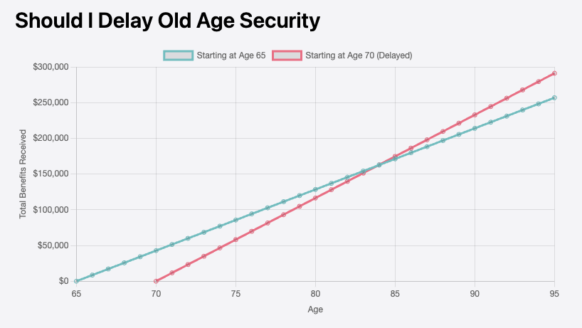
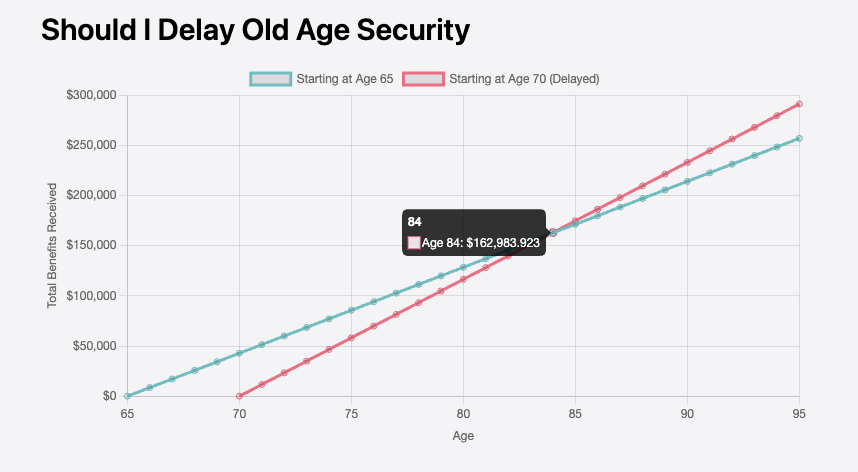
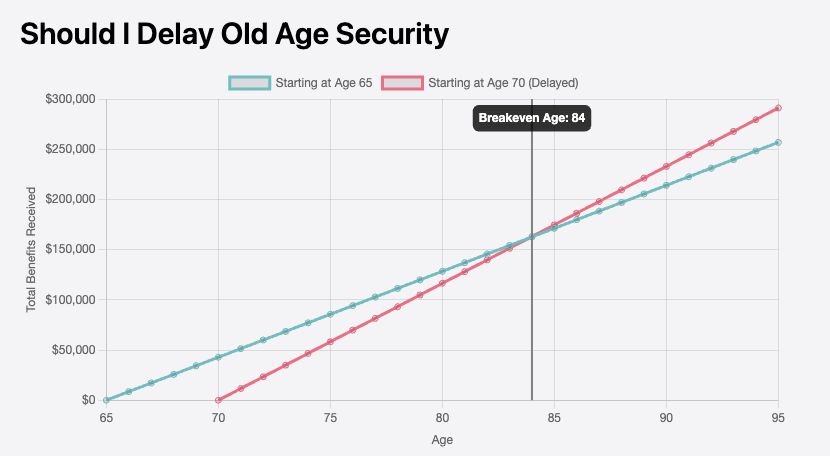
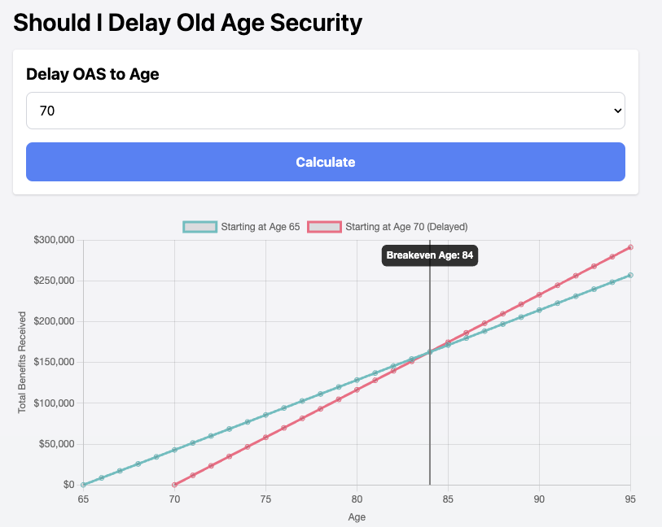
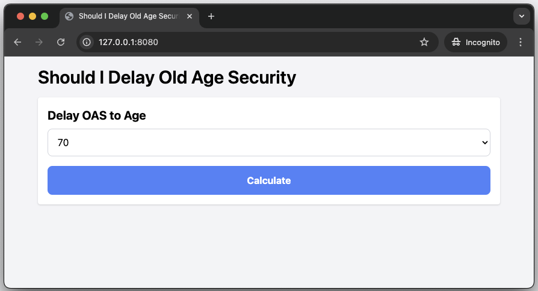
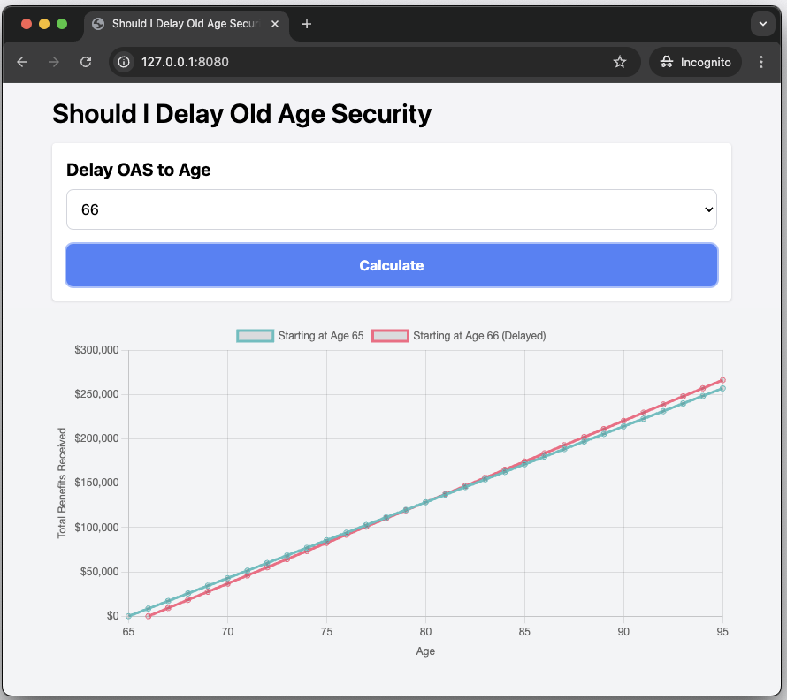
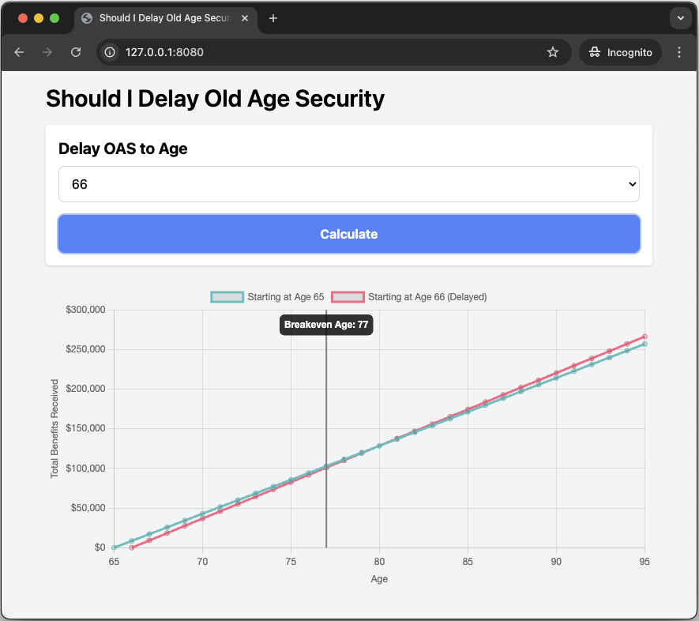
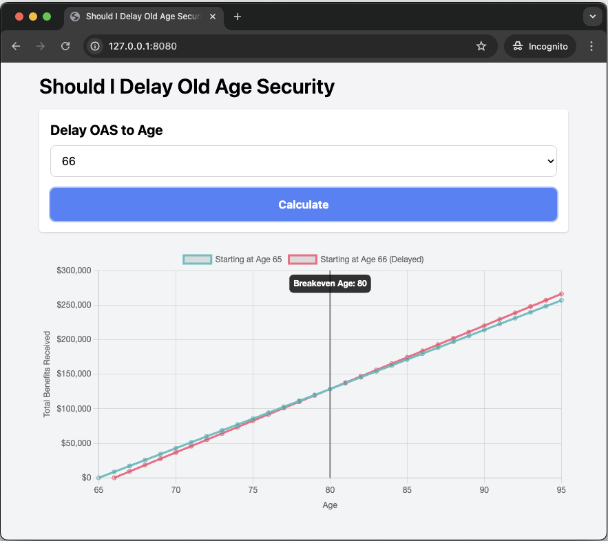
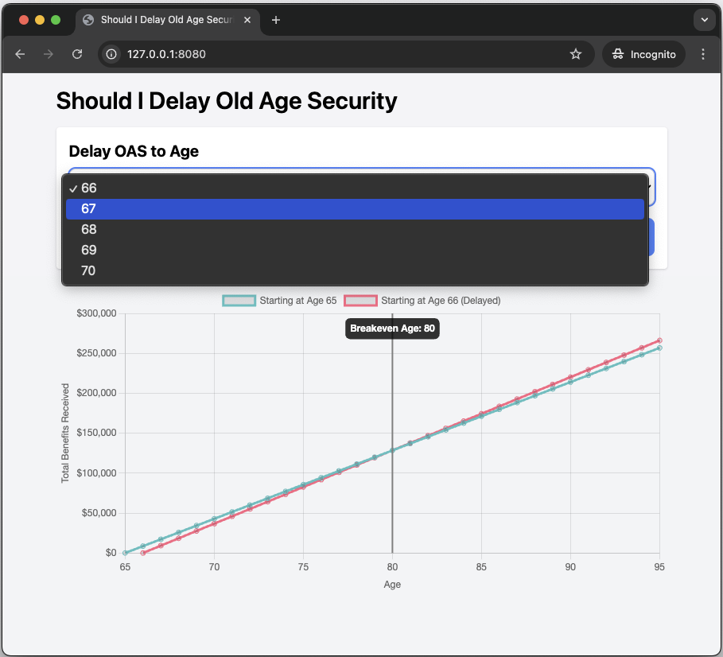
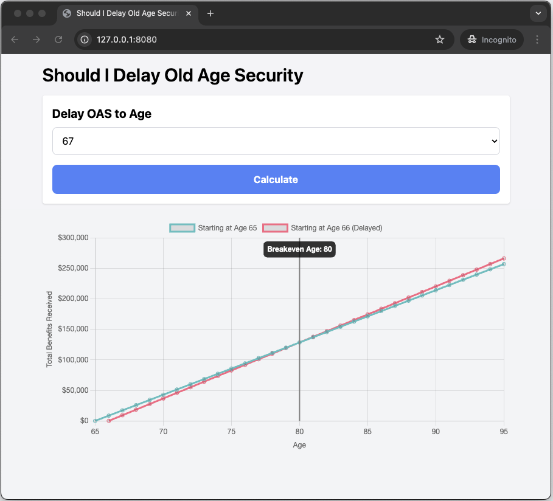

When building software, especially for complex financial scenarios, it's crucial to determine if you're on the right track before investing significant effort in selecting the language to build in, framework, architecture, automated testing, and setting up CI/CD pipelines. Rapid prototyping allows you to quickly reach valuable insights and validate your approach.

I had an opportunity to collaborate with [John Stapleton](https://openpolicyontario.com/), a subject matter expert on social assistance policy and poverty reduction, on an Old Age Security (OAS) breakeven calculator, targeted at low income Canadians. This post will demonstrate how I used ChatGPT to quickly build a prototype and validate our ideas.

## Problem

Before getting into the technical details of the prototype, let's start with the problem to be addressed:

Low uptake of Old Age Security (OAS) among low-income Canadian seniors, especially immigrants without a full 40 years in Canada after the age of 18, is a significant issue. John Stapleton and I previously collaborated on a [Guaranteed Income Supplement RRSP calculator](https://rrspgiscalculator.site/), addressing the unintuitive aspects of financial planning for low-income Canadians wrt retirement savings plans. Our new challenge was similar: Create a tool to help seniors understand the benefits of OAS, and if low income, it's almost never a good idea to delay it.

In the Toronto Metropolitan area, where 71% of seniors are immigrants, many people turning 65 are not applying for OAS due to:

1. Attempting to attain more qualifying years for OAS.
2. Understanding that waiting until age 70 increases their monthly payments.
3. Mainstream advice from private planners advocating for delaying OAS. This advice is sound if the money is not required and there is no eligibility for Guaranteed Income Supplement (GIS). However, for those eligible for significant GIS amounts, waiting might not be in their best interest.

The goal is to build a free online tool to illustrate these nuances effectively, and encourage people who would benefit to apply for OAS benefits as soon as possible rather than delaying.

## Business Rules

Another thing to understand before getting into the technical details is the business rules around OAS. They are as follows:

1. To receive the full monthly OAS pension amount, you must have 40 years of residency as an adult (after age 18) in Canada, at the time you turn 65.
2. If you have less than 40 years residency, you qualify for 1/40th of the full amount for every year. For example, 35 years of residency would qualify for 35/40 fraction of the full amount.
3. For every month after 65 that you delay taking OAS, the monthly amount you're entitled to when you do start increases by 0.6%, up to a maximum of 5 years, i.e. 60 months. So the most it could increase would be 0.6% * 60 = 36%.
4. Canadians whose income is below the cutoff for GIS (Guaranteed Income Supplement), also qualify for an additional top up to their OAS, however they must claim OAS to also receive the GIS amount.

TODO: Address a common misunderstanding:
Note that delaying past age 65 does *not* increase the residency amount. For example, someone who has 35 years of residency by the time they turn 65 will not get an additional 5/40ths of the pension amount by delaying to age 70. They will however get the 36% delay bump, but that's 36% of the amount based on their 35 years of residency.

TODO Aside: There's actually more nuance, but these additional details not required for the prototype, for those who would like to learn more see the govt canada website at https://www.canada.ca/en/services/benefits/publicpensions/cpp/old-age-security.html.

## Initializing the Prototype

The idea was to get something that the subject matter expert and others could try out as quickly as possible. Our budget was exactly $0.00, so it had to be something that could be hosted for free. In this case, a static website hosted on [GitHub Pages](https://pages.github.com/) is the perfect solution. It doesn't even require purchasing a domain as GitHub will generate a publicly accessible url based on your GitHub username and repository name.

TODO: Aside domain + CNAME

The simplest possible implementation would be a single `index.html` containing all the markup, and logic in a script tag `<script>...</script>`. I didn't want to spend time setting up a build system. I envisioned from pushing any changes, to immediately having the new code available. To support this, I setup a GitHub repository to only have a `gh-pages` branch. Then any changes pushed to the branch are automatically deployed to GitHub pages. Here are the steps to do this:

* While logged in to your GitHub account, create a new public GitHub repo, name it `whatever_prototype`, do not initialize repo with any files.
* Clone the repository to your laptop: `git clone..`
* `cd` into the repository you just cloned
* Create an empty branch: `git checkout --orphan gh-pages`
* Create an empty commit: `git commit --allow-empty -m "Initialize gh-pages branch"`
* Push: `git push origin gh-pages`
* Back in the GitHub web UI, go to your repo's Settings -> General, and make sure that `gh-pages` is the default branch.

Now anytime you push new changes while on the `gh-pages` branch, they will get deployed via a "pages build an deployment" workflow and publicly reachable at `https://your-username.github.io/your-repo-name/`. No need to setup this workflow, GitHub does it for you automatically for any project that has a `gh-pages` branch.

With the setup out of the way, it was time to start building.

## Figure out the Math

Recall the goal was to show that delaying OAS to a later age may not be worth it for many people as they would have to outlive the Statistics Canada life expectancy values to have more money overall by delaying.

I started with some manual calculations, assuming the simplest case: Someone who is eligible for a full OAS pension at 65, and not eligible for GIS. For 2024, they would receive a monthly OAS amount of $713.34 if starting at age 65. This means by the time they turn 66, they would have received a total of $713.34 * 12 = $8,560.08, i.e. 12 monthly payments. And by age 67, they would have a total of $713.34 * 12 * 2 = $17,120.16, i.e. 12 monthly payments per year at 2 years. By age 70, this person would have accumulated 5 years worth of payments which is 60 months for a total of $713.34 * 12 * 5 = $42,800.40. And so on, for each year the person is still alive and collecting OAS.

On the other hand, waiting until age 70 would increase the monthly payment by 36%, i.e. 0.06% for each month delay, so 5 years of delay === 60 months, and 60 * 0.06% = 36%. So that 713.34 monthly payment would turn into: $713.34 * 1.36 = $970.14. By the time this person turns 71, they would have a total of $970.14 * 12 = $11,641.68. While this sounds like an impressive amount more than the $8,560.08 amount they would have had in one year if starting at 65, they're missing out on the $42,800.40 they could have had by starting at age 65.

I explained the OAS rules above to ChatGPT and asked it to generate a table with columns for age, going from age 66 through 90, calculate the OAS amount someone would have accumulated by that age if they had started at 65, and another column for starting at 70, and then to calculate the difference between starting at 70 and 65.

Here are the results - I've highlighted age 84, explanation to follow:

| Age | Start at 65 ($) | Start at 70 ($) | Difference ($) |
| --- | --------------- | --------------- | -------------- |
| 66  | 8,560.08        | 0               | -8,560.08      |
| 67  | 17,120.16       | 0               | -17,120.16     |
| 68  | 25,680.24       | 0               | -25,680.24     |
| 69  | 34,240.32       | 0               | -34,240.32     |
| 70  | 42,800.40       | 0               | -42,800.40     |
| 71  | 51,360.48       | 11,641.68       | -39,718.80     |
| 72  | 59,920.56       | 23,283.36       | -36,637.20     |
| 73  | 68,480.64       | 34,925.04       | -33,555.60     |
| 74  | 77,040.72       | 46,566.72       | -30,474.00     |
| 75  | 85,600.80       | 58,208.40       | -27,392.40     |
| 76  | 94,160.88       | 69,850.08       | -24,310.80     |
| 77  | 102,720.96      | 81,491.76       | -21,229.20     |
| 78  | 111,281.04      | 93,133.44       | -18,147.60     |
| 79  | 119,841.12      | 104,775.12      | -15,066.00     |
| 80  | 128,401.20      | 116,416.80      | -11,984.40     |
| 81  | 136,961.28      | 128,058.48      | -8,902.80      |
| 82  | 145,521.36      | 139,700.16      | -5,821.20      |
| 83  | 154,081.44      | 151,341.84      | -2,739.60      |
| <span class="markdown-table-highlight">**84**</span>  | **162,641.52**      | **162,983.52**      | **341.88**          |
| 85  | 171,201.60      | 174,625.20      | 3,423.60       |
| 86  | 179,761.68      | 186,266.88      | 6,505.20       |
| 87  | 188,321.76      | 197,908.56      | 9,586.80       |
| 88  | 196,881.84      | 209,550.24      | 12,668.40      |
| 89  | 205,441.92      | 221,191.92      | 15,750.00      |
| 90  | 214,002.00      | 232,833.60      | 18,831.60      |

The amounts represent the *total* OAS accumulated. Even though starting at age 70 results in a higher monthly payment compared to starting at age 65, the *total* OAS accumulated is less up until age 84, when it starts to pull ahead. In other words, someone would have to live until at least age 84 to have a greater total amount. And even then, it's only a few hundred dollars. Given that according to Statistics Canada combined life expectancy for 2024 is ~83, you can start to see that it may not make sense for many people to delay OAS to age 70.

## Visualization

While the table of numbers is useful, some people's eyes glaze over when presented with rows and rows of numbers. This data could also be presented as a line chart where:

* The horizontal `x` axis is for age (i.e. time moving forward)
* The vertical `y` axis is for total accumulated OAS

The two streams of income (Start at 65, Start at 70) could be visualized as two lines on this chart, showing the total OAS income over time for starting payments at age 65 versus age 70. Each point on a line would represent the total OAS accumulated at that age. The line that starts at age 70 would have a greater slope because each payment is greater, but it would also start "pushed out to the right" because the payments from age 65 - 70 would be 0. The line that starts at age 65 would have a lower slope due to lower monthly payments. This mean the two lines would have to intersect, and the age at which they intersect would be the break even age.

This would require bringing in a charting library. I decided to go with [Chart.js](https://www.chartjs.org/) because it's relatively simple to use and results in pleasing looking charts with the default configuration, perfect for a prototype where there is no designer. It also has support for [responsive charts](https://www.chartjs.org/docs/latest/configuration/responsive.html).

I asked ChatGPT to generate an `index.html` with a line chart using Chart.js, with two lines on the chart representing total accumulated OAS starting at age 65 and starting at age 70, using the business rules I had explained earlier. I also asked for a title "Should I Delay Old Age Security" and told it to use TailwindCSS for overall page styles and to make it a mobile first design.

It came up with the following:

* Head section with CDN link for TailwindCSS and CDN script source for Chart.js
* Very light grey background on the page rather than default white to avoid being too bright
* Centered area for the content
* Title marked up to stand out
* Canvas element for the chart (Chart.js uses Canvas rather than SVG)
* JavaScript functions to generate chart data for each line (one starting at 65 and another starting at 70)
* JavaScript code to configure and initialize the line chart using responsive mode, and the two JavaScript functions for the data
* It even added tooltips which was a nice touch!

```htm
<!DOCTYPE html>
<html lang="en">

<head>
  <meta charset="UTF-8">
  <meta name="viewport" content="width=device-width, initial-scale=1.0">
  <title>Should I Delay Old Age Security</title>
  <!-- TailwindCSS CDN link -->
  <link href="https://cdn.jsdelivr.net/npm/tailwindcss@2.2.19/dist/tailwind.min.css" rel="stylesheet">
  <!-- Chart.js CDN links (core library and chart types that you'll use) -->
  <script src="https://cdn.jsdelivr.net/npm/chart.js@3.7.0"></script>
</head>

<body class="bg-gray-100 p-4">

  <div class="max-w-screen-md mx-auto">
    <h1 class="text-3xl font-semibold mb-4">Should I Delay Old Age Security</h1>
    <canvas id="myChart"></canvas>
  </div>

  <script>
    // Function to generate data for starting at age 65
    const generateChartData = () => {
      const initialAge = 65;
      const finalAge = 95;
      const monthlyAmount = 713.34; // Example monthly amount for OAS

      let dataPoints = [];
      dataPoints.push({ x: initialAge, y: 0})

      for (let age = initialAge + 1; age <= finalAge; age++) {
        let totalBenefit = (age - initialAge) * 12 * monthlyAmount;
        dataPoints.push({ x: age, y: totalBenefit });
      }

      return dataPoints;
    };

    // Function to generate data for starting at age 70
    const generateChartDataDelayed = () => {
      const recommendedAge = 65
      const initialAge = 70;
      const finalAge = 95;
      const originalMonthlyAmount = 713.34
      const delayedMonths = (initialAge - recommendedAge) * 12
      const multiplier = 1 + (delayedMonths * 0.006); // 0.6% increase per month
      const monthlyAmount = originalMonthlyAmount * multiplier;

      let dataPoints = [];
      dataPoints.push({ x: initialAge, y: 0 })

      for (let age = initialAge + 1; age <= finalAge; age++) {
        let totalBenefit = (age - initialAge) * 12 * monthlyAmount;
        dataPoints.push({ x: age, y: totalBenefit });
      }

      return dataPoints;
    };

    // Chart.js configuration
    const ctx = document.getElementById('myChart').getContext('2d');
    const data = {
      datasets: [
        {
          label: 'Starting at Age 65',
          data: generateChartData(),
          borderColor: 'rgb(75, 192, 192)',
          tension: 0.1,
          fill: false
        },
        {
          label: 'Starting at Age 70 (Delayed)',
          data: generateChartDataDelayed(),
          borderColor: 'rgb(255, 99, 132)',
          tension: 0.1,
          fill: false
        }
      ]
    };

    const options = {
      responsive: true,
      plugins: {
        tooltip: {
          callbacks: {
            label: function (tooltipItem) {
              return `Age ${tooltipItem.raw.x}: $${tooltipItem.raw.y.toLocaleString()}`;
            }
          }
        },
      },
      scales: {
        x: {
          type: 'linear',
          position: 'bottom',
          title: {
            display: true,
            text: 'Age'
          },
          ticks: {
            stepSize: 5
          }
        },
        y: {
          title: {
            display: true,
            text: 'Total Benefits Received'
          },
          ticks: {
            callback: function (value, index, values) {
              return '$' + value.toLocaleString(); // Add thousands separators
            }
          }
        }
      }
    };

    const myChart = new Chart(ctx, {
      type: 'line',
      data: data,
      options: options
    });
  </script>
</body>

</html>
```

Which resulted in this:



Hovering over any point on a line, renders a tooltip with the age and total OAS amount at that age. In the example below, I'm hovering over the point where the two lines intersect, which is the break even age:



## Highlight Break Even Point

The first attempt is not too bad, saving a lot of developer time in setting up the initial scaffold for rendering a chart and writing functions to generate the data. However, it required additional effort from the user to hover over the intersection point to see the details of the break even point.

I asked ChatGPT if there was a way to add a marker of sorts on the chart for the intersection point and to label it the breakeven age. It told me that Chart.js has an annotation plugin for this purpose. It proceeded to generate some code but it didn't work. My research revealed that the annotation plugin is not built into Chart.js, but rather, a separate library needs to be pulled in.

After explaining this to ChatGPT it modified the prototype as follows:

```htm
<head>
  <!-- Added Chart.js annotation plugin from CDN -->
  <script src="https://cdn.jsdelivr.net/npm/chartjs-plugin-annotation@1.1.0"></script>
</head>

<body>
  <!-- Existing markup -->

  <script>
    // Existing functions...

    // New function added to determine break even age
    const findBreakevenAge = () => {
      const data65 = generateChartData();
      const data70 = generateChartDataDelayed();

      let breakevenAge = null;

      for (let i = 0; i < data65.length; i++) {
        const age = data65[i].x;
        const benefitAt65 = data65[i].y;
        const benefitAt70 = data70[i].y;

        if (benefitAt70 === benefitAt65) {
          breakevenAge = age;
          break;
        }
      }

      return breakevenAge;
    };

    // Chart configuration modified to use annotation plugin:
    const breakEvenAge = findBreakevenAge()
    const options = {
      responsive: true,
      plugins: {
        tooltip: {...},
        annotation: {
          annotations: [
            {
              type: 'line',
              mode: 'vertical',
              scaleID: 'x',
              value: breakEvenAge,
              borderColor: 'gray',
              borderWidth: 2,
              label: {
                content: `Breakeven Age: ${breakEvenAge}`,
                enabled: true,
                position: 'start'
              }
            }
          ]
        }
      },
      // other options...
    }
    // Instantiate chart
    const myChart = new Chart(...)
  </script>
</body>
```

However, it wasn't rendering an annotation on the chart. After debugging into the code, I discovered two issue:

1. The datasets `data65` and `data70` aren't comparable by starting at the 0th index of data65 because the ages don't match. i.e. the 0th age of `data65` is `65` whereas 0th age of `data70` is `70`. To find the break even age we need to compare that datasets at the same ages.
2. The `findBreakevenAge()` function generated by ChatGPT was trying to find an exact equality of OAS at two ages. However, recall from the initial math analysis (TODO: link), the incomes are never exactly equal. For example the breakeven age of 84 showed approximately a $300 difference.

I explained the above to ChatGPT and told it to start comparing the datasets at age 70, and also to find the age at which the absolute difference between the two income streams is less than or equal to $2000.

Here's the modified code generated by ChatGPT:

```javascript
// Find the breakeven age (where the two lines intersect approximately)
const findBreakevenAge = () => {
  const data65 = generateChartData();
  const data70 = generateChartDataDelayed();

  let breakevenAge = null;

  // Start at 70 because the second dataset only starts there
  for (let age = 70; age <= 95; age++) {
    const benefitAt65 = data65.find(item => item.x === age)?.y || 0;
    const benefitAt70 = data70.find(item => item.x === age)?.y || 0;

    if (Math.abs(benefitAt70 - benefitAt65) <= 2000) {
      breakevenAge = age;
      break;
    }
  }

  return breakevenAge;
};
```

TODO: Aside: There's a third issue with respect to efficiency in that the `findBreakevenAge()` function is calling the data generation functions again, even though they've already been called to render the lines. That's easily fixable by extracting these to constants and re-using them for both chart and annotation generation. I wasn't worried about that at this time as I just wanted to get something working. TBD: Humans still needed for efficient solutions...

And here is the visual result from these fixes:



Nice! 🎉

## User Input Form

At this point, I was satisfied with the visualization. The next step was to add in some flexibility with user input. For example, what if a user wants to delay to age 68 rather than 70, how would that impact the break even age? The code up to this point was hard-coded assuming a user would be delaying to age 70.

Starting with the UI, I asked ChatGPT to generate a responsive form using TailwindCSS styles with a dropdown for which age to delay taking OAS, between 66 and 70, and a submit button. There's no benefit to delaying beyond age 70 because the 0.6% increase per month of delay maxes out at 60 months delay, i.e. 5 years from age 65 which is 70. I told it to make the field required, and default to 70.

It added the following form to the markup, just above the chart, contained in a panel with a subtle shadow:

```htm
<!-- Added a panel for the form -->
<div class="bg-white p-4 rounded shadow mb-6">
  <form id="oas-form">
    <!-- Age taking OAS: 66, 67, 68, 69, 70 -->
    <div class="mb-4">
      <label for="age-taking-oas" class="block text-xl font-bold mb-2">Delay OAS to Age</label>
      <select id="age-taking-oas" name="age_taking_oas"
        class="w-full p-3 border border-gray-300 rounded-lg focus:outline-none focus:ring-2 focus:ring-blue-500" required>
        <option value="66">66</option>
        <option value="67">67</option>
        <option value="68">68</option>
        <option value="69">69</option>
        <option value="70" selected>70</option>
      </select>
    </div>

    <!-- Submit Button -->
    <div class="text-center">
      <button type="submit"
        class="w-full bg-blue-500 text-white font-bold py-3 px-4 rounded-lg hover:bg-blue-700 focus:outline-none focus:ring-2 focus:ring-blue-500 focus:ring-opacity-50">
        Calculate
      </button>
    </div>
  </form>
</div>

<!-- Existing chart element -->
<canvas id="myChart"></canvas>
```

Which looks like this:



## Responding to User Input

I then asked ChatGPT to add a form submit event listener. This listener should extract the age at which the user selected to take OAS, and use that instead of the hard-coded age 70 when calculating the delayed income stream. I explained that for each month of delay, there's a 0.6% increase in the payment amount.

It modified the code as follows:

It came up with this (I'm just showing the modified portions of the code):

```javascript
// Form submit handler to intercept regular form submission
document.getElementById('oas-form').addEventListener('submit', calculate);

// Modify data generation to take dynamic starting age into account
const generateChartDataDelayed = (ageTakingOas) => {
  const recommendedAge = 65
  const finalAge = 95;
  const originalMonthlyAmount = 713.34

  // Use user-provided age rather than hard-coded age 70 to determine the delay period
  const delayedMonths = (ageTakingOas - recommendedAge) * 12
  const multiplier = 1 + (delayedMonths * 0.006); // 0.6% increase per month
  const monthlyAmount = originalMonthlyAmount * multiplier;

  let dataPoints = [];
  dataPoints.push({ x: ageTakingOas, y: 0 })

  for (let age = ageTakingOas + 1; age <= finalAge; age++) {
    let totalBenefit = (age - ageTakingOas) * 12 * monthlyAmount;
    dataPoints.push({ x: age, y: totalBenefit });
  }

  return dataPoints;
};

// Add a calculate method as target of event listener to run every time form is submitted
function calculate(evt) {
  // Prevent regular form submission because this is a client side only app
  evt.preventDefault();

  // Extract user selected value for when they plan to start OAS
  const ageTakingOas = Number(document.getElementById('age-taking-oas').value);

  // Build data for chart, passing in user provided `ageTakingOas` for delayed income stream
  const data = {
    datasets: [
        {
          label: 'Starting at Age 65',
          data: generateChartData(),
          borderColor: 'rgb(75, 192, 192)',
          tension: 0.1,
          fill: false
        },
        {
          label: `Starting at Age ${ageTakingOas} (Delayed)`,
          data: generateChartDataDelayed(ageTakingOas),
          borderColor: 'rgb(255, 99, 132)',
          tension: 0.1,
          fill: false
        }
      ]
  }

  // Now we generate the chart here in the calculate function so it will be
  // updated every time user submits the form
  const breakEvenAge = findBreakevenAge()
  const options = {...}
  const myChart = new Chart(ctx, {
    type: 'line',
    data: data,
    options: options
  });
}
```

Now that the chart generation has moved inside the calculate function, when first landing on the page, it looks like this:



Let's try it out, selecting to delay just one year to age 66 - notice that the ChatGPT generated code also updated the chart label to show the user selected age:



This time we can see the lines are closer together, and they crossover earlier (at around age 80 rather than 84), than the previous example when delaying to age 70.

## Bug No Breakeven

However, ChatGPT introduced a bug - the breakeven chart annotation is no longer being displayed. The issue is that the `findBreakevenAge` function is still using the hard-coded age 70 to compare income streams, and so it will not find a match when the user provides a different age as in this example. After explaining the issue to ChatGPT it corrected the code by passing in the user selected age to the `findBreakevenAge` function.

Here are the portions of the code it modified - notice it did not update the variable names such as `data70` or `benefitAt70`, but it did update the logic:

```javascript

// Modified `findBreakevenAge` to take the user selected age
const findBreakevenAge = (ageTakingOas) => {
  const data65 = generateChartData();

  // Pass in user selected age to the delayed income stream calculation
  const data70 = generateChartDataDelayed(ageTakingOas);

  let breakevenAge = null;

  // Start at user selected age because the second dataset only starts there
  for (let age = ageTakingOas; age <= 95; age++) {
    const benefitAt65 = data65.find(item => item.x === age)?.y || 0;
    const benefitAt70 = data70.find(item => item.x === age)?.y || 0;

    if (Math.abs(benefitAt70 - benefitAt65) <= 2000) {
      breakevenAge = age;
      break;
    }
  }

  return breakevenAge;
};

function calculate(evt) {
  // ...

  // Pass the user selected age to the `breakEvenAge` function
  const ageTakingOas = Number(document.getElementById('age-taking-oas').value);
  const breakEvenAge = findBreakevenAge(ageTakingOas)

  // ...
}
```

With the break even logic updated to take into account user selected starting age, the breakeven annotation is displayed:



## Bug Breakeven Incorrect

However, this reveals a new issue - its showing a breakeven age of 77 when the lines actually cross over at age 80. This is because the original heuristic of finding the first data point where the differences in income is $2000 or less isn't quite right for a smaller delay age, because in this case, the differences in income are smaller (as can be seen by the lines being closer together in slope).

I explained the issue to ChatGPT and asked it to modify the break even logic to determine the absolute minimum difference between the two data streams rather than comparing to $2000. Here's the modified function:

```javascript
// Find the age at which the difference between the two income streams is the smallest
const findBreakevenAge = (ageTakingOas) => {
  const data65 = generateChartData();
  const data70 = generateChartDataDelayed(ageTakingOas);

  let minDifference = Infinity;
  let breakevenAge = null;

  // Start at ageTakingOas because the second dataset only starts there
  for (let age = ageTakingOas; age <= 95; age++) {
    const benefitAt65 = data65.find(item => item.x === age)?.y || 0;
    const benefitAt70 = data70.find(item => item.x === age)?.y || 0;

    const difference = Math.abs(benefitAt70 - benefitAt65);

    if (difference < minDifference) {
      minDifference = difference;
      breakevenAge = age;
    }
  }

  return breakevenAge;
};
```

With that change in place, we can see the correct breakeven age of 80 displayed on the chart, when user selects age 66 to delay:



## Bug Can't Change Age

The next thing the user might want to do is to select a different age for delaying OAS, to see the effect on the income streams and break even age. However, this reveals another bug, which is that nothing seems to happen when selecting a different age, given that the chart is already rendered from the first selection.

For example, given that we just calculated for delay age of 66, then try to select age 67:



The age 67 is shown in the dropdown, but after clicking the Calculate button, the chart doesn't change, it's still showing the results for age 66, not 67:



Opening the browser developer tools and inspecting the Console tab reveals an Uncaught JavaScript error:

```
chart.js@3.7.0:13 Uncaught
Error: Canvas is already in use. Chart with ID '0' must be destroyed before the canvas can be reused.
    at new dn (chart.js@3.7.0:13:90904)
    at HTMLFormElement.calculate ((index):220:23)
```

Currently the context for the canvas on which Chart.js draws is defined as a constant outside of any functions. The chart is redefined each time as part of the `calculate` function, which is called every time the user submits the form. The error message about being unable to reuse the Canvas element is coming the `calculate` function where it tries to instantiate a new chart for the second time:

```javascript
const ctx = document.getElementById('myChart').getContext('2d');
// ...

function calculate(evt) {
  // ...

  // Error from this line:
  // Canvas is already in use. Chart with ID '0' must be destroyed before the canvas can be reused.
  const myChart = new Chart(ctx, {
    type: 'line',
    data: data,
    options: options
  });
}
```

I gave ChatGPT the error message, and it corrected the code by defining a variable outside of the calculate function for the chart. Then it moved the context declaration inside the `calculate` function. It then modified the code to check if the `myChart` variable is already defined, and if so, it calls `destroy()` on it before attempting to re-use it for another chart:

```javascript
// Keep a reference to the chart because we need to check if its already populated
// when attempting to re-render
let myChart = null
// ...

function calculate(evt) {
  // Canvas context needed for rendering the chart
  const ctx = document.getElementById('myChart').getContext('2d');
  // ...

  // If a chart instance already exists, destroy it
  if (myChart) {
    myChart.destroy();
  }

  // Now we can safely generate another chart
  myChart = new Chart(ctx, {
    type: 'line',
    data: data,
    options: options
  });
```

At this point, the code is functional, the user can keep selecting different delay ages, click the Calculate button, and see the chart rendered with two streams of income and the breakeven age updated.

## Less than 40 years in Canada

There's another complexity in that if someone has been in Canada for less than 40 years as an adult (i.e. after age 18) by the time they turn 65, then they're eligible for a fraction of the pension amount rather than the full amount. For example, if someone has lived for 35 years in Canada after age 18, and the full pension amount is $713.34, then they would be eligible for $713.34 * (35/40) = 624.17. i.e. the fraction they're eligible for is based on how many 40ths of years of residency they have.

There's a common, but mistaken belief that delaying OAS in this case will have multiple benefits: Firstly the 0.6% per month of delay increase, *and* an increase of 1/40th the pension amount for every year of delay due to the residency increase. For example, someone who has 35 years in Canada at age 65, and delays OAS to age 68, may believe that this would qualify them for an extra 3/40ths of the full pension amount because they delayed for 3 years and now have 3 more qualifying residency years, and that they would get an extra 0.6% for each month of delay.

However, the benefits of delaying do not "stack". What the government of Canada does is "fix" the pension amount to however many years the person has in Canada by age 65. Then if the person chooses to delay, the government calculates the 0.6% per month increase on the "fixed" pension amount calculated based on the 35 years in Canada.

In our example of someone that has 35 years in Canada, if they were to start at age 65, they would qualify for $713.34 * (35/40) = $624.17 per month. Then if they were to delay for 3 years, i.e. 36 months, this would increase the monthly amount to $624.17 * (1 + (36 * 0.006)) = $758.99.

<aside class="markdown-aside">
Technically the person could write in a request to the government asking them to use their residency increase INSTEAD OF the monthly increase, however, the monthly 0.6% increase always results in a greater amount than the residency fraction increase so in practice, this is never done.
</aside>

WIP: Explain all this to ChatGPT and ask it to update the form with numeric integer input between 18 and 65, with help text, and update calculation to extract this value from form and use it...

## GIS Eligibility

## Text Explanation

## TODO
* WIP main content
* Bug with re-using chart element
* User Input section is too long, break up into subsections
* Less than 40 years in Canada
* GIS eligibility
* conclusion para
* description meta
* edit
* Aside domain + CNAME somewhere in prototype setup
* Combine "less than 40 years" with user input section or keep separate?
* Ignoring annual inflation adjustments, comparing all values in today's dollars
* Mention `npx http-server` for super quick, easy local static server in init or build prototype section
* Ref stats can life expectancy
* Obviously there's still a lot of work to do, such as extracting hard-coded numbers to meaningfully named constants, figuring out how to update the numbers from govt data, etc. But its important for a prototype, to STOP development once the idea is validated, otherwise you're creating more work for yourself in porting over more features to the "real thing", or you'll be tempted to make the prototype the real thing, which will burden you with unmaintainable code forever.
* Aside: When generating JS functions, ChatGPT seems to recommend the `const findBreakevenAge = () => {...}` format but this results in creation of an anonymous function which makes for not very useful stacktraces. I prefer `function findBreakevenAge() {...}`
* Screenshot somewhere showing how it looks on a phone? i.e. responsive by default
* Lessons learned: No doubt faster development time. But it does introduce bugs when adding something new, it doesn't update what was written before. Inefficiencies - the same thing will get calculated over and over again, and its up to developer to refactor or point out the issue to ChatGPT.
