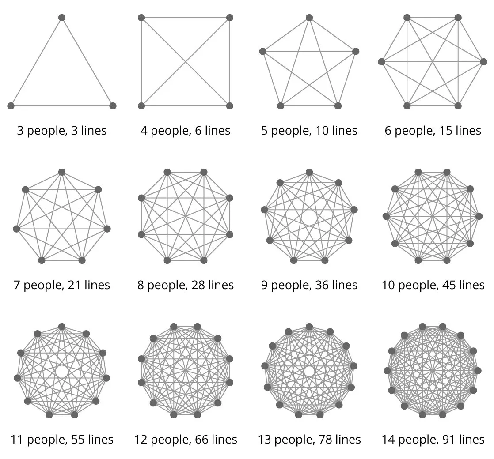

I was inspired to write this post after listening to a Software Engineering Radio podcast with guest Jon Smart on the subject of [Patterns and Anti-Patterns for Successful Software Delivery](https://www.se-radio.net/2022/12/episode-543-jon-smart-on-patterns-and-anti-patterns-for-successful-software-delivery-in-enterprises/). He discusses why "Agile Transformation" is an anti-pattern, the importance of focusing on outcomes rather than outputs, and avoiding one-size-fits-all solutions. He says the goal shouldn't be to "do agile", but rather introduces a new language of better (quality), sooner (time to value), safer (agile not fragile), and happier (customers, colleagues, citizens, clients).

Listening to this podcast made me reflect on my many years experience of software development on various project and product teams across different sized companies and industries in terms of what practices have made some teams more effective than others. In this post, I'll share practices I've experienced that have made teams effective.

## Definition

But first, what do I mean by an effective team? My definition of this term is a team that can continuously deliver working software that solves their customers problems, keeping the customers happy to keep on paying for the service, and spreading the good word.

The delivery of each release introduces little to no [regressions](https://en.wikipedia.org/wiki/Software_regression).

Equally important, an effective team consists of team members who communicate well with each other, feel satisfied and fulfilled in their work, and reasonably look forward to starting work each day.

Now that the definition is out of the way, the rest of this post will cover qualities that make effective teams.

## Product

An effective team starts with good product direction. The role of the person(s) that define this has changed names over the years, from Business Analyst, to Product Manager or Product Owner. I'll just refer to it as PM.

An effective team will have a PM that has a strong sense of product direction and can express clearly how different areas of the product should work and why. These features should be driven by what will solve the customers problems, ultimately generating revenue. The PM should also expect clarifying questions from engineers and consistently update written requirements to reflect those clarifications (more on writing later in this post). This way all team members current *and* future can gain an understanding of why the product works the way it does.

Sometimes the product direction is not entirely clear. The company could be dealing with unknowns and engaging in research and experiments to determine market fit. A team can still be effective in this case if it's communicated clearly to all team members that they're dealing with unknowns. In this environment, people are encouraged to think creatively of potential solutions and to try things out, with the understanding that many features may not stick and have to be rolled back. i.e. no one is blamed if something doesn't work out because it all contributes to increased understanding.

The only style of product I've seen be ineffective is when there are a lot of unknowns, but the PM (or key business decision makers) doesn't seem to be aware that they don't know. In this case, when developers ask clarifying questions, the answers are still vague. Then developers will make their best guess. When the feature is delivered, its not what anyone expected, but no one can exactly explain why. This can lead to finger pointing where product blames developers for not meeting requirements and developers in turn saying the requirements weren't clear. This leads to constant frustration, stress and high turnover.

## Minimal Process

An effective team keeps the spirit of [agile](https://agilemanifesto.org/principles.html) alive, while not burying themselves under needless ceremonies and process. In my experience, this means keeping a focus on getting things done using a flow approach rather than a rigid methodology like Scrum. A small(ish) team of intrinsically motivated people with solid written communication skills and autonomy over the entire stack can get a lot done with a minimum of process and meetings.

There does need to be some process to avoid chaos, i.e. every day should not feel like a hack-a-thon, but it should not be a burden and should not be disrupting developer flow with regular meetings. This process could include:

* Breaking up large requirements into smaller items and entering these into a ticketing system to keep track of the work to be done, in priority order.
* Developers pick up tickets by assigning the next most important item in the list to themselves and starting a feature branch in version control with the ticket number and brief description in the branch name. Commit messages also include the ticket number.
* All code has automated tests at the appropriate level (from unit to end-to-end). Definitely investing in end-to-end testing to limit the need for manual QA (or only need it for things that can't be automated).
* Non-obvious things are included in [engineering documentation](../about-those-docs) as part of feature development.
* Linting is in place for consistent formatting and to prevent coding errors. Ideally linting has been added on day one of the project. [It can be added later](../markdown/add-rubocop-to-legacy-project), although that will be more effort.
* CI (Continuous Integration) runs on each commit to verify the build, lint rules and passing tests
* Developers submit PRs when their feature is ready for review, with [instructions to reviewer](../markdown/working-towards-asynchronous-future#pull-requests) how to exercise the code.
* Developers address feedback on their PRs, and when approved merge.
* If CI passes on the merge commit, CD (Continuous Deployment) kicks in and automatically deploys the code to production.
* Developers pick up next most important item, rinse and repeat.

<aside class="markdown-aside">
There's been a lot said about ticketing systems being four letter words and all that. It doesn't need to be this way. The ticketing system is simply a communication tool to help teams know what needs to be done and what's most important. It's not intended as a management tool to measure developers performance or to make developers spend any more time in it than necessary. Ideally the ticketing system is fully integrated with version control so that ticket status changes such as In Progress, In Review, and Done are applied automatically as developers start pushing to branches, submit PRs, and merge.
</aside>

## Culture of Writing

An effective team develops a culture of writing, both on the business and technical side.

On the business side, writing is used to capture the requirements and business rules, and also the *why* behind these. This could be tied to improved revenue generation or user experience. I've found its helpful for developers that are implementing the requirements to understand why a feature is being built a certain way.

On the technical side, [writing](../about-those-docs#what-to-document) is used to share knowledge and expertise to level up all team members, current and future. This includes architectural proposals and decisions, project setup, common workflows through the application, troubleshooting tips, third party integrations, configuration, how to do deployments, how to exercise new code being added in a pull request, and anything else that helps developers understand how the project works.

These written documents are not intended as contracts where people can finger point later if something is not working. Rather, they are living documents owned by the entire team. They support collaboration and team continuity, and are updated as questions and new information arises. Here is where I differ from one of the Agile Manifesto principles which states:

> The most efficient and effective method of conveying information to and within a development team is face-to-face conversation.

Relying primarily on face-to-face conversations:

* Results in a lot of scheduled or impromptu meetings that interrupt flow state.
* Requires co-incidence that everyone required to make a decision happens to be online at the same time. What if someone's out sick, vacation, appointment, works in a different timezone etc.
* Relies on people having perfect memories of what was discussed and decided in the conversation.
* Assumes that the best way to get people's input into decisions is via realtime conversation - this can result in "off the cuff" remarks that upon deeper technical analysis, may not turn out to be optimal.
* Can be prone to [loudest voice in the room](https://www.linkedin.com/pulse/loudest-voice-room-hisako-esaki/) effect where the more dominant personalities assert their opinions, and the quieter types that may have differing opinions don't feel comfortable challenging it or can't get a word in.
* Results in a lot of knowledge that only lives in people's heads, and gets lost as people leave.

Using written communication can improve team effectiveness by:

* Minimizing interruptions - developers can review proposals or questions others may have when its an optimal time for them.
* Asynchronous nature of responding to written communication means the team can be distributed and can still function even when people have different schedules or personal matters to attend to. i.e. work can revolve around life rather than life needing to revolve around work.
* Leaves a written artifact of discussions and decisions. No more "What was that we decided in the meeting last week?" or "Why was tool X over Y chosen to solve this problem?".
* Captures everyone's feedback because everyone has an opportunity to contribute to a shared document or via comments.
* Contributes to a shared understanding, not just the current team members, but future team members. i.e. as the usual churn of tech workers coming and going happens, the project can still continue smoothly because important decisions have been captured in writing.

## Meetings

The previous section on writing is not to suggest that face-to-face conversations are never needed. There could be a tricky issue that's gone back and forth in comments in a document or PR and isn't getting resolved. Or some people think better "out loud" and sometimes need to bounce ideas off a few other people. An effective team will support all types of thinkers. So if a meeting is needed, here's how to get the most out of the precious time:

* Make it brief. Set the default meeting time to 30 minutes in whatever calendar/scheduling tool the company is using. If you think you'll need longer, bump it up to 45 minutes, but try not to go over an hour. In my experience, people lose their focus beyond this, and if the issue hasn't been resolved in an hour, dragging it on any longer doesn't help.
* Limit the required attendees. For example, if two people are having a strong difference of opinion over a technical proposal, only those two, plus maybe the team lead or manager should be required. Other team members can be marked as optional. It's not always the case that every team member has a strong opinion, for these folks, not interrupting them and letting them get on with their work may be best.
* Include a goal in the meeting description. This is different from an agenda, which is simply a list of items to be discussed. You could have a list of points that even after discussion, doesn't move the team forward. A goal on the other hand is very specific. For example: "At the end of this meeting, we will have a decision on whether we will be using either RabbitMQ or Kafka for messaging". Or "The purpose of this meeting is to finalize the design for the search results page". The meeting description should include pointers to documents/discussion that has happened prior, so all attendees can be fully up to speed before the meeting starts. In the case of a technical decision, this could be a link to an [ADR](../about-those-docs/#architecture-decision-records) and/or related PR comments. In the case of a UI/UX decision, it could be pointers to the Figma document (or whatever design tool is being used).
* Update the referenced documents during the meeting as decision(s) are being made. This way there's no issue of forgetting what was decided or having to be a secretary later transcribing what people said.
* At the conclusion of the meeting, share/publish the decision to make it visible to the entire team.

## Small-ish Team Size

Over the years, I have found the optimal team size to be on the small end, ranging from 2 - 4 developers, plus a PM and designer. The reason for this is it limits the number of [lines of communication](https://www.leadingagile.com/2018/02/lines-of-communication-team-size-applying-brooks-law/) within the team. Here is a useful diagram from that blog post to illustrate the issue:

If the team has 2 developers, a PM, and a designer, that's a total size of 4, resulting in 6 lines of communication, which is manageable. Bumping this up to 4 developers results in a total team size of 6, which leads to 15 lines of communication. I feel like that's pushing at the maximum of what a team can manage and still be effective.

It can be tempting to add more developers to a project thinking that productivity will improve linearly. For example if one developer can complete one feature per week, then adding 9 more developers will result in 9 features completed per week. But it never works out this way. What's more likely is people end up stepping on each other's toes attempting to modify the same area of the code for different reasons, or spending the majority of their time in meetings trying to co-ordinate rather than hands-on building software. This is explained by [Brook's Law](https://en.wikipedia.org/wiki/Brooks%27s_law) which observes that adding people to a software project that is behind schedule delays it even longer.

There's a little more nuance here in that it varies with the surface area of the project. A large project could in theory support a few more developers, if the areas that need to be developed in parallel are all independent of each other. On the other hand, even if the project is large, if the majority of development tends to occur in one area, then keep the team size small.

## Do the Simplest Thing That Works

I learned this motto from a company I worked at earlier in my career and the advice has served me well.

An effective team chooses relatively simple solutions that get the job done, while not painting themselves into a corner. The idea here is to value maintainability and ease of deployment over cleverness or attempting a "big tech" scale architecture from day one of the project. While its nice to think that in the future the project will be so popular it needs to support millions, or even billions of simultaneous users, the reality is, most projects don't get to Meta/Alphabet/Amazon scale.

This often means starting with a monolith rather than microservices. It can always be split up later *if* transaction volumes and revenue generated from these justifies that. And even then, you would want to measure and identify where the performance bottlenecks are, and come up with optimal solutions to address those directly. For example, if incoming requests are receiving errors due to running out of database connections, splitting up into microservices may not resolve the underlying issue. Instead investigate - is connection pooling being used? Is there a memory leak where some code is always opening, then forgetting to close a connection? Is there some work that could be moved to a background task manager to reduce the length of time needed to service a request? If many requests are read-only could increasing the number of database replicas help? For reads and writes, could consider [horizontal scaling](https://dzone.com/articles/how-to-horizontally-scale-your-postgres-database-using-citus) of database. Notice these investigations are going from simplest to most complex.

Avoid over-engineering, i.e. building in abstractions and flexibility unless its known to be needed. Otherwise what can happen is this flexibility is never needed, but when future requirements come in, they need to "flex" in a different direction, resulting in overly complex code.

Avoid premature optimization. For example, writing harder to understand code that shaves microseconds of performance over more straightforward code. Developers spend more of their time reading code others wrote rather than writing net new code so legibility and avoiding second takes is often more valuable than a few microseconds that some obscurely written code saves. An exception to this is a real-time system in which those microseconds are a competitive advantage, such as a trading system. In this case, this is a good place to add code comments explaining what this code does, and more importantly *why* this code is needed. In my experience, performance issues have been caused more frequently by missing database indices, N+1 queries, and loading too much JavaScript, especially intrusive trackers and advertising.

## Vertical Development

aka fullstack, minimize friction...

## Automation

- linting
- testing
- CI/CD

## Psychological Safety

Definition from podcast: Ability to feel safe to ask questions, to challenge authority, to have your voice heard, to express your thoughts without fear of repercussion, without fear of being shot down or belittled. Ability to have open, vulnerable conversations with respect. Not having a blame culture. If something goes wrong, its not because someone did something wrong, it's because there was something in the system of work that enabled this thing to happen.

I would add: Not just feeling safe to ask questions and challenge authority, but for it to be encouraged.

Not assigning blame when something goes wrong, but looking to the process and how it can be improved to avoid this kind of error in the future.

## TODO
* Make the meetings points level 3 sub-sections
* Lines of communication reference re: team size
* Caveat - based on my experience, of course there are many more teams and companies I haven’t worked at that may have different lessons learned, your mileage may vary
* Where does effective communication (between engineers and between engineers and product) fit in?
* Traceability: Eg: Jira ticket can either have the requirements, or just high level and point to a Wiki/Confluence doc with more details. Every Git commit and PR should reference ticket number. Then future developers that are maintaining code can git blame, find the jira ticket, then find the detailed requirements to fully understand why the current code behaves as it does. They can also find the PR which should contain instructions about how to exercise that feature.
* Rotate developers across different areas to spread knowledge, reduce lottery count
* Dedicate some % of time to KTLO
* Edit feature image
* Reduce lines of communication img size