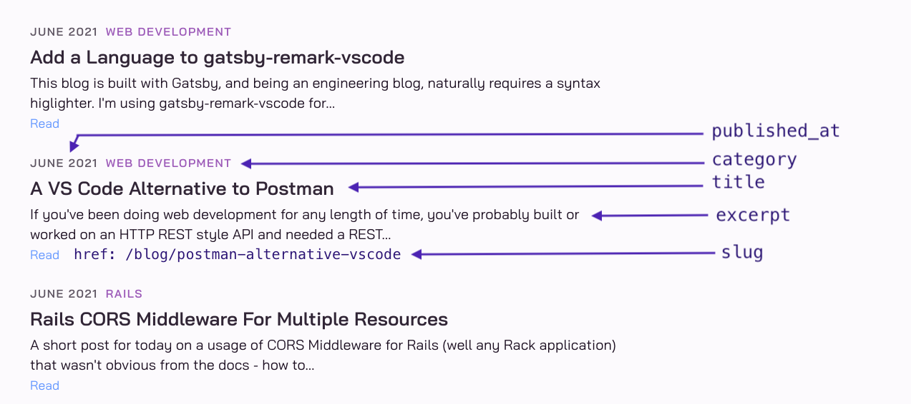

This is the second in a multi-part series of posts detailing how I built the search feature for this blog. In this post, I will explain how I built the search index.

In case you missed it, [Part 1: Search Introduction](../roll-your-own-search-service-for-gatsby-part1) covers the existing options for adding search to a Gatsby site, and why I decided not to use any of them, and instead build a custom search service using PostgreSQL [Full Text Search](https://www.postgresql.org/docs/13/textsearch.html)  and Rails.

## Document Model

The first step in building the search service is to design a database table containing the content to be searched. Since the posts on this blog are written in markdown, this will be all the text in the markdown files. The table also needs to contain enough information for the search results page on the client (this blog) to render the results and make each result clickable to link to the original content.

The search service is built as a Rails project. To get started, a new Rails project can be scaffolded with `rails new myapp -d=postgresql`. Or in my case, I already have a Rails project that provides some custom analytics for the blog, so I'm adding the search service to it.

Here is the migration to add the `documents` table. The `text` type is used for columns whose contents could get very large such as the `body`, which will contain the markdown content of each blog post.

```ruby
class CreateDocuments < ActiveRecord::Migration[6.0]
  def change
    create_table :documents do |t|
      t.string :title, null: false
      t.text :description
      t.string :category
      t.date :published_at
      t.string :slug
      t.text :body, null: false
      t.text :excerpt

      t.timestamps
    end

    add_index :documents, :title, unique: true
  end
end
```

Running this migration generates a table that looks like this:

```
                                           Table "public.documents"
    Column    |              Type              | Collation | Nullable |                Default
--------------+--------------------------------+-----------+----------+---------------------------------------
 id           | bigint                         |           | not null | nextval('documents_id_seq'::regclass)
 title        | character varying              |           | not null |
 description  | text                           |           |          |
 category     | character varying              |           |          |
 published_at | date                           |           |          |
 slug         | character varying              |           |          |
 body         | text                           |           | not null |
 created_at   | timestamp(6) without time zone |           | not null |
 updated_at   | timestamp(6) without time zone |           | not null |
 excerpt      | text                           |           |          |
Indexes:
    "documents_pkey" PRIMARY KEY, btree (id)
    "index_documents_on_title" UNIQUE, btree (title)
```

## Document Table Example Row

Next step in building the search index is to populate the table with content from this blog.

The following illustrates how each field in the `documents` table should be mapped to content from the blog:




For example, to populate a row in the `documents` table for the [VS Code Alternative to Postman](../postman-alternative-vscode) blog post illustrated above, the sql would be as follows (the `excerpt` and `body` columns are shortened for legibility):

```sql
INSERT INTO documents(
  title, description, category, published_at, slug, body, created_at, updated_at, excerpt
)
VALUES(
  'A VS Code Alternative to Postman',
  'Looking for a Postman alternative? This VS Code REST Client extension could be the answer.',
  'Web Development',
  '2021-06-13',
  '/blog/postman-alternative-vscode/',
  'If youve been doing web development for any length of time, youve probably built or worked on an HTTP REST style API and needed a REST Client to test it.'
  now(),
  now(),
  'If youve been doing web development for any length of time, youve probably built or worked on an HTTP REST style API and needed a REST…'
);
```

## Generate INSERT Statements from Gatsby

Of course it wouldn't be practical or scale to manually write all the INSERT statements. These need to be automatically generated. The best place to do this is in the blog build step that processes all the markdown posts.

Recall this is a Gatsby blog. The blog pages are created at build time. The build step runs a file named `gatsby-node.js` in the root of the blog project. This file exports a function called `createPages`, which executes a `graphql` query to get all the markdown content. The graphql query returns a list of nodes that contain the markdown content such as title, category, publish date etc. These are used to create each individual blog page using the Gatsby provided `createPage` function.

So this is the perfect place to generate some sql `INSERT` statements, and write them out to a `search.sql` file. Here is the existing `createPages` function.

```js
// gatsby-node.js

exports.createPages = ({ graphql, actions }) => {
  const { createPage } = actions

  return new Promise(resolve => {
    graphql(`
      {
        allMarkdownRemark(sort: { fields: [frontmatter___date], order: DESC }) {
          edges {
            node {
              frontmatter {
                title
                category
                date(formatString: "YYYY-MM-DD")
                description
              }
              fields {
                slug
              }
              excerpt,
              html,
              rawMarkdownBody
            }
          }
        }
      }
    `).then(result => {
      result.data.allMarkdownRemark.edges.forEach(({ node }) => {
        // build individual blog pages
        createPage({
          path: node.fields.slug,
          component: path.resolve("./src/templates/post.js"),
          context: {
            slug: node.fields.slug,
            content: node.html,
            title: node.frontmatter.title,
            description: node.frontmatter.description,
          },
        })
      })
      resolve()
    })
  })
}
```

And here is the modified `createPages` function that also generates SQL `INSERT` statements to populate the `documents` table. The existing `createPages` function is already fairly lengthy, so the new logic is placed in a new search helper module. The generated insert statement is appended to a `search.sql` file in the project root. This file is git ignored because it is a generated file.

```js
// gatsby-node.js

const searchHelper = require('./lib/search-helper');

exports.createPages = ({ graphql, actions }) => {
  const { createPage } = actions

  return new Promise(resolve => {
    graphql(`
      {
        allMarkdownRemark(sort: { fields: [frontmatter___date], order: DESC }) {
          edges {
            node {
              snip...
            }
          }
        }
      }
    `).then(result => {
      // NEW CODE HERE: wipe out old search file if it exists
      if (fs.existsSync('search.sql')) {
        fs.unlinkSync('search.sql');
      }

      result.data.allMarkdownRemark.edges.forEach(({ node }) => {
        createPage({
          // snip...
        })

        // NEW CODE HERE: generate search insert statements for search service
        insertStatement = searchHelper.generateInsert(node)
        fs.appendFileSync('search.sql', insertStatement + '\n', 'utf8');
      })
      resolve()
    })
  })
}
```

The new `searchHelper` module exposes a `generateInsert` function that takes in a `node` result from the graphql query and uses the fields in `node` to generate an INSERT statement. Newlines and some markdown format characters are removed from the content since they're not necessary for being searched.

As for knowing how to parse a `node` object into fields such as `title`, `description`, this comes from [gatsby-transformer-remark](https://github.com/gatsbyjs/gatsby/tree/master/packages/gatsby-transformer-remark). A Gatsby plugin I use on this blog to parse Markdown files.

```js
// lib/search-helper.js
function generateInsert(node) {
  return `INSERT INTO documents(title, description, category, published_at, slug, body, created_at, updated_at, excerpt)
    VALUES(
      '${replaceMany(node.frontmatter.title)}',
      '${replaceMany(node.frontmatter.description)}',
      '${node.frontmatter.category}',
      '${node.frontmatter.date}',
      '${node.fields.slug}',
      '${replaceMany(node.rawMarkdownBody)}',
      now(),
      now(),
      '${replaceMany(node.excerpt)}'
    );
  `
}

function replaceMany(str) {
  return str
    .replace(/(?:\r\n|\r|\n)/g, ' ')
    .replace(/'/g, '')
    .replace(/"/g, '')
    .replace(/#/g, '')
    .replace(/`/g, '');
}

module.exports = {
  generateInsert,
}
```

## Ingest Documents

The final step in building the search index is to apply all the SQL `INSERT` statements generated in `search.sql` to the `documents` table in the Rails project. Here is the command to do it against the local PostgreSQL database. My database and user are named `hello`:

```
psql -h 127.0.0.1 -d hello -U hello -f /path/to/search.sql
```

To verify it worked, connect to to the database and run a query. `body` column is shortened for legibility:

```
hello=> select title, category, slug, left(body, 20) as body from documents;
                               title                                |     category     |                          slug                           |         body
--------------------------------------------------------------------+------------------+---------------------------------------------------------+----------------------
 Roll Your Own Search Service with Rails and Postgres: Search Index | web development  | /blog/roll-your-own-search-service-for-gatsby-part2/    |  This is the second
 Roll Your Own Search Service with Rails and Postgres: Introduction | web development  | /blog/roll-your-own-search-service-for-gatsby-part1/    |  This is the first i
 Add a Language to gatsby-remark-vscode                             | web development  | /blog/add-language-gatsby-remark-vscode/                |  This blog is built
 A VS Code Alternative to Postman                                   | Web Development  | /blog/postman-alternative-vscode/                       |  If youve been doing
 Rails CORS Middleware For Multiple Resources                       | rails            | /blog/rails-cors-middleware-multiple/                   |  A short post for to
 TDD by Example: Fixing a Bug                                       | javascript       | /blog/tdd-by-example-bugfix/                            |  This post will demo
 Saving on monthly expenses - A Cautionary Tale                     | personal finance | /blog/save-monthly-expense-caution/                     |  Today I want to sha
 Rails Blocked Host Solved by Docker Cleanup                        | rails            | /blog/rails-blocked-host-docker-clean/                  |  Today I want to sha
 Hack Your RRSP Tax Refund                                          | personal finance | /blog/hack-your-rrsp-refund/                            |  Ah spring is in the
 Using Herokus pg:pull with Docker                                  | PostgreSQL       | /blog/heroku_pg_pull_and_docker/                        |  **TLDR:** Use PG_HO
 Build and Publish a Presentation with RevealJS and Github          | web development  | /blog/build-and-publish-presentation-with-html-and-css/ |  If youve ever given
 Solving a Python Interview Question in Ruby                        | ruby             | /blog/python-interview-question-in-ruby/                |  A few months ago, I
 Automate Tabs & Commands in iTerm2                                 | terminal         | /blog/iterm-automation/                                 |  Do you find yoursel
 Debug Github Actions                                               | rails            | /blog/debug-github-action/                              |  A few weeks ago I w
 TDD by Example                                                     | javascript       | /blog/tdd-by-example/                                   |  If youve been codin
 Promotional interest rates and the fine print                      | personal finance | /blog/emergency-fund-fine-print/                        |  Taking a break from
 Improve Productivity with VS Code Snippets                         | vscode           | /blog/improve-productivity-with-vs-code-snippets/       |  Have you ever found
 Construct a PATCH request for a JSON API                           | rails            | /blog/patch-request-with-json-api/                      |  Im currently buildi
 Use UUID for primary key with Rails and Postgres                   | rails            | /blog/rails-uuid-primary-key-postgres/                  |  When working with R
 Start a Rails 6 Project with RSpec                                 | rails            | /blog/start-rails-6-project-with-rspec/                 |  Currently at work I
 Find Jira Tickets Faster                                           | productivity     | /blog/find-jira-tickets-faster/                         |  A short blog post f
 View Localhost on Your Phone                                       | web development  | /blog/phone-localhost/                                  |  A common occurrence
 Dockerize a Rails Application for Development                      | rails            | /blog/dockerize-rails-app-for-dev-debug-and-testing/    |  At work, I was rece
 VS Code Shell Integration                                          | vscode           | /blog/vscode-shell-integration/                         |  Today Im going to s
 Is a Career in Software Development Right for You?                 | career           | /blog/is-career-in-software-development-right-for-you/  |  A career in softwar
 What Makes a Good Podcast                                          | podcasts         | /blog/what-makes-a-good-podcast/                        |  I absolutely love p
 Off with the Digital Distractions!                                 | productivity     | /blog/off-with-the-digital-distractions/                |  As a programmer, it
 Access Chrome Bookmarks with Keyboard                              | productivity     | /blog/how-to-access-chrome-bookmarks-via-keyboard/      |  If you frequently u
 Crossword Solver with CentOS                                       | just for fun     | /blog/crossword-solver-with-centos/                     |  If you enjoy crossw
 Navigate Back & Forth in VS Code                                   | vscode           | /blog/how-to-navigate-back-and-forth-in-vscode/         |  If you come from a
 How to Learn New Things                                            | career           | /blog/how-to-learn-new-things/                          |  As a software devel
 How I Setup my Terminal                                            | terminal         | /blog/how-i-setup-my-terminal/                          |  Have you ever seen
(32 rows)
```

## Search Index Maintenance

One more thing to consider is how to maintain the search index going forward, as more documents are added to the blog. Recall the `title` field in the `documents` table is unique, so attempting to insert the same documents would cause an error. The solution is to use the `UPSERT` feature in PostgreSQL, which is a special syntax to specify what should happen in the case of a conflicting `INSERT`.

In my case, I'm keeping it simple and doing nothing, which will basically only insert new records when the `search.sql` file is loaded. To specify this behavior, the generated `INSERT` statements need to be modified to specify the `ON CONFLICT` instructions. Recall these statements are generated in the search helper module in the Gatsby blog project.

```js
// lib/search-helper.js
function generateInsert(node) {
  return `INSERT INTO documents(title, description, category, published_at, slug, body, created_at, updated_at, excerpt)
    VALUES(
      '${replaceMany(node.frontmatter.title)}',
      '${replaceMany(node.frontmatter.description)}',
      '${node.frontmatter.category}',
      '${node.frontmatter.date}',
      '${node.fields.slug}',
      '${replaceMany(node.rawMarkdownBody)}',
      now(),
      now(),
      '${replaceMany(node.excerpt)}'
    )
    ON CONFLICT (title)
    DO NOTHING;
  `
}

function replaceMany(str) {
  // snip...
}

module.exports = {
  generateInsert,
}
```

This way, every time I add a new article to my blog, I can safely reload the generated `search.sql` into the `documents` table.

## What's Next?

So now the `documents` table is fully populated and ready to be used for search. Next up, see [Part 3: Search Engine](../roll-your-own-search-service-for-gatsby-part3) for how to use the built-in PostgreSQL search functions to search the documents.