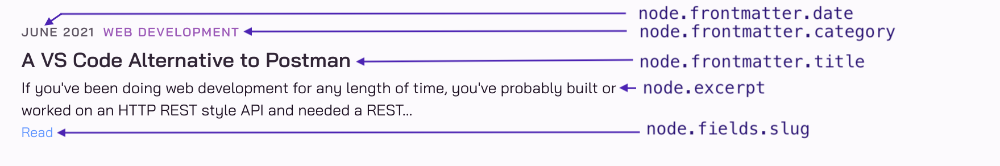

This is the fifth and final in a multi-part series of posts detailing how I built the search feature for this blog. This post will explain how to build a search UI with Gatsby, making use of the search service that we've built up throughout the earlier posts in this series.

In case you missed it:

* [Part 1: Search Introduction](../roll-your-own-search-service-for-gatsby-part1) covers the existing options for adding search to a Gatsby site, and why I decided not to use any of them, and instead build a custom search service.
* [Part 2: Search Index](../roll-your-own-search-service-for-gatsby-part2) covers the design and population of the `documents` table that contains all the content to be searched.
* [Part 3: Search Engine](../roll-your-own-search-service-for-gatsby-part3) provides an introduction to Postgres Full Text Search, showing some examples of using it to write queries to search against a documents table.
* [Part 4: Search API](../roll-your-own-search-service-for-gatsby-part4) explains how to expose an HTTP based search API using Rails and PostgreSQL, and how to deploy it.

## API Refresher

A quick reminder of where [Part 4: Search API](../roll-your-own-search-service-for-gatsby-part4) left off, the search API can be executed with a `GET` to the `/search` endpoint and any given `q` parameter to specify the search term. For example:

```http
GET {{host}}/search?q=tdd
Accept: application/json
```

Returns:

```http
HTTP/1.1 200 OK
Content-Type: application/json; charset=utf-8

[
  {
    "title": "TDD by Example",
    "description": "A practical example of using TDD to add a new feature to an existing project.",
    "category": "javascript",
    "published_at": "2021-01-02",
    "slug": "/blog/tdd-by-example/",
    "excerpt": "If youve been coding for any length of time, youve probably heard that you should test your code, and by that I mean writing automated…"
  },
  {
    "title": "TDD by Example: Fixing a Bug",
    "description": "A practical example of using TDD to fix a bug and do some refactoring on an existing project.",
    "category": "javascript",
    "published_at": "2021-05-16",
    "slug": "/blog/tdd-by-example-bugfix/",
    "excerpt": "This post will demonstrate an example of using TDD (test driven development) to fix a bug on an existing project. If youre not familiar…"
  },
  {
    "title": "Solving a Python Interview Question in Ruby",
    "description": "Learn how to model tuples in Ruby and solve a Python data science interview question in Ruby.",
    "category": "ruby",
    "published_at": "2021-03-01",
    "slug": "/blog/python-interview-question-in-ruby/",
    "excerpt": "A few months ago, I came across a tweet posing a technical interview question for a data science position using Python:  Lets set aside for…"
  }
]
```

This needs to be integrated with Gatsby. Even though it's a static site generator, it also ships with React and has full dynamic capabilities at run time. This means the pages/components can execute code like `await fetch('https://prod-host/search?q=tdd')...`, and use React hooks such as `useEffect` to load data from an endpoint (i.e. side effect) and `setState` to populate state such as a list of search results retrieved from the endpoint.

## Design

Before diving into the search components, the following diagram illustrates the search flow for an example user that wants to search for blog posts on "rails":


### Step 1

A new `search-input` component is added in the top navigation bar. The user can enter a search term into the input box, and hit <kbd>Enter</kbd> when ready to search.

### Step 2

The `search-input` will capture the value entered into the input box, and trigger navigation to the new search results page, passing along the `q` parameter which represents the search term.

It's important to ensure that the `q` parameter becomes part of the search results page url, i.e. `/search-results?q=rails`. This is to support a user wanting to bookmark the search results page for a particular search term or wanting to share the url.

### Step 3

The `search-results?q=rails` page will extract the search term value from the `q` parameter in the url (`rails` in this example). It will use this to execute a [fetch](https://developer.mozilla.org/en-US/docs/Web/API/Fetch_API) request against the Rails server search endpoint (see [Part 4: Search API](../roll-your-own-search-service-for-gatsby-part4) for more details about the server side).

The search results from the server get converted to a format expected by the existing `article-list` component, and passed in as props to that component. Then these results are rendered, including a "Read" link to the article whose `href` attribute is populated from the `slug` property of the search results.

## Search Input

Now let's take a closer look at each UI component, starting with the new `search-input`, which is added to the top navigation bar.

The input element has an `onKeyPress` event handler, which invokes a `search` function that checks if the <kbd>Enter</kbd> key has been pressed, and if so, navigates to the new `/search-results` page. This event handler has access to the current character code being entered via `event.charCode` and the complete value of the text entered in the input via `event.target.value`.

Notice that the argument to the `onKeyPress` attribute of the `<input>` element is a function, *not* the invocation of the function. Also notice that the entire text value is passed to the `/search-results` page with a template string `/search-results/?q=${text}`.

To navigate to a page programmatically, Gatsby provides the [navigate](https://www.gatsbyjs.com/docs/reference/built-in-components/gatsby-link/#how-to-use-the-navigate-helper-function) helper function.

For the magnifying glass icon displayed in the search input, I'm using the [react-icons](https://github.com/react-icons/react-icons) library, specifically the `MdSearch` icon from Material Design. This project uses css modules for scoped styles.

```js
// src/components/search-input.js

import React from 'react';
import { navigate } from 'gatsby';
import { MdSearch } from "react-icons/md";
import styles from "./search-input.module.css"

const ENTER_KEY_CODE = 13;

const SearchInput = () => {
  function search (charCode, text) {
    if (charCode === ENTER_KEY_CODE) {
      navigate(`/search-results/?q=${text}`);
    }
  }

  return (
    <div className={styles.wrapper}>
      <MdSearch size="1.7rem" />
      <input type="text"
            className={styles.search}
            aria-label="Search"
            placeholder="Search, eg: Rails"
            onKeyPress={(event) => search(event.charCode, event.target.value)} />
    </div>
  )
}

export default SearchInput
```

## Search Results

In Gatsby terms, this is a "page" rather than a component because it's the target of the router, and it lives in the `pages` project directory. But technically, it's still a React component. This page does all the heavy lifting of search so it's a little more involved than the `search-input` component.

### Parse Query

The first challenge is to extract the `q` parameter from the url to this page, which represents the search term. For example, if this page gets called with `/search-results?q=rails`, then it needs to set a variable `searchTerm` to the value "rails".

Surprisingly, I found this wasn't possible via the [reach-router](https://github.com/reach/router) alone. Gatsby's router is basically a wrapper around `reach-router`. I had to bring in the [query-string](https://github.com/sindresorhus/query-string) library to parse the query portion of the url.

Here is just the first snippet of the component to parse `searchTerm` out of the url using the `useLocation` hook provided by the `reach-router` and the `parse` method of the `query-string` library. Note that `location.search` refers to the `search` property of the `location` object returned by the `useLocation()` hook, not to be confused with the actual search term in the url. The `search` property of the `location` object refers to any portion of the url string after and including the `?`.

```js
// src/pages/search-results.js

import React from "react";
import { useLocation } from '@reach/router';
import queryString from 'query-string';
import Layout from "../components/layout"

// Example: Called with `/search-results?q=rails
const SearchResults = () => {
  const location = useLocation();
  const query = queryString.parse(location.search);
  const searchTerm = query.q
  // location.search = "?q=rails"
  // query = {q: "rails"}
  // searchTerm = "rails"

  return (
    <Layout>
      TBD...
    </Layout>
  )
}

export default SearchResults;
```

### Fetch Results

The next step is to fetch search results from the server for the `searchTerm` that was parsed out of the url. Since fetching data is considered a side effect, this code goes in a [useEffect](https://reactjs.org/docs/hooks-effect.html) hook.

Fetching the data will require an `async/await` function. When combining `async/await` with the `useEffect` hook in React, it's necessary to define the `async` function and invoke it directly in the hook. This gets a little messy so the actual function to get results from the server `getSearchResults` will be defined outside, and a smaller function that simply wraps this `fetchData` will be defined inside the `useEffect` hook.

I'm using the [Fetch API](https://developer.mozilla.org/en-US/docs/Web/API/Fetch_API) to get results from the search server.

`<Layout>` is an existing component used in this blog to render the top navigation and footer.

```js
// src/pages/search-results.js

import React, { useEffect } from "react";
import { useLocation } from '@reach/router';
import queryString from 'query-string';
import Layout from "../components/layout"

const SearchResults = () => {
  // Parse query from URL
  const location = useLocation();
  const query = queryString.parse(location.search);
  const searchTerm = query.q

  // This function will be called from within the useEffect hook.
  async function getSearchResults(query) {
    let json = []
    const response = await fetch(`https://prod.rails.host/search?q=${query}`, {
      method: 'GET',
      headers: {
        'Accept': 'application/json'
      }
    });
    if (response.ok) {
      json = await response.json();
    }
    return json;
  }

  useEffect(() => {
    // fetchData is simply a wrapper around getSearchResults.
    // This is needed due to how React handles async functions within useEffect hook.
    // `searchTerm` is what was parsed out of the URL
    // eg: `rails` for url `/search-results?q=rails`
    async function fetchData() {
      const searchResults = await getSearchResults(searchTerm);
      // Do something with search results
    }
    // Call the wrapper function directly within the useEffect hook.
    fetchData();
  }, [searchTerm]);


  return (
    <Layout>
      TBD...
    </Layout>
  )
}

export default SearchResults;
```

### Render Results

Now that the search results have been retrieved from the server, they need to be rendered. This site already has an `<ArticleList>` component that is used to display a list of articles such as on the home page or on the paginated blog pages. The goal is to re-use it to display search results. Here is what it looks like:


The `<ArticleList>` component expects a single prop `articles`, which is a list of "nodes", which are objects generated from the `gatsby-transformer-remark` plugin. These contain the metadata from the markdown content of each blog post (title, publish date, etc.). The reason for this is the blog pages are built statically during the Gatsby build process with a GraphQL query against the markdown content.

The `<ArticleList>` component iterates over the `articles` prop, which is an array of `node` objects, and renders an `<Article>` component for each node. Here is what an `<Article>` component looks like, a single entry in the `ArticleList`:



The code for the `ArticleList` component:

```js
import React from "react"
import styles from "./article-list.module.css"
import Article from "./article"

export default props => (
  <section className={styles.container}>
    {props.articles.map(({ node }) => (
      <Article
        key={node.id}
        id={node.id}
        to={node.fields.slug}
        title={node.frontmatter.title}
        category={node.frontmatter.category}
        date={node.frontmatter.date}
        excerpt={node.excerpt}
      />
    ))}
  </section>
)
```

One really cool thing about Gatsby is the same components can be re-used for dynamic content as well. All that's needed is to convert the search results from the search service into "node" objects expected by the `<ArticleList>` component, pass that in as the `articles` prop, and it will render dynamically.

In order to do that, in the `SearchResults` component, the `useState` hook is used to save the search results into a `list` variable, and then that gets converted to the format expected by `ArticleList` with a `toNodeArray` function.

```js
// src/pages/search-results.js

import React, { useEffect, useState } from "react";
import { useLocation } from '@reach/router';
import queryString from 'query-string';
import Layout from "../components/layout"
import ArticleList from "../components/article-list"
import styles from "./search-results.module.css"

const SearchResults = () => {
  const location = useLocation();
  const query = queryString.parse(location.search);
  const searchTerm = query.q

  // Used for saving search results within this component
  const [list, setList] = useState([]);

  async function getSearchResults(query) {
    // snip...
  }

  // Convert search results from search service to a format expected by ArticleList
  function toNodeArray(searchResults) {
    return searchResults.map(sr => {
      return {
        node: {
          excerpt: sr.excerpt,
          fields: {
            slug: sr.slug
          },
          frontmatter: {
            category: sr.category,
            date: sr.published_at,
            title: sr.title
          },
          id: sr.title
        }
      }
    })
  }

  useEffect(() => {
    async function fetchData() {
      const searchResults = await getSearchResults(searchTerm);
      // Save search results
      setList(searchResults);
    }
    fetchData();
  }, [searchTerm]);


  return (
    <Layout>
      <div className={styles.container}>
        <h2 className={styles.header}>Search Results For: <span className={styles.term}>{query.q}</span></h2>
        <ArticleList articles={toNodeArray(list)} />
      </div>
    </Layout>
  )
}

export default SearchResults;
```

And that's it, now the search results are displayed!

### Cleanup

The `SearchResults` component is getting a little messy having too much logic in it. It can be cleaned up by extracting the `getSearchResults` and `toNodeArray` functions into a search service module.

```js
// src/services/search.js

export async function getSearchResults(query) {
  let json = []
  const response = await fetch(`https://prod.rails.host/search?q=${query}`, {
    method: 'GET',
    headers: {
      'Accept': 'application/json'
    }
  });
  if (response.ok) {
    json = await response.json();
  }
  return json;
}

export function toNodeArray(searchResults) {
  return searchResults.map(sr => {
    return {
      node: {
        excerpt: sr.excerpt,
        fields: {
          slug: sr.slug
        },
        frontmatter: {
          category: sr.category,
          date: sr.published_at,
          title: sr.title
        },
        id: sr.title
      }
    }
  })
}
```

And now this function can be used in the search results component with less clutter:

```js
// src/pages/search-results.js

import React, { useEffect, useState } from "react";
import { Link } from 'gatsby';
import { useLocation } from '@reach/router';
import queryString from 'query-string';

// Use utility functions from a service to avoid cluttering up this component
import { getSearchResults, toNodeArray } from '../services/search';

import Layout from "../components/layout"
import ArticleList from "../components/article-list"
import styles from "./search-results.module.css"

const SearchResults = () => {
  const location = useLocation();
  const query = queryString.parse(location.search);
  const searchTerm = query.q
  const [list, setList] = useState([]);

  useEffect(() => {
    async function fetchData() {
      const searchResults = await getSearchResults(searchTerm);
      setList(searchResults);
    }
    fetchData();
  }, [searchTerm]);

  return (
    <Layout>
      <div className={styles.container}>
        <h2 className={styles.header}>Search Results For: <span className={styles.term}>{query.q}</span></h2>
        <ArticleList articles={toNodeArray(list)} />
      </div>
    </Layout>
  )
}

export default SearchResults;
```

## Conclusion

TBD...

This concludes the multi-part series on rolling your own search service for a static site...