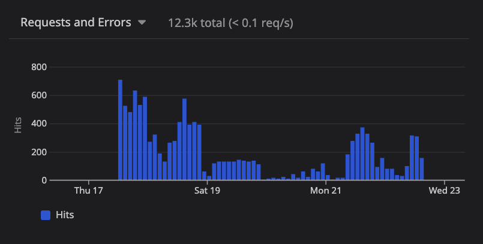
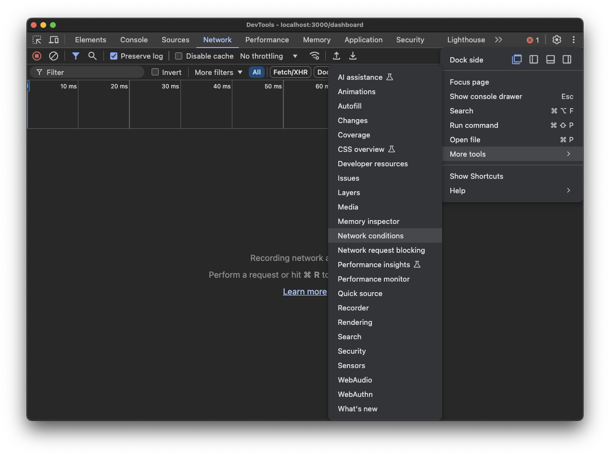
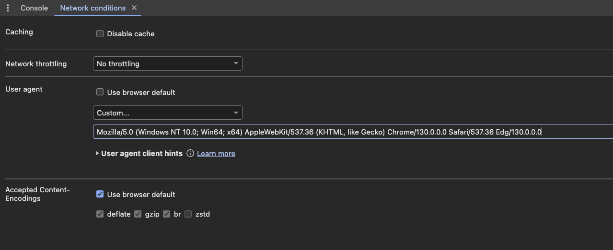
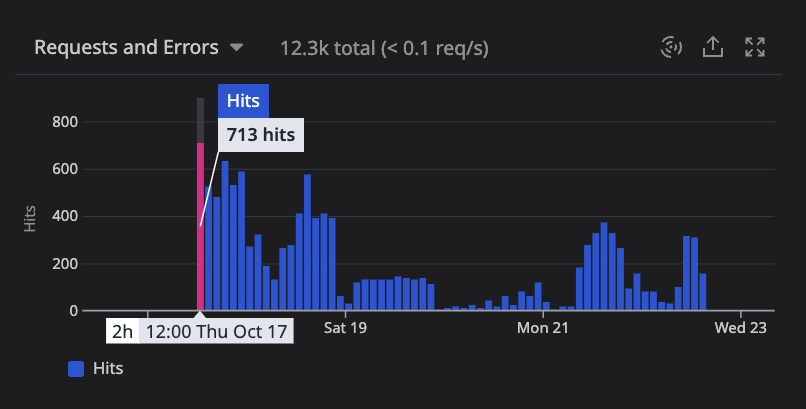
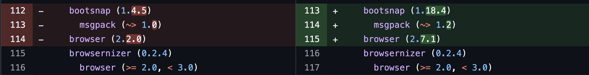

Recently, I encountered a perplexing issue: customers using Microsoft Edge could no longer access the Rails app I maintain. Instead, they were redirected to our `/unsupported_browser` page, which advises users to switch to Chrome, Firefox, or Safari. This wasn’t just an inconvenience, it was a major blocker for some users who relied exclusively on Edge. Here’s the story of how I debugged and fixed the problem.

## The Issue

A user reported that they were being redirected to the `/unsupported_browser` page on Edge, despite having used the app for years without issues. This behavior was unexpected because Microsoft Edge, being  [Chromium-based since January 2020](https://support.microsoft.com/en-us/microsoft-edge/download-the-new-microsoft-edge-based-on-chromium-0f4a3dd7-55df-60f5-739f-00010dba52cf), is a modern browser and fully compatible with our app.

To understand why Edge users were being blocked, I started by identifying where the `/unsupported_browser` page was being rendered in the Rails app. The `bin/rails routes` command lists all routes defined in the application, and the `-g` (grep) flag filters the results to only those matching the given string or regular expression:

```bash
bin/rails routes -g "unsupported_browser"

#              Prefix Verb URI Pattern                    Controller#Action
# unsupported_browser GET  /unsupported_browser(.:format) pages#unsupported_browser
```

The results above indicated that the `/unsupported_browser` url is handled by the `unsupported_browser` method in the `PagesController`.

I was curious to determine if this was an isolated issue affecting only one user, or if other users were experiencing the same problem, so I turned my attention to our observability tool to investigate traffic patterns.

## One User or Many?

 This app uses Datadog APM for observability, with the datadog gem and auto instrumentation enabled. This makes any `Controller#action` available as a Resource in the Services section.

The top of every resource page in Datadog shows some summary graphs, including the number of requests to this resource over a period of time. The resource page for `PagesController#unsupported_browser` in Datadog showed a sharp increase in the number of requests over the past few days:



The resource page in Datadog also includes a list of traces it captured for this request. Since it's a rack request, Datadog also captures the User Agent string. Here are a few examples of User Agent strings I found for the `/unsupported_browser` request:

```
Mozilla/5.0 (Windows NT 10.0; Win64; x64) AppleWebKit/537.36 (KHTML, like Gecko) Chrome/129.0.0.0 Safari/537.36 Edg/129.0.0.0
Mozilla/5.0 (Windows NT 10.0; Win64; x64) AppleWebKit/537.36 (KHTML, like Gecko) Chrome/129.0.0.0 Safari/537.36 Edg/130.0.0.0
```

Using [ua-parser-js](https://www.npmjs.com/package/ua-parser-js), revealed that these were modern versions of Microsoft Edge. For example:

```bash
npx ua-parser-js "Mozilla/5.0 (Windows NT 10.0; Win64; x64) AppleWebKit/537.36 (KHTML, like Gecko) Chrome/129.0.0.0 Safari/537.36 Edg/129.0.0.0"
```
```json
[
    {
        "ua": "Mozilla/5.0 (Windows NT 10.0; Win64; x64) AppleWebKit/537.36 (KHTML, like Gecko) Chrome/129.0.0.0 Safari/537.36 Edg/129.0.0.0",
        "browser": {
            "name": "Edge",
            "version": "129.0.0.0",
            "major": "129"
        },
        "cpu": {
            "architecture": "amd64"
        },
        "device": {},
        "engine": {
            "name": "Blink",
            "version": "129.0.0.0"
        },
        "os": {
            "name": "Windows",
            "version": "10"
        }
    }
]
```

## Reproducing the Issue

The next step was to see if I could reproduce the issue. From the user agent string analysis, it appeared to only be affecting Microsoft Edge users on Windows 10. While it is possible to install the Microsoft Edge browser on a Mac, I was concerned that the User Agent string wouldn't be exactly the same from a Mac vs Windows.

Fortunately, it's possible using Chrome (my default browser on Mac) to send an alternate User Agent string. With the Developer Tools open, select the Network tab, then click on the three vertical dots at the top right, and select More Tools, then Network Conditions as shown in the screenshot below:



This opens up the Network Conditions sub-panel. Here you can uncheck the "Use browser default" option in the "User agent" section. Then you can fill in any string you'd like. Here is where I filled in one of the example User Agent strings I had retrieved from Datadog for Microsoft Edge on Windows 10:



What this does is for any subsequent network requests, while devtools is open, it will send your custom User Agent string to the server instead of your actual browser/device User Agent string.

With this in place, when I refreshed the app, I was redirected to `/unsupported_browser`, just like some of our users were experiencing. This was good news - it's much easier to troubleshoot a reproducible issue.

## When did it Start?

With the issue now reproducible, the next logical question was: Why were users only encountering this problem recently?

To answer that, I took a closer look at the Datadog requests over time graph, and noticed that there was a very distinct date when these requests started, as highlighted below:



This just happened to be the exact same date we had released a major Ruby upgrade from 2.x to 3.x!


Armed with steps to reproduce, and an idea of the most recent change that might have broken things, I could start digging into the code to find the root cause.

## Digging Into the Code

I started by looking into the code that renders the `/unsupported_browser` path, including the router, controller, and view:

```ruby
# config/routes.rb
Rails.application.routes.draw do
  get "/unsupported_browser", to: "pages#unsupported_browser"
end
```

```ruby
# app/controllers/pages_controller.rb
class PagesController < ApplicationController
  def unsupported_browser
  end
end
```

```erb
<%# app/views/pages/unsupported_browser.html.erb %>
<div>
  Content to display please use one of the browsers below...
</div>
```

But there was nothing remarkable in any of the above code: No recent changes as a result of the Ruby upgrade, and not even any logic, just static display. I also checked the base `ApplicationController` but nothing relevant there either.

So the next question was, what was directing some requests to the `/unsupported_browser` path? In absence of any obvious logic in the application code, the answer could be in [rack middleware](https://stackoverflow.com/questions/2256569/what-is-rack-middleware), which can filter and modify http requests and responses.

To view the list of middleware currently configured for a Rails app, you can run `bin/rails middleware`. I ran this looking for anything that wasn't out-of-the-box Rails like `ActionDispatch::...` or `Rack::...`, and possibly related to browser detection.

I found this:

```bash
bin/rails middleware
# usual Rails things...
# use Browsernizer::Router
```

The `Browsernizer::Router` middleware comes from the [browsernizer](https://github.com/assembler/browsernizer) gem (which depends on the [browser](https://github.com/fnando/browser) gem). These two gems are used to detect browsers and redirect unsupported ones. Looking at the `Gemfile`, I discovered our app does indeed use this gem.

And reviewing the `Gemfile.lock` changes from the Ruby upgrade revealed that while `browsernizer` hadn’t changed, its dependency, `browser`, was updated from version 2.2.0 to 2.7.1. This can be viewed in the snippet of the git diff below:



Definitely getting closer...

The browsernizer middleware is configured in an initializer as follows:

```ruby
# config/initializers/browsernizer.rb
Rails.application.config.middleware.use Browsernizer::Router do |config|
  config.supported "Internet Explorer", false
  config.supported "Microsoft Edge", false

  config.location  "/unsupported_browser"
  config.exclude   %r{^/assets}
end
```
At first glance, it appeared that Microsoft Edge was intentionally marked as unsupported. However, this configuration was introduced eight years ago, back when Edge was more like Internet Explorer. At the time, this rule made sense for this particular app. And the `browser` gem v2.2.0 was also released 8 years ago.

<aside class="markdown-aside">
This app's front end is built with Backbone and Marionette, which historically had compatibility issues with older browsers like IE8, prompting the decision to block both Internet Explorer and Edge in the initial configuration. Browser support was improved in Marionette around 2019, but this app is over 8 years old, and at that time support for older browsers was not the case. This <a class="markdown-link" href="https://github.com/marionettejs/backbone.marionette/issues/3658">GitHub issue</a> and <a class="markdown-link" href="https://github.com/marionettejs/backbone.marionette/blob/master/test/rollup.config.js#L24-L30">test configuration</a> have more details.
</aside>

But in January 2020, Microsoft modified their Edge browser to be Chromium based, which would have also modified the User Agent string that browser was sending. However, this app had remained on the older version of the `browser` gem (v2.2.0) during this transition.

## Identify Root Cause

With the older `browser` gem (v2.2.0), Chromium-based Edge wasn’t recognized as "Microsoft Edge" due to differences in User-Agent parsing. This version of the gem was released 8 years ago, prior to the existence of Chromium-based Edge, so it couldn't have been detected as such.

This unintentional gap allowed Chromium-based Edge users to bypass the block because the v2.2.0 version of `browser` incorrectly identified Chromium-based Edge as "Chrome". After the Ruby upgrade, the newer `browser` gem (v2.7.1) correctly identified *all* Edge browsers - Chromium-based or not, therefore triggering the block for all versions of Edge, which was not intended.

To verify this, I setup a Ruby project with the older 2.2.0 version of the `browser` gem as follows:

```ruby
# Gemfile
source "https://rubygems.org"
gem "browser", "2.2.0"
```

```ruby
# main.rb
require "browser"

# Modern (i.e. Chromium-based) MS Edge
user_agent = "Mozilla/5.0 (Windows NT 10.0; Win64; x64) AppleWebKit/537.36 (KHTML, like Gecko) Chrome/129.0.0.0 Safari/537.36 Edg/130.0.0.0"

# Let's see what the older browser gem makes of Chromium-based Edge:
browser = Browser.new(user_agent, accept_language: "en-us")

puts "Browser name: #{browser.name}"
# Browser name: Chrome

puts "Is this Edge? #{browser.edge?}"
# Is this Edge? (no further output so must be nil)

puts "Is this Chrome? #{browser.chrome?}"
# Is this Chrome? true
```

As shown from the above output, v2.2.0 of `browser` gem was identifying Chromium-based Edge as Chrome, and so this browser was bypassing the blocks setup in `config/initializers/browsernizer.rb`.

Then I setup another Ruby project, this time with the 2.7.1 version of the browser gem that the project had been updated to as part of the upgrade project:

```ruby
# Gemfile
source "https://rubygems.org"
gem "browser", "2.7.1"
```

```ruby
# main.rb
require "browser"

# Modern (i.e. Chromium-based) MS Edge
user_agent = "Mozilla/5.0 (Windows NT 10.0; Win64; x64) AppleWebKit/537.36 (KHTML, like Gecko) Chrome/129.0.0.0 Safari/537.36 Edg/130.0.0.0"

# Let's see what the newer browser gem makes of Chromium-based Edge:
browser = Browser.new(user_agent, accept_language: "en-us")

puts "Browser name: #{browser.name}"
# Browser name: Microsoft Edge

puts "Is this Edge? #{browser.edge?}"
# Is this Edge? true

puts "Is this Chrome? #{browser.chrome?}"
# Is this Chrome? false
```

As shown from the above output, v2.7.1 of the `browser` gem was now identifying Chromium-based Edge as Microsoft Edge, which was then getting blocked by `config/initializers/browsernizer.rb`.

## Implementing the Fix

The real requirement was to:

1. Block Internet Explorer.
2. Block non-Chromium-based Edge.
3. Allow all Chromium-based browsers, including modern Edge.

Unfortunately, the `browsernizer` gem hasn’t been updated to support the latest `browser` gem versions, where a convenient `chromium_based?` method exists. To work around this, I implemented a custom check for Chromium-based Edge in our browsernizer configuration, based on the most recent version of `browser` gem:

```ruby
# config/initializers/browsernizer.rb
Rails.application.config.middleware.use Browsernizer::Router do |config|
  # Block IE
  config.supported "Internet Explorer", false

  # Dynamic check for all other browsers
  config.supported do |browser|
    if browser.edge?
      browser.ua.match?(/\bEdg\b/) # Allow Chromium-based Edge
    else
      true
    end
  end

  config.location  "/unsupported_browser"
  config.exclude   %r{^/assets}
end
```

With this fix in place, I repeated the manual testing I had been doing with Chrome dev tools and sending the Chromium-based Edge User Agent string, and this time I was allowed to get into the app.

## Ensuring the Bug Stays Fixed

But it's not enough to only deliver a code fix. We also need some tests to ensure this stays fixed.

This project does have decent system/feature test coverage with [Capybara](https://github.com/teamcapybara/capybara) and [Cuprite](https://github.com/rubycdp/cuprite), which is a pure Ruby driver for Capybara. But Cuprite is Chrome only, so at first glance, it seems like it wouldn't be possible to have an automated test to verify other browsers.

However, remembering my earlier experiment with Chrome dev tools to simulate the error condition by sending a different User Agent string, I had an idea that maybe the same thing could be done with a feature test, if there was a way to modify the User Agent string sent in request header.

It turns out, Cuprite does indeed support [modifying request headers](https://github.com/rubycdp/cuprite?tab=readme-ov-file#request-headers). The code sample they provide helpfully includes an example for changing the user agent string, which is exactly what I wanted to do:

```ruby
page.driver.headers # => {}
page.driver.headers = { "User-Agent" => "Cuprite" }
page.driver.add_headers("Referer" => "https://example.com")
page.driver.headers # => { "User-Agent" => "Cuprite", "Referer" => "https://example.com" }
```

This allowed me to write a test to simulate a user visiting the root path "/" from any number of different browsers, differentiated only by the User Agent string. If a browser is supported, then the test expects that the user should be redirected to "/login", otherwise, "/unsupported_browser":

```ruby
# spec/features/user_agent_spec.rb
require "rails_helper"

feature "Browser support based on User Agent", :js do
  def visit_with_user_agent(user_agent)
    page.driver.headers = { "User-Agent" => user_agent }
    visit "/"
  end

  scenario "Old Edge (non-Chromium) should not be allowed" do
    old_edge_ua = "Mozilla/5.0 (Windows NT 10.0; Win64; x64) AppleWebKit/537.36 (KHTML, like Gecko) Edge/16.16299"
    visit_with_user_agent(old_edge_ua)
    expect(page).to have_current_path("/unsupported_browser")
  end

  scenario "New Edge (Chromium-based) should be allowed" do
    new_edge_ua = "Mozilla/5.0 (Windows NT 10.0; Win64; x64) AppleWebKit/537.36 (KHTML, like Gecko) Chrome/126.0.0.0 Safari/537.36 Edg/126.0.0.0"
    visit_with_user_agent(new_edge_ua)
    expect(page).to have_current_path("/login")
  end

  scenario "Chrome should be allowed" do
    chrome_ua = "Mozilla/5.0 (Windows NT 10.0; Win64; x64) AppleWebKit/537.36 (KHTML, like Gecko) Chrome/91.0.4472.124 Safari/537.36"
    visit_with_user_agent(chrome_ua)
    expect(page).to have_current_path("/login")
  end

  scenario "Firefox should be allowed" do
    firefox_ua = "Mozilla/5.0 (Windows NT 10.0; Win64; x64; rv:90.0) Gecko/20100101 Firefox/90.0"
    visit_with_user_agent(firefox_ua)
    expect(page).to have_current_path("/login")
  end

  scenario "Safari should be allowed" do
    safari_ua = "Mozilla/5.0 (Macintosh; Intel Mac OS X 10_15_7) AppleWebKit/605.1.15 (KHTML, like Gecko) Version/14.1.1 Safari/605.1.15"
    visit_with_user_agent(safari_ua)
    expect(page).to have_current_path("/login")
  end

  scenario "Internet Explorer should not be allowed" do
    ie_ua = "Mozilla/5.0 (compatible; MSIE 10.0; Windows NT 6.1; Trident/6.0)"
    visit_with_user_agent(ie_ua)
    expect(page).to have_current_path("/unsupported_browser")
  end
end
```

These tests ensure that future updates won’t reintroduce the bug.

## Lessons Learned

TODO: This section needs work

1. **Legacy Configurations Need Periodic Reviews**: The `browsernizer` configuration was a time bomb waiting for the right conditions to trigger issues.
2. **Test Browser Compatibility**: Incorporating tests with simulated User-Agent strings is invaluable for avoiding browser-specific regressions.
3. **Keep Dependencies Up-to-Date**: Stagnant gems like `browsernizer` can lead to tech debt and compatibility issues.
4. **Debugging Tools Are Your Friend**: Chrome DevTools’ ability to simulate User-Agent strings was critical to reproducing the issue.

## TODO
* Annotate `chrome-devtools-custom-user-agent-string.png` with arrow pointing to what to uncheck and where to custom fill in
* Aside: Datadog/APM terminology - link to a good learning resource for those unfamiliar
* Aside: Mention browsernizer hasn't been updated in 8 years, careful with bringing in gems that don't get regularly updated, we may in the future want to remove this dependency and use browser gem directly for browser detection.
* Aside: Browserstack is useful for testing on a variety of real browsers, our team might invest in a few licenses for the future.
* Conclusion or maybe call it Lessons Learned - careful with bringing in gems that may no longer be maintained, especially if all they do is provide a lightweight wrapper around a well-maintained/popular gem. Do maintain the system tests as much as possible, because relying on manual testing will slow you down tremendously as app size grows. Anything else?
* Consistency in browser naming re: Edge, MS Edge, Microsoft Edge.
* edit
* Updated related to include Datadog Heroku post, should be published by then
