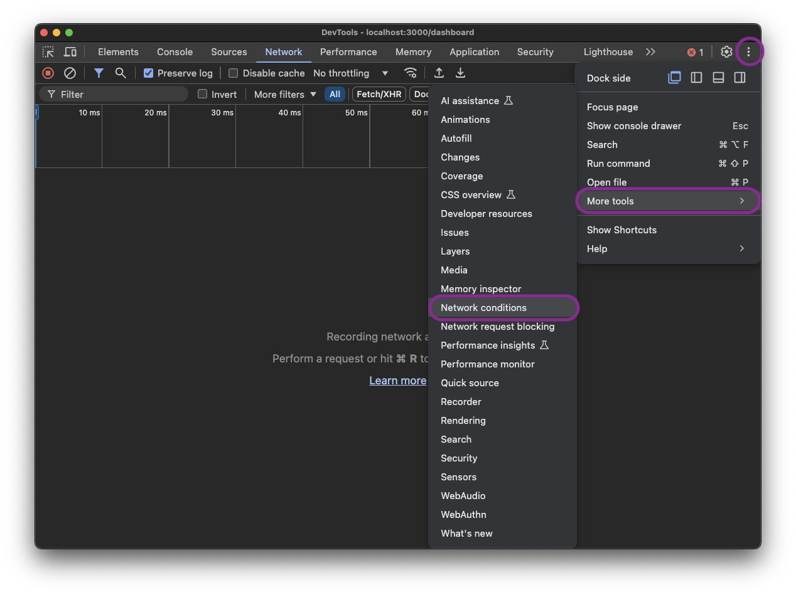

Recently, I encountered a strange issue on a legacy Rails application I maintain: Customers using Microsoft Edge could no longer access the site. Instead, they were redirected to the `/unsupported_browser` page, which advises users to switch to Chrome, Firefox, or Safari. This wasn’t just an inconvenience, it was a major blocker for some users who relied exclusively on Edge. This post will walk through the debugging steps and resolution.

## The Issue

A user reported that they were being redirected to the `/unsupported_browser` page on Edge, despite having used the app for years without issues. This behavior was unexpected because Microsoft Edge, being  [Chromium-based since January 2020](https://support.microsoft.com/en-us/microsoft-edge/download-the-new-microsoft-edge-based-on-chromium-0f4a3dd7-55df-60f5-739f-00010dba52cf), is a modern browser and fully compatible with this application.

To understand why Edge users were being blocked, I started by identifying where the `/unsupported_browser` page was being rendered in the Rails app. The `bin/rails routes` command lists all routes defined in the application, and the `-g` (grep) flag filters the results to only those matching the given string or regular expression:

```bash
bin/rails routes -g "unsupported_browser"

#              Prefix Verb URI Pattern                    Controller#Action
# unsupported_browser GET  /unsupported_browser(.:format) pages#unsupported_browser
```

The results above indicated that the `/unsupported_browser` url is handled by the `unsupported_browser` method in the `PagesController`.

I was curious to determine if this was an isolated issue affecting only one user, or if other users were experiencing the same problem, so I turned my attention to our observability tool to investigate traffic patterns.

## One User or Many?

 This app uses [Datadog APM](https://docs.datadoghq.com/tracing/) for observability, with the [datadog gem](https://github.com/DataDog/dd-trace-rb) and auto instrumentation enabled. This makes any Rails `Controller#action` available as a Resource in the Services section.

The top of every resource page in Datadog shows some summary graphs, including the number of requests to this resource over a period of time. The resource page for `PagesController#unsupported_browser` in Datadog showed a sharp increase in the number of requests over the past week:


The resource page in Datadog also includes a list of traces it captured for this request. Since it's a [rack](https://www.writesoftwarewell.com/definitive-guide-to-rack/) request, Datadog also captures the User Agent string. Here are a few examples of User Agent strings I found for the `/unsupported_browser` request:

```
Mozilla/5.0 (Windows NT 10.0; Win64; x64) AppleWebKit/537.36 (KHTML, like Gecko) Chrome/129.0.0.0 Safari/537.36 Edg/129.0.0.0
Mozilla/5.0 (Windows NT 10.0; Win64; x64) AppleWebKit/537.36 (KHTML, like Gecko) Chrome/129.0.0.0 Safari/537.36 Edg/130.0.0.0
```

Using [ua-parser-js](https://www.npmjs.com/package/ua-parser-js), revealed that these were modern versions of Microsoft Edge. For example:

```bash
npx ua-parser-js "Mozilla/5.0 (Windows NT 10.0; Win64; x64) AppleWebKit/537.36 (KHTML, like Gecko) Chrome/129.0.0.0 Safari/537.36 Edg/129.0.0.0"
```
```json
[
    {
        "ua": "Mozilla/5.0 (Windows NT 10.0; Win64; x64) AppleWebKit/537.36 (KHTML, like Gecko) Chrome/129.0.0.0 Safari/537.36 Edg/129.0.0.0",
        "browser": {
            "name": "Edge",
            "version": "129.0.0.0",
            "major": "129"
        },
        "cpu": {
            "architecture": "amd64"
        },
        "device": {},
        "engine": {
            "name": "Blink",
            "version": "129.0.0.0"
        },
        "os": {
            "name": "Windows",
            "version": "10"
        }
    }
]
```

## Reproducing the Issue

The next step was to see if I could reproduce the issue. From the User Agent string analysis, it appeared to only be affecting Microsoft Edge users on Windows 10. While it is possible to install the Microsoft Edge browser on a Mac, I was concerned that the User Agent string wouldn't be exactly the same from a Mac vs Windows.

Fortunately, it's possible using Chrome (my default browser on Mac) to send an alternate User Agent string. With the Developer Tools open, select the Network tab, then click on the three vertical dots at the top right, and select More Tools, then Network Conditions as shown in the screenshot below:



This opens up the Network Conditions sub-panel. Here you can uncheck the "Use browser default" option in the "User agent" section. Then you can fill in any string you'd like. Here is where I filled in one of the example User Agent strings I had retrieved from Datadog for Microsoft Edge on Windows 10:


For any network requests made while Developer Tools is open, the browser will now send your custom User Agent string to the server instead of the one normally associated with your browser or device.

With this setup, refreshing the browser with the url at the application home page, redirected me to `/unsupported_browser`, confirming that I had successfully reproduced the issue our users were encountering. This was great news because having a reproducible issue makes troubleshooting significantly easier.

## When Did it Start?

With the issue now reproducible, the next logical question was: Why were users only encountering this problem recently? i.e. this application has been running in production for years, why was this problem starting now?

To answer that, I took a closer look at the Datadog requests over time graph, and noticed that there was a very distinct date when these requests started, as highlighted below:


This just happened to be the exact same date we had released a major Ruby upgrade from 2.x to 3.x!


Armed with steps to reproduce, and an idea of the most recent change that might have broken things, I could start digging into the code to find the root cause.

## Digging Into the Code

I started by looking into the code that renders the `/unsupported_browser` path, including the router, controller, and view:

```ruby
# config/routes.rb
Rails.application.routes.draw do
  get "/unsupported_browser", to: "pages#unsupported_browser"
end
```

```ruby
# app/controllers/pages_controller.rb
class PagesController < ApplicationController
  # no logic here means this will render: app/views/pages/unsupported_browser.html.erb
  def unsupported_browser
  end
end
```

```erb
<%# app/views/pages/unsupported_browser.html.erb %>
<div>
  Content to display please use one of the browsers below...
</div>
```

But there was nothing remarkable in any of the above code: No recent changes as a result of the Ruby upgrade, and not even any logic, just static display. I also checked the base `ApplicationController` but nothing relevant there either.

So the next question was, what was directing some requests to the `/unsupported_browser` path? In absence of any obvious logic in the application code, the answer could be in [rack middleware](https://stackoverflow.com/questions/2256569/what-is-rack-middleware), which can filter and modify http requests and responses.

To view the list of middleware currently configured for a Rails app, you can run `bin/rails middleware`. I ran this looking for anything that wasn't out-of-the-box Rails like `ActionDispatch::...` or `Rack::...`, and possibly related to browser detection.

I found this:

```bash
bin/rails middleware
# usual Rails things...
# use Browsernizer::Router
```

The `Browsernizer::Router` middleware comes from the [browsernizer](https://github.com/assembler/browsernizer) gem (which depends on the [browser](https://github.com/fnando/browser) gem). This gem is used to detect browsers and redirect unsupported ones. Looking at the `Gemfile`, I discovered our app does indeed use this gem.

And reviewing the `Gemfile.lock` changes from the Ruby upgrade revealed that while `browsernizer` hadn’t changed, its dependency, `browser`, was updated from version 2.2.0 to 2.7.1. This can be viewed in the snippet of the git diff below:


Definitely getting closer...


The browsernizer middleware is configured in an initializer as follows:

```ruby
# config/initializers/browsernizer.rb
Rails.application.config.middleware.use Browsernizer::Router do |config|
  config.supported "Internet Explorer", false
  config.supported "Microsoft Edge", false

  config.location  "/unsupported_browser"
  config.exclude   %r{^/assets}
end
```
At first glance, it appeared that Microsoft Edge was intentionally marked as unsupported. However, this configuration was introduced eight years ago, back when Microsoft Edge was more like Internet Explorer. At the time, this rule made sense for this particular app.

<aside class="markdown-aside">
This app's front end is built with Backbone and Marionette, which historically had compatibility issues with older browsers like IE8, prompting the decision to block both Internet Explorer and Edge in the initial configuration. Browser support was improved in Marionette around 2019, but this app is over 8 years old, and at that time support for older browsers was not the case. This <a class="markdown-link" href="https://github.com/marionettejs/backbone.marionette/issues/3658">GitHub issue</a> and <a class="markdown-link" href="https://github.com/marionettejs/backbone.marionette/blob/master/test/rollup.config.js#L24-L30">test configuration</a> have more details.
</aside>

In January 2020, Microsoft modified their Edge browser to be Chromium based, which would have also modified the User Agent string that browser was sending. However, this app had remained on an older version of the `browser` gem (v2.2.0) during this transition.

## Identify Root Cause

With the older `browser` gem (v2.2.0), Chromium-based Edge wasn’t recognized as "Microsoft Edge" due to differences in User-Agent parsing. This version of the gem was released 8 years ago, prior to the existence of Chromium-based Edge, so it couldn't have been detected as such.

This unintentional gap allowed Chromium-based Edge users to bypass the block because the v2.2.0 version of `browser` incorrectly identified Chromium-based Edge as "Chrome". After the Ruby upgrade, the newer `browser` gem (v2.7.1) correctly identified *all* Edge browsers - Chromium-based or not as "Edge". This started triggering the block for all versions of Edge, which was not intended.

To verify this, I setup a Ruby project with the older 2.2.0 version of the `browser` gem as follows:

```ruby
# Gemfile
source "https://rubygems.org"
gem "browser", "2.2.0"
```

```ruby
# main.rb
require "browser"

# Modern (i.e. Chromium-based) MS Edge
user_agent = "Mozilla/5.0 (Windows NT 10.0; Win64; x64) AppleWebKit/537.36 (KHTML, like Gecko) Chrome/129.0.0.0 Safari/537.36 Edg/130.0.0.0"

# Let's see what the older browser gem makes of Chromium-based Edge:
browser = Browser.new(user_agent, accept_language: "en-us")

puts "Browser name: #{browser.name}"
# Browser name: Chrome

puts "Is this Edge? #{browser.edge?}"
# Is this Edge? (no further output so must be nil)

puts "Is this Chrome? #{browser.chrome?}"
# Is this Chrome? true
```

As shown from the above output, v2.2.0 of `browser` gem was identifying Chromium-based Edge as Chrome. This is what had allowed Chromium-based Edge users to bypass the block setup in `config/initializers/browsernizer.rb` for all these years.

Then I setup another Ruby project, this time with the v2.7.1 version of the `browser` gem that the project had been updated to as part of the upgrade:

```ruby
# Gemfile
source "https://rubygems.org"
gem "browser", "2.7.1"
```

```ruby
# main.rb
require "browser"

# Modern (i.e. Chromium-based) MS Edge
user_agent = "Mozilla/5.0 (Windows NT 10.0; Win64; x64) AppleWebKit/537.36 (KHTML, like Gecko) Chrome/129.0.0.0 Safari/537.36 Edg/130.0.0.0"

# Let's see what the newer browser gem makes of Chromium-based Edge:
browser = Browser.new(user_agent, accept_language: "en-us")

puts "Browser name: #{browser.name}"
# Browser name: Microsoft Edge

puts "Is this Edge? #{browser.edge?}"
# Is this Edge? true

puts "Is this Chrome? #{browser.chrome?}"
# Is this Chrome? false
```

As shown from the above output, v2.7.1 of the `browser` gem was now identifying Chromium-based Edge as Microsoft Edge, which was then getting blocked by `config/initializers/browsernizer.rb`.

## Implementing the Fix

The intention of the browser detection middleware was to:

1. Block Internet Explorer.
2. Block non-Chromium-based Edge.
3. Allow all Chromium-based browsers, including modern Edge.

Unfortunately, the `browsernizer` gem hasn’t been updated to support the latest `browser` gem versions, where a convenient `chromium_based?` method exists. To work around this, I implemented a custom check for Chromium-based Edge in our browsernizer configuration, based on the most recent version of `browser` gem:

```ruby
# config/initializers/browsernizer.rb
Rails.application.config.middleware.use Browsernizer::Router do |config|
  # Block IE
  config.supported "Internet Explorer", false

  # Dynamic check for all other browsers
  config.supported do |browser|
    if browser.edge?
      browser.ua.match?(/\bEdg\b/) # Allow Chromium-based Edge
    else
      true
    end
  end

  config.location  "/unsupported_browser"
  config.exclude   %r{^/assets}
end
```

With this fix in place, I repeated the manual testing I had been doing with Chrome dev tools and sending the Chromium-based Edge User Agent string, and this time I was allowed to get into the app.

<aside class="markdown-aside">
Longer term we may consider replacing the `browsernizer` gem with a custom solution since it's no longer maintained. We could instead use the `browser` gem directly and implement our own middleware, since the `browser` gem is actively maintained.
</aside>

## Ensuring the Bug Stays Fixed

But it's not enough to only deliver a code fix. We also need some tests to ensure this stays fixed.

This project has system test coverage with [Capybara](https://github.com/teamcapybara/capybara) and [Cuprite](https://github.com/rubycdp/cuprite), which is a pure Ruby driver for Capybara. But Cuprite is Chrome only, so at first glance, it seems like it wouldn't be possible to have an automated test to verify other browsers.

However, remembering my earlier [experiment with Chrome developer tools](../ruby-upgrade-broke-ms-edge#reproducing-the-issue) to simulate the error condition by sending a different User Agent string, I had an idea that maybe the same thing could be done with a feature test.

It turns out, Cuprite supports [modifying request headers](https://github.com/rubycdp/cuprite?tab=readme-ov-file#request-headers). The documentation includes an example for changing the User Agent string, which is exactly what I wanted to do:

```ruby
# From Cuprite README.md -> Request headers
page.driver.headers # => {}
page.driver.headers = { "User-Agent" => "Cuprite" }
page.driver.add_headers("Referer" => "https://example.com")
page.driver.headers # => { "User-Agent" => "Cuprite", "Referer" => "https://example.com" }
```

This allowed me to write a system test to simulate a user visiting the root path `"/"` from any number of different browsers, differentiated only by the User Agent string. If a browser is supported, then the test expects that the user should be redirected to `"/login"`, otherwise, `"/unsupported_browser"`:

```ruby
# spec/features/user_agent_spec.rb
require "rails_helper"

feature "Browser support based on User Agent", :js do
  def visit_with_user_agent(user_agent)
    page.driver.headers = { "User-Agent" => user_agent }
    visit "/"
  end

  scenario "Old Edge (non-Chromium) should not be allowed" do
    old_edge_ua = "Mozilla/5.0 (Windows NT 10.0; Win64; x64) AppleWebKit/537.36 (KHTML, like Gecko) Edge/16.16299"
    visit_with_user_agent(old_edge_ua)
    expect(page).to have_current_path("/unsupported_browser")
  end

  scenario "New Edge (Chromium-based) should be allowed" do
    new_edge_ua = "Mozilla/5.0 (Windows NT 10.0; Win64; x64) AppleWebKit/537.36 (KHTML, like Gecko) Chrome/126.0.0.0 Safari/537.36 Edg/126.0.0.0"
    visit_with_user_agent(new_edge_ua)
    expect(page).to have_current_path("/login")
  end

  scenario "Chrome should be allowed" do
    chrome_ua = "Mozilla/5.0 (Windows NT 10.0; Win64; x64) AppleWebKit/537.36 (KHTML, like Gecko) Chrome/91.0.4472.124 Safari/537.36"
    visit_with_user_agent(chrome_ua)
    expect(page).to have_current_path("/login")
  end

  scenario "Firefox should be allowed" do
    firefox_ua = "Mozilla/5.0 (Windows NT 10.0; Win64; x64; rv:90.0) Gecko/20100101 Firefox/90.0"
    visit_with_user_agent(firefox_ua)
    expect(page).to have_current_path("/login")
  end

  scenario "Safari should be allowed" do
    safari_ua = "Mozilla/5.0 (Macintosh; Intel Mac OS X 10_15_7) AppleWebKit/605.1.15 (KHTML, like Gecko) Version/14.1.1 Safari/605.1.15"
    visit_with_user_agent(safari_ua)
    expect(page).to have_current_path("/login")
  end

  scenario "Internet Explorer should not be allowed" do
    ie_ua = "Mozilla/5.0 (compatible; MSIE 10.0; Windows NT 6.1; Trident/6.0)"
    visit_with_user_agent(ie_ua)
    expect(page).to have_current_path("/unsupported_browser")
  end
end
```

These tests ensure that future updates won’t reintroduce the bug.

## Lessons Learned

1. If an app is using browser detection, periodically revisit the configuration as new browsers become available to ensure it still works as intended.
2. If using a gem for browser detection, keep this dependency up to date.
3. If a gem is no longer receiving updates, consider replacing it with something that is maintained, or if the logic is relatively simple, with a custom solution.
4. Include automated tests for browser detection.
5. A good APM tool is your friend in diagnosing production issues.
