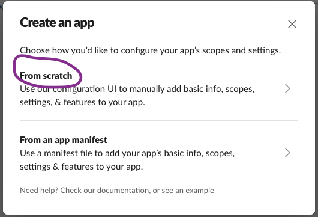
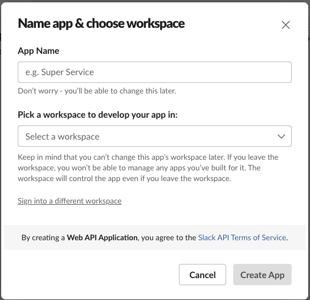

This is the first post in a multi-part series on building a Slack application with Rails. The app we'll be building is Retro Pulse (description TBD). In this first post, we'll get a new Rails app up and running, and get oauth working so we can connect our Rails app to Slack. There's a few moving parts to get set up and configured before we can have a working application.

## Introducing Retro Pulse

Before getting into the technical details, let's take a look at what we'll be building...

## Create Rails App

Start by generating a new Rails project. I'm using TailwindCSS although you can leave that out if you prefer to use SASS or vanilla CSS. I'm also using PostgreSQL but you can stick with the default SQLite if you prefer:

```bash
rails new retro-pulse --css tailwind --database=postgresql
```

In order to make the Slack integration as easy as possible, we'll be working with the [slack-ruby-bot-server-events](https://github.com/slack-ruby/slack-ruby-bot-server-events) gem. This is actually an extension to the [slack-ruby-bot-server](https://github.com/slack-ruby/slack-ruby-bot-server) gem, which exposes RESTful routes for Slack team handling (although for this simple app, we won't be enabling public distribution so it will be for your team only). The slack-ruby-bot-server-events gem adds some niceties for handling Slack slash commands, actions, and events. It also expects otr-activerecord and pagy_cursor dependencies to be installed so we'll add those as well.

In the main section of the project `Gemfile`, add:

```ruby
# Slack Integration
gem "slack-ruby-bot-server-events"
gem "otr-activerecord"
gem "pagy_cursor"
```

Since integrating with Slack requires managing Slack-specific secrets, also add the [dotenv-rails](https://github.com/bkeepers/dotenv) gem to the development and test groups. This will allow us to manage secrets with environment variables rather than hard-coding them into the application.

```ruby
group :development, :test do
  gem 'dotenv-rails'
end
```

Then run `bundle install`.

## Configure Rails for Slack

This next section explains the configuration changes needed to the Rails app to support Slack integration with the slack gems.

Add a `.env` file to the root of the project with `touch .env`, we'll be filling in the values shortly:

```
SLACK_CLIENT_ID=TBD
SLACK_CLIENT_SECRET=TBD
SLACK_SIGNING_SECRET=TBD
SLACK_VERIFICATION_TOKEN=TBD
```

Update the `.gitignore` file in the project root to ignore `.env`.

Update the `config.ru` file in the project root to also start the Slack server. This will expose RESTful endpoints to handle Slack teams. The `config.ru` file got generated earlier when you ran `rails new...`. Here is the original version:

```ruby
# This file is used by Rack-based servers to start the application.
require_relative "config/environment"

run Rails.application
Rails.application.load_server
```

Add the new line shown below. This will cause the slack-ruby-bot-server to check for a working database connection and perform a migration to generate the `teams` table (will be used to persist oauth token). You didn't have to write this migration, it's part of the slack-ruby-bot-server gem:

```ruby
# This file is used by Rack-based servers to start the application.
require_relative "config/environment"

# === ADD THIS LINE HERE ===
SlackRubyBotServer::App.instance.prepare!

run Rails.application
Rails.application.load_server
```

Configure the slack-ruby-bot-server by defining the oauth [scopes](https://api.slack.com/scopes) the Slack app will require. Scopes give your app permission to perform actions, such as posting messages in your workspace. Here are the specific scopes the Retro Pulse app requires:

```ruby
# config/initializers/slack_ruby_bot_server.rb
SlackRubyBotServer.configure do |config|
  config.oauth_version = :v2
  config.oauth_scope = ["commands", "chat:write", "users:read", "chat:write.public"]
end
```

Configure the slack-ruby-bot-server-events gem with the Slack signing secret (we still have `TBD` for that in `.env`, but will be populating it shortly):

```ruby
# config/initializers/slack_ruby_bot_server_events.rb
SlackRubyBotServer::Events.configure do |config|
  config.signing_secret ||= ENV.fetch("SLACK_SIGNING_SECRET")
  config.signature_expires_in ||= 300
end
```

Add the Api endpoints provided by the `slack-ruby-bot-server` gem at `/` in `config/routes.rb`:

```ruby
Rails.application.routes.draw do
  mount Api => "/"
end
```

At this point, you should be able to start a Rails server with `bin/dev`. Also if you launch a Rails console with `bin/rails c`, you should be able to see the `Team` model, which is defined in the `slack-ruby-bot-server` gem. There are no teams populated at the moment, because we haven't yet written the code to add this app to a Slack workspace:

```ruby
Team.all
# empty collection
```

Still in the Rails console, you can view the API routes provided by the slack-ruby-bot-server gem:

```ruby
Api.routes.each do |route|
  method = route.request_method.ljust(10)
  path = route.path
  puts "#{method} #{path} #{controller}"
  nil
end
nil

# GET        /api(.:format)
# GET        /api/status(.:format)
# GET        /api/teams/:id(.:format)
# GET        /api/teams(.:format)
# POST       /api/teams(.:format)
# GET        /api/swagger_doc(.:format)
# GET        /api/swagger_doc/:name(.:format)
# POST       /api/slack/command(.:format)
# POST       /api/slack/action(.:format)
# POST       /api/slack/event(.:format)
```

You can also view the `teams` table schema by connecting directly to a database console with `bin/rails db`, and then:

```sql
-- This is for Postgres
\d teams
--                                                   Table "public.teams"
--            Column            |              Type              | Nullable |              Default
-- -----------------------------+--------------------------------+----------+-----------------------------------
--  id                          | bigint                         | not null | nextval('teams_id_seq'::regclass)
--  team_id                     | character varying              |          |
--  name                        | character varying              |          |
--  domain                      | character varying              |          |
--  token                       | character varying              |          |
--  oauth_scope                 | character varying              |          |
--  oauth_version               | character varying              | not null | 'v1'::character varying
--  bot_user_id                 | character varying              |          |
--  activated_user_id           | character varying              |          |
--  activated_user_access_token | character varying              |          |
--  active                      | boolean                        |          | true
--  created_at                  | timestamp(6) without time zone | not null |
--  updated_at                  | timestamp(6) without time zone | not null |
-- Indexes:
--     "teams_pkey" PRIMARY KEY, btree (id)
```

The `teams` table got generated by the slack-ruby-bot-server gem when we added `SlackRubyBotServer::App.instance.prepare!` to `config.ru` and started the Rails server for the first time. Once we have OAuth working to add this app to a Slack workspace, you'll see how this table gets populated.

## Ngrok

Our Rails application is running on http://localhost:3000. However, Slack needs a publicly accessible URL to send requests to when events like OAuth redirects or slash commands are triggered. When you configure a callback URL or specify an endpoint for Slack to communicate with, it needs to be an address that Slack's servers can reach over the internet. Since localhost is specific to each user's local machine and not accessible externally, Slack wouldn't be able to send requests to your local development server.

This is where [ngrok](https://ngrok.com/) comes in. Ngrok creates a secure tunnel to your local development environment and provides a public URL that forwards requests to your localhost. It acts as an intermediary, allowing external services like Slack to communicate with your local development server. By using ngrok, you can expose your local server to the internet and provide a public URL that can be used as a callback or endpoint for Slack to send requests to during development.

Sign up for a [free account](https://dashboard.ngrok.com/signup). Then in a terminal, start ngrok forwarding to port 3000 (which is where the Rails server is running):

```bash
ngrok http 3000

# Output will look something like this, your details will vary:
# Region                        United States (us)
# Latency                       32ms
# Web Interface                 http://127.0.0.1:4040
# Forwarding                    https://12e4-203-0-113-42.ngrok-free.app -> http://localhost:3000
```

## Create Slack App

The next part is to create a new Slack application. Open [https://api.slack.com/apps](https://api.slack.com/apps) (sign in to your Slack account if prompted), and click on "Create New App". At the time of this writing, this is a green button at the top right of the "Your Apps" page like this:


Choose "From scratch" (later we'll use an app manifest to make updating it easier):



For the App Name, enter "Retro Pulse" (or whatever you'd like if you want to name it something else). Then select a workspace. If you're logged in to your employer's workspace that will show up in the list, but you can also [create your own workspace](https://slack.com/help/articles/206845317-Create-a-Slack-workspace) for app development, then select it from the list:



After clicking "Create App", you'll be navigated to the "Basic Information" settings of your newly created app. Copy the values Client ID, Client Secret, Signing Secret, and Verification Token from the App Credentials section, to the corresponding entries in `.env` you created earlier:


Click on the OAuth & Permissions section from the left hand section under Features and enter the following Redirect URL. The host name should be the forwarding address you saw when starting ngrok in the previous step. Your Client ID is from the Basic Information section.

```
https://12e4-203-0-113-42.ngrok-free.app?scope=incoming-webhook&client_id=your_client_id
```

Recall that ngrok is forwarding to localhost:3000, so the above url will land on the root route of the Rails app. Let's make sure that gets handled in the next step.

## Rails Send OAuth Request

We need to create an "Add to Slack" link that will be displayed on the home page of the Rails app. When the user clicks on it, they will be taken to Slack where they will be asked if they agree to authenticate Retro Pulse (which will add the app to their chosen Slack Workspace). After the user agrees, Slack will send a request to the Redirect URL you defined in the previous section. It will contain the OAuth code. This needs to be exchanged for a token, to do this, we'll write a small amount of JavaScript with a StimulusJS controller that takes the code, and submits a POST to the `/api/teams` endpoint provided by the slack-ruby-bot-server gem. That endpoint will do the work of exchanging the code provided in the redirect url by Slack, for a token, which will be persisted in the `teams` table.

To start, add a WelcomeController with only an index method. The method is empty as we'll just be using conventions to display the associated welcome index view:

```ruby
# app/controllers/welcome_controller.rb
class WelcomeController < ApplicationController
  def index; end
end
```

Now add the associated welcome index view:

```erb
<div>
  <a href="<%= SlackRubyBotServer::Config.oauth_authorize_url %>?scope=<%= SlackRubyBotServer::Config.oauth_scope_s %>&client_id=<%= ENV['SLACK_CLIENT_ID'] %>">
    
  </a>
</div>
```

Run the Rails server with `bin/dev` and navigate to [http://localhost:3000](http://localhost:3000). You should see an "Add to Slack" button. Open developer tools and inspect the generated url for the Slack button. It will include the OAuth scopes and Client ID you configured earlier:

Generated url:

```
https://slack.com/oauth/v2/authorize?
  scope=commands,chat:write,users:read,chat:write.public
  &client_id=your_client_id
```

If you click the button you'll be taken to a Slack page showing that the app is requesting permission to access your Slack workspace. My workspace for development is named "TestBotDev":


It shows all the OAuth permissions the Retro Pulse app is requesting. But don't click the "Allow" button yet. We still have some work to do on the Rails side to handle this.

## Rails Receive OAuth Response

WIP...

## TODO
* title
* intro para
* main content
* conclusion para
* edit
* connecting multi-part series, include a "you are here"
* list my versions
* Possibly [diagram](https://excalidraw.com/) of Slack Oauth2 flow with Rails app and ngrok
* Somewhere: tradeoff between using a gem that does a lot of the heavy lifting, but introduces seeming "magic" vs writing it all yourself via first principles (use Slack http api directly with a gem like Faraday or http party)
* Aside: for extra security, use [token rotation](https://api.slack.com/authentication/rotation), but I couldn't find that this is implemented in slack-ruby-bot-server-events gem
* ref Slack OAuth: https://api.slack.com/authentication/oauth-v2
* Assumptions: Reader has beginner to intermediate familiarity with Rails and is also familiar with Slack (as an end user, not developer).
* List tree/nested deps of Slack gems so its clear what we all have access to (see `docs/gems_for_slack.md` in retro-pulse project) for explanation. Need to understand slack-ruby-client how to call it, so that when reading Slack api docs, you can use it to access any api method.
* explain why retro-pulse needs each of the oauth_scopes
* explain what the app does and show some screenshots
