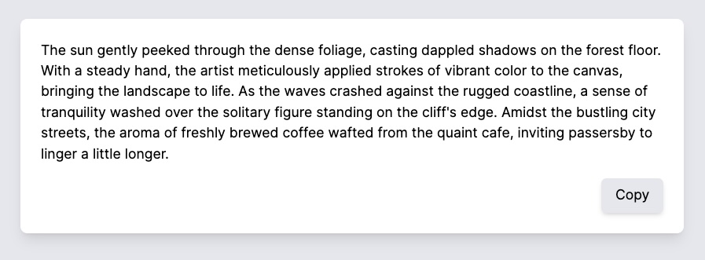
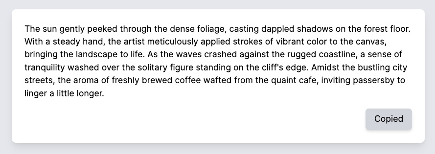
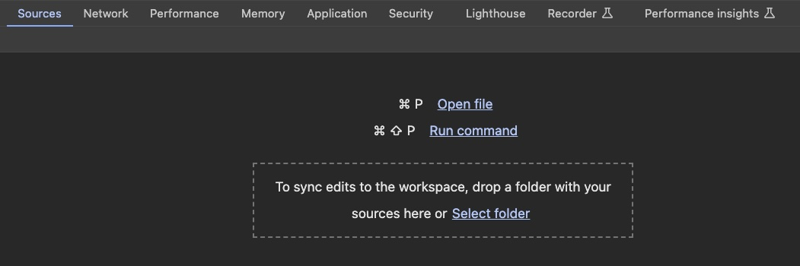
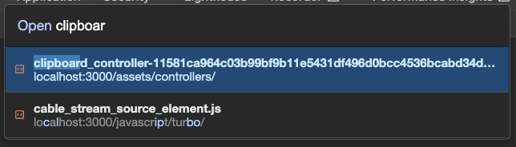
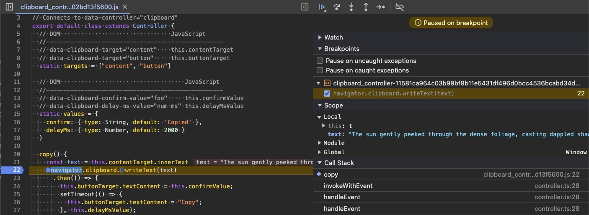

In this post, we'll learn how to implement a Copy to Clipboard feature using Stimulus within a Rails application. Before diving into the specifics, let's take a moment to understand what Stimulus is.

Stimulus is a JavaScript library that facilitates adding small, targeted enhancements to web applications. It's part of the [Hotwire](https://hotwired.dev/) stack, which is an innovative approach to building modern web apps without the complexity typically associated with heavy JavaScript frameworks for building single page apps. While Stimulus can be used as a standalone library from [npm](https://www.npmjs.com/package/@hotwired/stimulus), this post will show how it fits into a Rails application, where it enhances server-rendered HTML with just the right amount of interactivity, aka "JavaScript sprinkles".

Here's what we'll build - given some text and a button:



When the Copy button is clicked, the text is copied to the clipboard, and the button text updates to indicate it has been copied:



At this point, the text starting with "The sun gently peeked.." can be pasted anywhere. A few seconds later, the button text updates to its original value:


The completed project is on [Github](https://github.com/danielabar/stimulus_demo).

The copy button is an example of a feature that doesn't need server interaction - i.e. there's no need to send a request to the server, maintain state in the database and update the url of the application. This is why JavaScript, implemented with StimulusJS is a perfect solution for this. Let's get started.

## Initial Setup

Given a controller that makes some data available for a view as follows:

```ruby
# app/controllers/welcome_controller.rb
class WelcomeController < ApplicationController
  def index
    @very_important_content = <<-CONTENT
      The sun gently peeked through the dense foliage, casting dappled shadows on the forest floor.
      With a steady hand, the artist meticulously applied strokes of vibrant color to the canvas, bringing the landscape to life.
      As the waves crashed against the rugged coastline, a sense of tranquility washed over the solitary figure standing on the cliff's edge.
      Amidst the bustling city streets, the aroma of freshly brewed coffee wafted from the quaint cafe, inviting passersby to linger a little longer.
    CONTENT
  end
end
```

Here is the corresponding view that displays this content:

```erb
<%# app/views/welcome/index.html.erb %>

<div>
  <%= @very_important_content %>
</div>
```

Now we'd like to add a Copy button that copies the content text to the clipboard. To get started with the copy to clipboard feature, we first need a button that the user can click to start the interaction. Normally buttons would be contained in a form with an action that POSTs to the server. But this is going to be a client-side only interaction, therefore no form or action is needed:

```erb
<%# app/views/welcome/index.html.erb %>

<div>
  <%= @very_important_content %>
</div>

<%# === ADD BUTTON HERE === %>
<button>Copy</button>
```

## Introduce Stimulus

The next step is to generate a Stimulus controller. This is a JavaScript file that will be responsible for:

1. Handling the Copy button click event
2. Using the [Clipboard API](https://developer.mozilla.org/en-US/docs/Web/API/Clipboard_API) to copy the text in the content div to the clipboard
3. Updating the text of the Copy button to "Copied" for 2 seconds, and then setting it back to "Copy" after the 2 seconds have passed.

Rails provides a generator for this:

```bash
bin/rails generate stimulus clipboard
# create  app/javascript/controllers/clipboard_controller.js
```

This creates the following file:

```javascript
// app/javascript/controllers/clipboard_controller.js
import { Controller } from "@hotwired/stimulus"

// Connects to data-controller="clipboard"
export default class extends Controller {
  connect() {
  }
}
```

The `connect()` function is one of several [lifecycle callbacks](https://stimulus.hotwired.dev/reference/lifecycle-callbacks). It's called every time the associated element enters the DOM. To associate a DOM element with a Stimulus controller, `data-` attributes are used. This will make more sense with an example.

Let's update the welcome view to wrap both the content and button in a wrapper div, and assign the `data-controller` attribute to the wrapper div to connect it to our controller:

```erb
<%# app/views/welcome/index.html.erb %>

<%# === CONNECT CLIPBOARD STIMULUS CONTROLLER TO DOM === %>
<div data-controller="clipboard">
  <div>
    <%= @very_important_content %>
  </div>
  <button>Copy</button>
</div>
```

Now update the `connect()` function in the controller to log that it's been called:

```javascript
// app/javascript/controllers/clipboard_controller.js
import { Controller } from "@hotwired/stimulus"

// Connects to data-controller="clipboard"
export default class extends Controller {
  connect() {
    console.log("=== CLIPBOARD CONTROLLER CONNECTED === ")
  }
}
```

Navigating to `http://localhost:3000` with the browser dev tools open to the Console tab should show:
```
=== CLIPBOARD CONTROLLER CONNECTED ===
```

This is because the default route is the welcome route:

```ruby
Rails.application.routes.draw do
  get "welcome/index"
  root "welcome#index"
end
```

And the welcome controller index action renders the `app/views/welcome/index.html.erb` view, which causes the div with `data-controller="clipboard"` attribute to enter the DOM, which in turn causes the `connect()` function in the Stimulus controller to run.

## Copy Button Action

Now that the controller is connected, it's time to make it do some actual work.

Stimulus uses [actions](https://stimulus.hotwired.dev/reference/actions) for handling DOM events. An action connects a DOM element and an event listener fired on that element, to a function within the controller.

In this case, we need to handle the "click" event on the Copy button. To start, we update the markup with the `data-action` attribute:

```erb
<%# app/views/welcome/index.html.erb %>

<div data-controller="clipboard">
  <div>
    <%= @very_important_content %>
  </div>

  <%# === CONNECT CLICK EVENT ON BUTTON TO COPY FUNCTION IN CONTROLLER === %>
  <button data-action="click->clipboard#copy">Copy</button>
</div>
```

The syntax for the `data-action` value is `"event->controllerName#controllerFunction"`.

Then add a `copy()` function in the controller. For now, it just logs that it was called. The `connect()` function has been removed as we don't need to run any code when the element enters the DOM.

```javascript
// app/javascript/controllers/clipboard_controller.js
import { Controller } from "@hotwired/stimulus"

export default class extends Controller {
  // Executed when a DOM element with `data-action="click->clipboard#copy"`
  // is clicked on.
  copy() {
    console.log("=== CLIPBOARD COPY CALLED ===")
  }
}
```

Now if you refresh `http://localhost:3000` and click the Copy button, the dev tools Console tab should show:

```
=== CLIPBOARD COPY CALLED ===
```

Since the `click` event is commonly used for button elements, Stimulus provides a shorthand syntax for the `data-action` attribute, allowing you to leave off the "click" event:

```erb
<button data-action="clipboard#copy">Copy</button>
```

Now that the click event handler is hooked up to the Stimulus clipboard controller, the next step is to update the `copy()` function to use the [Clipboard API](https://developer.mozilla.org/en-US/docs/Web/API/Clipboard) to copy the text in the content div. It will look something like this:

```javascript
// app/javascript/controllers/clipboard_controller.js
import { Controller } from "@hotwired/stimulus"

export default class extends Controller {
  copy() {
    // The text to be copied should come from the content div
    const text = "TBD..."

    navigator.clipboard.writeText(text)
      .then(() => {
        // success
      })
      .catch((error) => {
        // fail
      });
  }
}
```

<aside class="markdown-aside">
At the time of this writing (~mid 2024), the Clipboard API is not fully supported in all browsers. See the MDN docs for <a class="markdown-link" href="https://developer.mozilla.org/en-US/docs/Web/API/Clipboard#browser_compatibility">browser compatibility</a>.
</aside>

However, in order to do this, the controller needs to know what text to copy. The actual text is contained in the content div. This requires getting a reference to the DOM element `<div>the text in here</div>`. This is explained in the next section.

## Targets

Stimulus uses [targets](https://stimulus.hotwired.dev/reference/targets) to get references to specific DOM elements that are within the scope of the controller. This is accomplished by adding a `data-clipboard-target=XXX` attribute to an element, where `XXX` will become part of the variable name in the controller. The `clipboard` part of this data attribute refers to the controller name.

For the copy to clipboard functionality, we need a reference to the content div so that we can extract its `innerText` to pass to the clipboard. We'll name this  `content` by adding a `data-clipboard-target="content"` to the content div:

```erb
<%# app/views/welcome/index.html.erb %>

<div data-controller="clipboard">

  <%# === GRAB A REFERENCE TO THIS ELEMENT BY NAMING IT `content` === %>
  <div data-clipboard-target="content">
    <%= @very_important_content %>
  </div>

  <button data-action="clipboard#copy">Copy</button>
</div>
```

To get a reference to the `content` element in the Stimulus controller, add it to the static targets array. Then it can be used in any function as `this.contentTarget`:

```javascript
// app/javascript/controllers/clipboard_controller.js
import { Controller } from "@hotwired/stimulus"

export default class extends Controller {
  static targets = ["content"]

  copy() {
    // Now we can reference `this.contentTarget` to get
    // DOM element having data-clipboard-target="content"
    const text = this.contentTarget.innerText
    console.log(`=== TEXT TO BE COPIED: ${text} ===`)
  }
}
```

Now if you refresh the browser at `http://localhost:3000` and click the Copy button, the console tab should display:

```
=== TEXT TO BE COPIED: The sun gently peeked through the dense foliage... ===
```

## Clipboard API

Now that we have a click handler hooked up to the Copy button, and are able to get a reference to the text content to be copied, we can put this all together with the clipboard API. Specifically the [writeText](https://developer.mozilla.org/en-US/docs/Web/API/Clipboard/writeText) function is used to copy the given text to the system clipboard. It returns a promise that resolves after the clipboard has been updated with the text.

Update the `copy()` function in the controller as follows:

```javascript
import { Controller } from "@hotwired/stimulus";

export default class extends Controller {
  static targets = ["content"]

  copy() {
    const text = this.contentTarget.innerText
    navigator.clipboard.writeText(text)
      .then(() => {
        console.log('Text copied to clipboard');
      })
      .catch((error) => {
        console.error('Failed to copy text to clipboard:', error);
      });
  }
}
```

<aside class="markdown-aside">
The reason error handling is required is because the clipboard API only works in a secure context, otherwise it will throw a `NotAllowedError`. Localhost is considered a secure context so this should work when running on your laptop. In a deployed environment, the page needs to be served over https. See the MDN <a class="markdown-link" href="https://developer.mozilla.org/en-US/docs/Web/Security/Secure_Contexts">documentation</a> for further details.
</aside>

To test if this is working, refresh the browser at `http://localhost:3000` and click the Copy button. The dev tools Console tab should show:

```
Text copied to clipboard
```

Then, entering <kbd class="markdown-kbd">Cmd</kbd> + <kbd class="markdown-kbd">V</kbd> in a new text document, or with your cursor anywhere in an existing document, should paste in the content from the page, starting with `The sun gently peeked through the dense...`.

## User Feedback

Technically, the copy to clipboard feature is working, but here's no visible feedback to the user that the copy was successful. It would be nice to update the text of the Copy button to "Copied" for a few seconds, so the user knows it worked, and then change the text back to "Copy".

In JavaScript, if you have a reference to a button element, it's text can be modified by setting it's [textContent](https://developer.mozilla.org/en-US/docs/Web/API/Node/textContent) property. So if we had a reference to the button element, we could change its text in the `copy()` function, after the clipboard `writeText` promise is resolved.

To get a reference to a DOM element with Stimulus, we need another target, which was [explained earlier](../stimulus-copy-to-clipboard#targets). Let's add another one for the button element named `button`. Starting with the template. The button element already has a `data-` attribute for the copy action, but it's no problem to add another one to specify it as a target:

```erb
<%# app/views/welcome/index.html.erb %>

<div data-controller="clipboard">
  ...

  <%# === GRAB A REFERENCE TO THE BUTTON ELEMENT BY NAMING IT `button` === %>
  <button
    data-action="clipboard#copy">
    data-clipboard-target="button"
      Copy
  </button>
</div>
```

Then update the static `targets` list in the clipboard controller to add `button`:

```javascript
import { Controller } from "@hotwired/stimulus"

export default class extends Controller {
  // === ADD BUTTON AS TARGET HERE ===
  static targets = ["content", "button"]

  copy() {
    // ...
  }
}
```

Once the button is added as a target, it can be referenced in controller functions as `this.buttonTarget`. Now we can update the `copy()` function to update the button's text, then use a [setTimeout](https://developer.mozilla.org/en-US/docs/Web/API/setTimeout) to put the text back to what it was, after a 2 second delay:

```javascript
import { Controller } from "@hotwired/stimulus"

export default class extends Controller {
  static targets = ["content", "button"]

  copy() {
    const text = this.contentTarget.innerText
    navigator.clipboard.writeText(text)
      .then(() => {
        // === UPDATE BUTTON TEXT TO COPIED ===
        this.buttonTarget.textContent = 'Copied';

        // === RESET THE BUTTON TEXT AFTER 2 SECONDS ===
        setTimeout(() => {
          this.buttonTarget.textContent = 'Copy';
        }, 2000);
      })
      .catch((error) => {
        console.error('Failed to copy text to clipboard:', error);
      });
  }
}
```

## Values

At this point, the feature is functional and could be considered complete. But there's a few further customizations that could be made to make this more re-usable across your application. For example, there may be some places where the success text should show something else such as "Done". You may also want variability in the delay, for example 3 seconds or just 1 second rather than 2 seconds.

Currently these values are hard-coded in the controller. It would be nice if the app developer could provide these as inputs to the controller. In Stimulus, this is accomplished with [values](https://stimulus.hotwired.dev/reference/values).

Start by declaring what inputs the Stimulus controller should accept with the `static values` declaration. This accepts an object where the keys are the input variable names, and the values are objects specifying the data types that the input will be converted to as it's read from the DOM into a JavaScript variable. You can also specify a default value in case none is provided from the DOM.

In the version of the controller below, two input values have been added to customize the behaviour:

1. `confirm`, which is a String to indicate what confirmation text the button should show after successful copy.
2. `delayMs`, which is a number in milliseconds before the original button text is displayed again

```javascript
import { Controller } from "@hotwired/stimulus"

// Connects to data-controller="clipboard"
export default class extends Controller {
  // ...

  // === DECLARE INPUT VARIABLES HERE ===
  static values = {
    confirm: { type: String, default: 'Copied' },
    delayMs: { type: Number, default: 2000 }
  }

  copy() {
    // ...
  }
}
```

Then we can update the view to pass these values in to the controller. Suppose the button text should be updated to `Done` rather than `Copied`, and we'd like a `3000` millisecond delay instead of the default `2000`:

```erb
<%# app/views/welcome/index.html.erb %>

<%# === SPECIFY ADDITIONAL INPUT VALUES ON THE DOM ELEMENT === %>
<%# === WHERE THE STIMULUS CONTROLLER IS DECLARED === %>
<div data-controller="clipboard"
  data-clipboard-confirm-value="Done"
  data-clipboard-delay-ms-value="3000">
    ...
</div>
```

Then the Stimulus controller can be updated to use these values instead of the hard-coded `Copied` and `2000`:

```javascript
import { Controller } from "@hotwired/stimulus"

// Connects to data-controller="clipboard"
export default class extends Controller {
  static targets = ["content", "button"]

  static values = {
    confirm: { type: String, default: 'Copied' },
    delayMs: { type: Number, default: 2000 }
  }

  copy() {
    const text = this.contentTarget.innerText
    navigator.clipboard.writeText(text)
      .then(() => {
        // === USE `confirmValue`
        this.buttonTarget.textContent = this.confirmValue;
        setTimeout(() => {
          this.buttonTarget.textContent = "Copy";
        // USE `delayMsValue`
        }, this.delayMsValue);
      })
      .catch((error) => {
        console.error('Failed to copy text to clipboard:', error);
      });
  }
}
```

Note the naming conventions: `camelCase` is used in JavaScript, whereas `kebab-case` is used in the DOM. So `data-clipboard-delay-ms-value` on a DOM element becomes `this.delayMs` in the controller.

## Targets vs Values

Both targets and values end up as `this.something` in the controller, which can be a little confusing. The distinction is:

**Targets** are DOM elements that the controller can reference. Use this when you need to perform DOM manipulation. These are specified by adding `data-{controllerName}-target="foo"` on any DOM element that the controller needs access to.

**Values** are inputs that can be provided to the controller from the DOM to vary its behaviour. These are specified by adding `data-{controllerName}-{variableName}="{variableValue}"` on the element where the controller is declared.

Here is the final version of the controller with comments explaining the mapping from targets and values to the DOM:

```javascript
import { Controller } from "@hotwired/stimulus"

// Connects to data-controller="clipboard"
export default class extends Controller {
  // Targets are DOM elements this controller can reference
  //---------------------------------------------------
  // DOM                                JavaScript
  //---------------------------------------------------
  // data-clipboard-target="content"    this.contentTarget
  // data-clipboard-target="button"     this.buttonTarget
  static targets = ["content", "button"]

  // Values are inputs provided from the DOM into the controller
  // DOM                                    JavaScript
  //---------------------------------------------------
  // data-clipboard-confirm-value="foo"     this.confirmValue
  // data-clipboard-delay-ms-value="num ms" this.delayMsValue
  static values = {
    confirm: { type: String, default: 'Copied' },
    delayMs: { type: Number, default: 2000 }
  }

  copy() {
    const text = this.contentTarget.innerText
    navigator.clipboard.writeText(text)
      .then(() => {
        this.buttonTarget.textContent = this.confirmValue;
        setTimeout(() => {
          this.buttonTarget.textContent = "Copy";
        }, this.delayMsValue);
      })
      .catch((error) => {
        console.error('Failed to copy text to clipboard:', error);
      });
  }
}
```

## Debugging

Stimulus controllers can be debugged using the browser developer tools just like any other JavaScript. For example using Chrome, from the developer tools, click on the "Sources" tab:



Enter <kbd class="markdown-kbd">Command</kbd> + <kbd class="markdown-kbd">P</kbd> to bring up the sources fuzzy search (or if using Windows, follow the instructions displayed in the Sources tab for the shortcut), then start typing in "clipboard". It should find a match like this:



After hitting <kbd class="markdown-kbd">Enter</kbd> to action the file match, it will load the file in the Sources tab. Then you can add breakpoints as usual. For example, here I've added a breakpoint at the `navigator.clipboard` line and clicked on the Copy button:



## Loading

We didn't have to do anything special like registering or loading the controller. It just "showed up" in the app. This is because this project is using [import-maps](https://github.com/WICG/import-maps), which is the default for JavaScript when starting a new Rails 7 project. The Rails [integration](https://github.com/rails/importmap-rails) automatically loads all the Stimulus controller files from `app/javascript/controllers`. If you're using a different JS bundler such as Webpack or esbuild, it will require a few more steps. See the Stimulus docs on [installing](https://stimulus.hotwired.dev/handbook/installing) for more details.

## Maintainability

A few caveats about maintainability:

On a large app with many Stimulus controllers, the template files will end up full of `data-controller`, `data-somecontroller-target` and `data-somecontroller-somevariable-value`. This could get confusing especially if there are multiple controllers in the same area of the DOM.

It would be amazing to have IDE support such as hover/go-to definition from the template to the controller and vice versa. There is [Stimulus LSP](https://marketplace.visualstudio.com/items?itemName=marcoroth.stimulus-lsp) which provides some support. It has completion support in the template, validation, and using the go-to-definition shortcut on any data- attribute from the template goes to the controller, although always the top of the file, not the specific value or target line. Doesn't work the other way though, from controller to template(s). Free extension idea if anyone's looking for a side project 😀

Another aspect of maintainability is automated testing. I couldn't find anything in the [Stimulus Reference](https://stimulus.hotwired.dev/reference/controllers) about unit testing controllers, although there is some discussion [here](https://discuss.hotwired.dev/t/add-a-doc-about-unit-testing-stimulus-controllers/4142) and [here](https://discuss.hotwired.dev/t/testing-stimulus/90).

In the meantime, be sure to have system tests that cover any JavaScript interactivity from the Stimulus controllers. If using [Capybara](https://github.com/teamcapybara/capybara), this means configuring it with a [driver](https://github.com/teamcapybara/capybara?tab=readme-ov-file#drivers) capable of executing JavaScript.

## Conclusion

This post covered how to implement a Copy to Clipboard feature in a Rails application using Stimulus. It began with an overview of Stimulus and its role in adding interactivity to web apps. Then it explained how to create a new Stimulus *controller*, use Stimulus *actions* to handle DOM events, *targets* to perform DOM manipulation, and *values* for customization of the controller's behaviour. Finally it covered some aspects of maintainability to be aware of when using Stimulus.

## TODO
* mention using Rails 7.1
* brief mention I'm using TailwindCSS but doesn't matter for Stimulus, use whatever you like for styles
* main content
  * new rails app `rails new`
  * welcome controller with index only action `bin/rails g controller welcome index`
* References: Stimulus docs:
  * https://stimulus.hotwired.dev/
  * https://stimulus.hotwired.dev/handbook/introduction
  * https://stimulus.hotwired.dev/handbook/installing (installation doc has naming conventions - very important!)
  * lifecycle callbacks: https://stimulus.hotwired.dev/reference/lifecycle-callbacks
  * actions: https://stimulus.hotwired.dev/reference/actions
* assumptions: basic rails and JS knowledge, link to MDN on js events, eg: https://developer.mozilla.org/en-US/docs/Learn/JavaScript/Building_blocks/Events and https://developer.mozilla.org/en-US/docs/Web/API/Element/click_event, JS classes
* edit

### Temp

Might also want to explore disabling button during delay period:

```javascript
import { Controller } from "@hotwired/stimulus"

// Connects to data-controller="clipboard"
export default class extends Controller {
  static targets = ["content", "button"]

  copy() {
    const text = this.contentTarget.innerText;

    // Disable the button
    this.buttonTarget.disabled = true;

    navigator.clipboard.writeText(text)
      .then(() => {
        this.buttonTarget.textContent = 'Copied';
        setTimeout(() => {
          this.buttonTarget.textContent = 'Copy';

          // Re-enable the button after 2 seconds
          this.buttonTarget.disabled = false;
        }, 2000);
      })
      .catch((error) => {
        console.error('Failed to copy text to clipboard:', error);
        // Ensure the button is re-enabled in case of error
        this.buttonTarget.disabled = false;
      });
  }
}
```

Then would need additional styles, conditional?
Would also need TailwindCSS build config to scan the controller if adding classes here

```javascript
import { Controller } from "@hotwired/stimulus"

export default class extends Controller {
  static targets = ["content", "button"]

  copy() {
    const text = this.contentTarget.innerText;

    // Disable the button
    this.buttonTarget.disabled = true;
    this.buttonTarget.classList.add('opacity-50', 'cursor-not-allowed');

    navigator.clipboard.writeText(text)
      .then(() => {
        this.buttonTarget.textContent = 'Copied';
        setTimeout(() => {
          this.buttonTarget.textContent = 'Copy';

          // Re-enable the button after 2 seconds
          this.buttonTarget.disabled = false;
          this.buttonTarget.classList.remove('opacity-50', 'cursor-not-allowed');
        }, 2000);
      })
      .catch((error) => {
        console.error('Failed to copy text to clipboard:', error);
        // Ensure the button is re-enabled in case of error
        this.buttonTarget.disabled = false;
        this.buttonTarget.classList.remove('opacity-50', 'cursor-not-allowed');
      });
  }
}

```
