When your web app has been around for years, you need more than unit tests, you need proof the whole thing still works from the user's perspective. That's where end-to-end tests (a.k.a. system or browser-based tests) come in, simulating real clicks, form fills, and page loads to verify entire workflows through the UI. They shouldn't just verify correct behaviour; they should tell a clear story about what's being tested. But as your project grows, those same tests can morph into dense, brittle scripts that hide the ""what" behind the "how", making them painful to read and maintain.

That's where [Cucumber](https://cucumber.io/) comes in. By separating high-level intent from low-level implementation, Cucumber lets you write tests in plain language that developers, product managers, and future-you can all understand at a glance. In this post, I'll walk through examples from a Rails app I built, the [Book Review Demo](https://github.com/danielabar/book_review_demo), to show how Cucumber can make your test suite more readable and maintainable.

This post assumes you are familiar with Ruby on Rails and have some experience writing system or feature tests, such as with RSpec and Capybara or similar tools.

## What Is Cucumber?

Cucumber is a testing tool that lets you describe application behavior in plain language. Unlike tools such as Capybara or Selenium, which control the browser directly, Cucumber sits *above* your browser automation stack. Its job isn't to drive the browser, but to express what you want to test in a way that anyone on your team, technical or non technical, can read and understand.

Cucumber scenarios are written in a structured format called [Gherkin](https://cucumber.io/docs/gherkin/reference), which uses keywords like `Feature`, `Background`, `Scenario`, `Given`, `When`, and `Then` to describe user-facing behavior. Each line beginning with `Given`, `When`, `Then` or `And` is called a [step](https://cucumber.io/docs/cucumber/api#steps), which is a plain-language instruction that maps to Ruby code performing the actual test logic.

For example:

```gherkin
Feature: Book reviews

  Background:
    Given the following books exist:
      | Title      | Author   | Published Year |
      | Book One   | Author A | 2001           |
      | Book Two   | Author B | 2002           |
    And users exist:
      | Email             | Password  |
      | user1@example.com | password1 |
      | user2@example.com | password2 |
    And the following reviews exist:
      | Book     | User Email        | Rating | Body       |
      | Book One | user2@example.com | 4      | Good read. |
    And I am signed in as "user1@example.com"

  Scenario: User sees book details and reviews
    When I visit the book show page for "Book One"
    Then I should see the book title, author, and published year for "Book One"
    And I should see the review for "user2@example.com" with body "Good read." and 4 stars
    And I should see a submit review button
```

We'll look at how those plain language steps connect to Ruby code in just a bit, but for now, notice how readable it is, even without knowing any Ruby or testing library syntax.

These phrases aren't comments or placeholders, they make up an executable test. Behind the scenes, each plain language step is connected to Ruby code that can use Capybara (or any other browser automation tool) to interact with the web application under test. This provides the best of both worlds: readable intent at the top, and full control at the bottom.

Cucumber is especially valuable in projects where collaboration matters. Product managers, QA engineers, designers, and even stakeholders can follow along with what's being tested without needing to parse through RSpec matchers or complex DOM selectors. And for developers, that same clarity makes tests easier to write, refactor, and maintain over the long haul.

<aside class="markdown-aside">
While this post uses a Ruby on Rails example, it's worth noting that Cucumber isn't Ruby-specific. Cucumber supports multiple languages including Java, JavaScript, Python, and many others. See <a class="markdown-link" href="https://cucumber.io/docs/installation/">installation options</a> for the full list.
</aside>

## Why Not Just RSpec + Capybara?

It's worth asking: If system testing can already be accomplished with RSpec and Capybara, why add another layer? Let's take a look at how the same scenario we saw earlier might look using RSpec system tests (assume [factory_bot](https://github.com/thoughtbot/factory_bot) is installed and factories have been defined for all models):

```ruby
require "rails_helper"

RSpec.describe "Book show page", type: :system do
  let!(:book_one) { create(:book, title: "Book One", author: "Author A", published_year: 2001) }
  let!(:book_two) { create(:book, title: "Book Two", author: "Author B", published_year: 2002) }
  let!(:user1)    { create(:user, email: "user1@example.com", password: "password1") }
  let!(:user2)    { create(:user, email: "user2@example.com", password: "password2") }
  let!(:review)   { create(:review, book: book_one, user: user2, rating: 4, body: "Good read.") }

  before do
    sign_in user1
  end

  it "shows book details and existing reviews" do
    visit book_path(book_one)

    within("##{dom_id(book_one)}") do
      expect(page).to have_content("Book One")
      expect(page).to have_content("Author A")
      expect(page).to have_content("2001")
    end

    within('[data-testid="reviews-list"]') do
      review_item = all('[data-testid="review-item"]').find do |item|
        item.find('[data-testid="review-author"]').text == "user2@example.com" &&
        item.find('[data-testid="review-body"]').text == "Good read."
      end

      expect(review_item).not_to be_nil
      expect(review_item.find('[data-testid="review-rating"]').all('svg').size).to eq(4)
    end

    expect(page).to have_button("Submit Review")
  end
end
```

While the same concepts are being tested, it takes effort to understand what's actually being tested. It's not *terrible*, especially for developers familiar with Capybara, but it's clearly written for the machine, not the human. You have to *parse* the `let`, `within`, `all`, and `find` blocks to reconstruct what's going on. The intent: "show book details and reviews", is buried inside DOM selectors and and Capybara DSL calls.

This is where Cucumber shines. Instead of encoding all the implementation detail in the test body, Cucumber pushes that detail down into step definitions. The result is a high-level test that reads like documentation.

<aside class="markdown-aside">
It is possible to make RSpec system tests more readable using custom matchers, <a class="markdown-link" href="https://martinfowler.com/bliki/PageObject.html">page objects</a>, or helper methods. But these strategies can also add complexity or hide detail in other files. Cucumber, on the other hand, embraces the separation between intent and implementation from the start.
</aside>

And the best part? You don't have to throw out your existing Capybara setup to adopt it. Cucumber doesn't replace Capybara, it wraps around it. The same drivers, selectors, and test helpers still apply. You're just giving your tests a better top layer.

## Setting Up Cucumber

In this section, we'll walk through setting up Cucumber in an existing Rails project. We'll configure Cucumber to work with Capybara, Cuprite (for headless JavaScript testing), FactoryBot, Devise, and DatabaseCleaner.

### Installation

Start by updating the project's `Gemfile` under the `:test` group. Note that we're opting for `cuprite` instead of the default `selenium-webdriver`:

```ruby
group :test do
  gem "capybara"
  gem "cuprite"
  gem "cucumber-rails", require: false
  gem "database_cleaner"
end
```

Then run:

```bash
bundle install
bin/rails generate cucumber:install
```

This creates a new `features/` directory as shown below:

```
features/
├── your .feature files go here
├── step_definitions/
│   └── *_steps.rb files contain your step logic
└── support/
    ├── env.rb (auto-generated, do not modify)
    └── custom configuration (see below)
```

All files in `features/support/*.rb` will be automatically loaded when tests run. The following sections explain each file we'll be adding and why it's needed.

### Configure Browser Driver

Cucumber itself is agnostic about how your tests interact with the browser - it just runs your scenarios and delegates the actual browser automation to whatever tool you choose. In Rails projects, a popular choice is [Capybara](https://github.com/teamcapybara/capybara), which provides a unified API for driving different browser engines.

Here, we configure Capybara to use [Cuprite](https://github.com/rubycdp/cuprite), a pure Ruby driver for Capybara. The configuration below sets Cuprite as the default driver for both regular and JavaScript-enabled tests. It enables headless mode by default, sets a large window size for consistent screenshots, and includes a Docker-friendly option.

Add `features/support/cuprite.rb`:

```ruby
require "capybara/cuprite"

Capybara.default_driver = :cuprite
Capybara.javascript_driver = :cuprite

Capybara.register_driver(:cuprite) do |app|
  Capybara::Cuprite::Driver.new(
    app,
    window_size: [1920, 1080],
    js_errors: true,
    headless: !ENV["VISIBLE_BROWSER"],
    # Max time (in seconds) to wait for browser commands to complete
    timeout: 10,
    browser_options: {
      # Required if running in Docker
      "no-sandbox" => nil
    }
  )
end

# Max time (in seconds) to wait for elements to appear/disappear
Capybara.default_max_wait_time = 5
```

### Configure DatabaseCleaner

With JavaScript drivers, Capybara runs the app server in a separate thread from your tests, so transactions aren’t shared. Simply rolling back a transaction at the end of a test won't clean up data seen by both threads. This means we need to configure truncation to ensure a clean state between tests.

Create `features/support/database_cleaner.rb`:

```ruby
DatabaseCleaner.strategy = :truncation
```

### FactoryBot Integration

[FactoryBot](https://github.com/thoughtbot/factory_bot) makes it easy to set up test data, and it works well with Cucumber once configured. (Assumes you've already added `factory_bot_rails` to your Gemfile in the `:test` group.)

Add `features/support/factory_bot.rb`:

```ruby
World(FactoryBot::Syntax::Methods)
```

This makes methods like `create(:user)` available directly in your step definitions, no need to prefix with `FactoryBot.`

### Devise and Warden for Fast Login

If your project uses [Devise](https://github.com/heartcombo/devise) for authentication (as many Rails apps do), you can speed up login in tests by using test helpers from it's dependent library, [Warden](https://github.com/wardencommunity/warden/wiki). Instead of clicking through login forms in every test, we can sign in programmatically.

Add `features/support/warden.rb`:

```ruby
Warden.test_mode!
World(Warden::Test::Helpers)

After { Warden.test_reset! }
```

Now you can use `login_as(user)` in your steps to simulate a logged-in session. This technique is much faster than logging in through the UI for each test (although you should have at least one test that does this to ensure the login form is working).

### Suppressing Publish Message

When running Cucumber tests for the first time, it may display a message about publishing results. This refers to Cucumber's optional [reports service](https://reports.cucumber.io/) that lets you upload your test run data to an online dashboard. It can be useful for teams who want to share test reports in a web interface, but it's not required.

If you don't need this feature, it can be silenced by editing `config/cucumber.yml`, which was generated during setup:

```yml
std_opts = "--format #{ENV['CUCUMBER_FORMAT'] || 'pretty'} --strict --tags 'not @wip' --publish-quiet"
```

This also sets a few sensible defaults:

* `--strict` will fail the build on undefined or pending steps.
* `--tags 'not @wip'` skips work-in-progress scenarios unless explicitly tagged.

## Writing Your First Feature Test

Suppose we want to test the login flow in our Book Review Demo app. Let's start by looking at what the user sees:

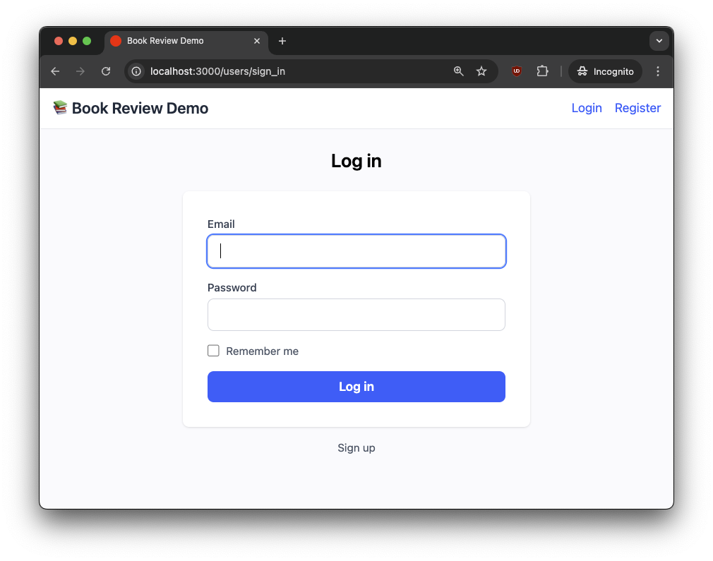

A user enters their credentials and clicks “Log in.” If the login is successful, they're redirected to the landing page, and the navigation bar updates to show their email address:


Let's see how we can express this workflow as a Cucumber feature test:

```gherkin
# features/authentication.feature
Feature: User authentication

  Scenario: User logs in with valid credentials
    Given a user exists with email "user@example.com" and password "password"
    When I visit the login page
    And I fill in "Email" with "user@example.com"
    And I fill in "Password" with "password"
    And I click "Log in"
    Then I should see "Signed in as user@example.com" in the navigation bar
    And I should see a "Logout" button
```

A feature file starts with a `Feature` block, which describes a high-level capability or area of your application (for example, “User authentication” or “Book reviews”). Each feature file can contain multiple `Scenario` blocks, each representing a specific user story or test case within that feature.

Each line in the `Scenario` maps to a Ruby method called a [step definition](https://cucumber.io/docs/cucumber/step-definitions), which connects steps in the feature file to programming code. These live in files under `features/step_definitions/`.

The `Given` keyword is used to set up the initial state for your scenario. This might mean creating test data, configuring the environment, or ensuring the application is in a known state before the user takes any actions.

Here's what the step definitions for the above scenario might look like:

```ruby
# features/step_definitions/authentication_steps.rb
Given("a user exists with email {string} and password {string}") do |email, password|
  create(:user, email: email, password: password) # FactoryBot
end

When("I visit the login page") do
  visit new_user_session_path
end

When("I fill in {string} with {string}") do |field, value|
  fill_in field, with: value
end

When("I click {string}") do |button|
  click_button button
end

Then("I should see {string} in the navigation bar") do |text|
  within("nav") { expect(page).to have_content(text) }
end

Then("I should see a {string} button") do |text|
  expect(page).to have_button(text)
end
```

**Notes:**

- You can use any Ruby code, including Capybara matchers and Rails helpers inside the step definitions.
- The `{string}` placeholders let you reuse steps for different values.
- In addition to `{string}`, step definitions can match on several other [types](https://github.com/cucumber/cucumber-expressions?tab=readme-ov-file#parameter-types)
- If the built-in types aren't enough for your use case, you can write a [custom type](https://github.com/cucumber/cucumber-expressions?tab=readme-ov-file#custom-parameter-types)

To run this feature test:

```bash
# Run a specific feature test
bundle exec cucumber features/authentication.feature

# Run all feature tests
bundle exec cucumber
```

Cucumber will print each step as it runs, showing which Ruby file and line number implements it. If all steps pass, you'll see a summary at the end. For example:

```
Capybara starting Puma...
* Version 6.6.0, codename: Return to Forever
* Min threads: 0, max threads: 4
* Listening on http://127.0.0.1:56341

Feature: User authentication

  Scenario: User logs in with valid credentials                               # features/demo_auth.feature:3
    Given a user exists with email "user@example.com" and password "password" # features/step_definitions/authentication_steps.rb:9
    When I visit the login page                                               # features/step_definitions/authentication_steps.rb:27
    And I fill in "Email" with "user@example.com"                             # features/step_definitions/authentication_steps.rb:41
    And I fill in "Password" with "password"                                  # features/step_definitions/authentication_steps.rb:41
    And I click "Log in"                                                      # features/step_definitions/authentication_steps.rb:1
    And I should see "Signed in as user@example.com" in the navigation bar    # features/step_definitions/authentication_steps.rb:53
    And I should see a "Logout" button                                        # features/step_definitions/authentication_steps.rb:13

1 scenario (1 passed)
7 steps (7 passed)
```

**What's happening under the hood?**

- Just like with RSpec system tests, Capybara automatically starts a real Rails server (usually Puma) for each test run, so your scenarios interact with a live application.
- **Feature files** describe *what* should happen, not *how*.
- **Step definitions** translate those plain-language steps into Ruby code that interacts with your app (using Capybara, FactoryBot, etc.).
- You can mix and match `Given`, `When`, `Then`, and `And` in both your feature files and step definitions - Cucumber matches them by the text, not the keyword.

## More Complex Feature

Now that we've seen a simple scenario, let's cover something a little more involved. After a user logs in, they're presented with a listing of books:

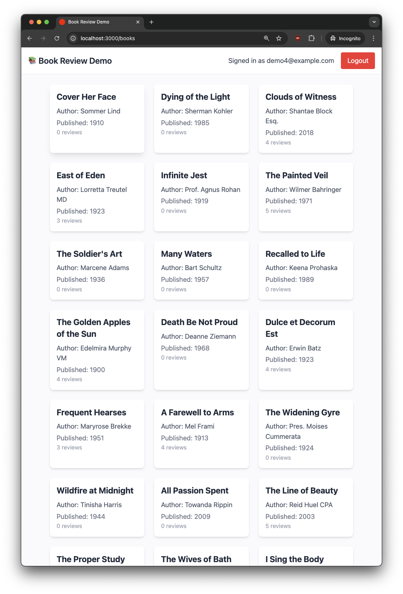

The user can click on any of them to view the reviews that have been left for this book, and they also are presented with a form to leave their own review:

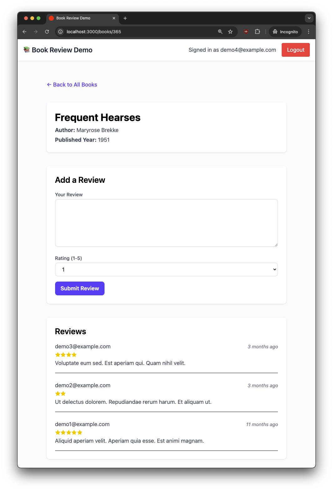

If they try to submit a review with no review text, an error results:

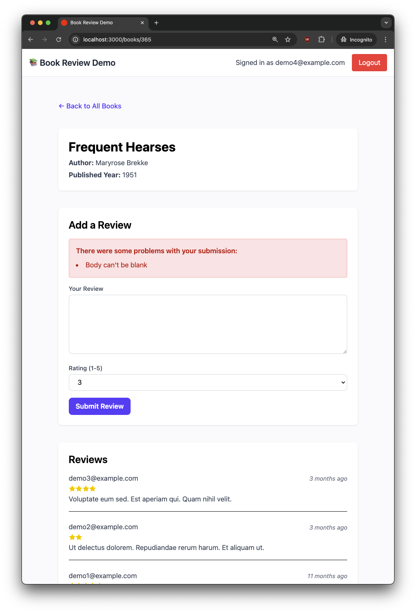

After correcting the error by providing some review text, they can then submit the review successfully, at which point it displays at the top of the review list as "You". The user can now also edit their review:

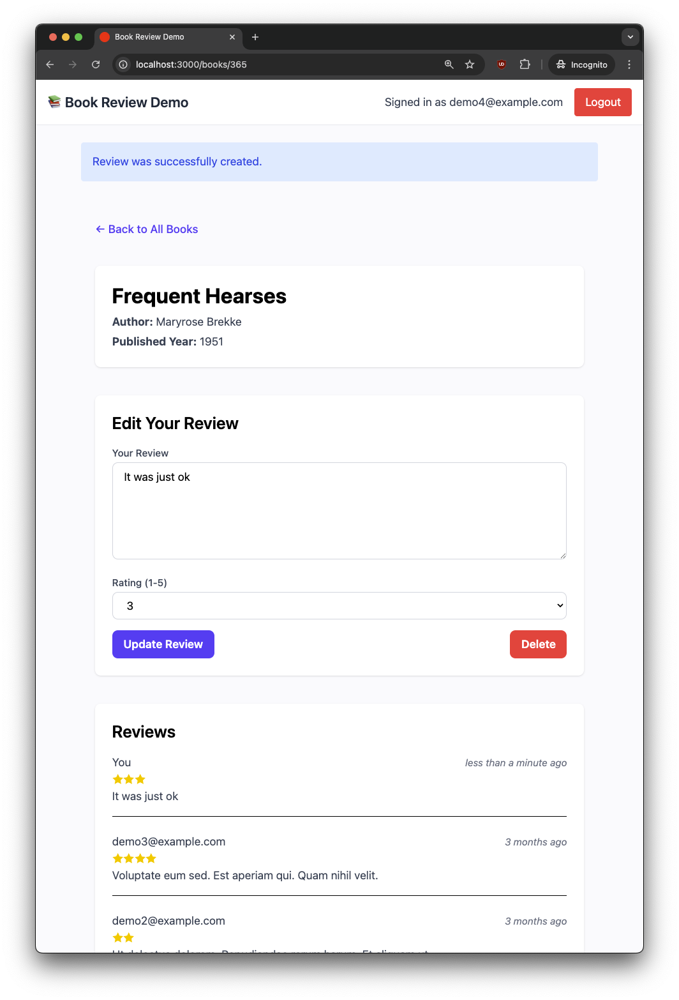

<aside class="markdown-aside">
In a real app, reviews would typically undergo content moderation before publishing, and users would be able to choose a display name instead of showing their email publicly. These details are omitted here to keep the demo relatively simple.
</aside>

To test this, we'll need a few books, users, and reviews setup in the test database. Recall in our first test we saw how we can create data for the test as follows:

```gherkin
# features/authentication.feature
Feature: User authentication

  Scenario: User logs in with valid credentials
    Given a user exists with email "user@example.com" and password "password"
    ...
```

While we could write multiples lines like this, Cucumber has a more convenient feature [Data Tables](https://www.jakubsobolewski.com/cucumber/articles/reference-gherkin.html#data-tables), which allow you to pass a list of values to a step definition. For example:

```gherkin
# features/book_reviews.feature
Feature: Book reviews

  Background:
    Given the following books exist:
      | Title      | Author   | Published Year |
      | Book One   | Author A | 2001           |
      | Book Two   | Author B | 2002           |
    And users exist:
      | Email             | Password  |
      | user1@example.com | password1 |
      | user2@example.com | password2 |
    And the following reviews exist:
      | Book     | User Email        | Rating | Body       |
      | Book One | user2@example.com | 4      | Good read. |
    And I am signed in as "user1@example.com"

  # All scenarios depend on the same data setup in Background
  Scenario: User adds a review
    ...

  Scenario: User edits their review
    ...
```

Let's focus our attention on the background steps:

```gherkin
# features/book_reviews.feature
Feature: Book reviews

  Background:
    Given the following books exist:
      | Title      | Author   | Published Year |
      | Book One   | Author A | 2001           |
      | Book Two   | Author B | 2002           |
    # ...
```

The step definition looks like this:

```ruby
# features/step_definitions/book_steps.rb
Given("the following books exist:") do |table|
  table.hashes.each do |row|
    create(:book, title: row["Title"], author: row["Author"], published_year: row["Published Year"])
  end
end
```

Rather than passing a single value like a `{string}` or `{int}` into the step, we are making use of Cucumber's [data tables](https://cucumber.io/docs/cucumber/data-tables/), which let you pass structured lists or records directly from your `.feature` files into your step definitions. When you write a step with a table, Cucumber automatically parses it and passes it as a [Cucumber::MultilineArgument::DataTable](https://www.rubydoc.info/gems/cucumber/Cucumber/MultilineArgument/DataTable) object to your Ruby block. You can then use methods like [hashes](https://www.rubydoc.info/gems/cucumber/Cucumber/MultilineArgument/DataTable#hashes-instance_method) to iterate over each row as a hash, making it easy to create multiple records or set up complex test data in a single, readable step.

**Why use data tables?**

- **Clarity:** Test data is visible right in the scenario, not hidden in Ruby code.
- **Maintainability:** Adding or changing test cases is as simple as editing the table.
- **Reusability:** Step definitions can handle any number of rows, so you don't need to write repetitive steps.

The `users exist` step follows the same pattern:

```ruby
Given('users exist:') do |table|
  table.hashes.each do |row|
    create(:user, email: row['Email'], password: row['Password'])
  end
end
```

The `the following reviews exist` step is similar, but since a Review is an association between a User and a Book, it uses the book title and user email to find the corresponding records:

```ruby
Given("the following reviews exist:") do |table|
  table.hashes.each do |row|
    book = Book.find_by(title: row["Book"])
    user = User.find_by(email: row["User Email"])
    create(:review, book: book, user: user, rating: row["Rating"], body: row["Body"])
  end
end
```

The last background step is to ensure a user is signed in that doesn't have a review on the book, so we can test the new review feature:

```gherkin
# features/book_reviews.feature
Feature: Book reviews

  Background:
  # data creation...
  And I am signed in as "user1@example.com"
```

Rather than performing the UI navigation and form filling to log in, we can accomplish this faster with the [Warden helper](../sustainable-feature-testing-in-rails-with-cucuber#devise-and-warden-for-fast-login) we configured earlier:

```ruby
# features/step_definitions/authentication_steps.rb
Given("I am signed in as {string}") do |email|
  user = User.find_by(email: email)
  login_as(user, scope: :user)
end
```

Now we can write the step definitions for the scenario:

```gherkin
# features/book_reviews.feature
Feature: Book reviews

  Background:
    # data creation...
    And I am signed in as "user1@example.com"

  Scenario: User adds a review
    When I visit the book show page for "Book One"
    And I enter a review with body "" and rating 5
    And I click "Submit Review"
    Then I should see the following form validation messages:
      | There were some problems with your submission: |
      | Body can't be blank                            |
    And I enter a review with body "Amazing!" and rating 5
    And I click "Submit Review"
    Then I should see "Review was successfully created."
    And I should see "You" at the top of the reviews list
    And I should see "Amazing!" in my review
    And I should see 5 stars for my review
```

The step definition for navigating to a given book details page finds the associated book by the given title, then uses the Rails path helper together with Capybara's `visit` method to perform the navigation:

```ruby
# features/step_definitions/review_steps.rb
When("I visit the book show page for {string}") do |book_title|
  book = Book.find_by(title: book_title)
  visit book_path(book)
end
```

The step to fill in the review form accepts a string and integer rating, then uses Capybara `fill_in` and `select` methods to fill in a text area and select dropdown respectively:

```ruby
# features/step_definitions/review_steps.rb
When("I enter a review with body {string} and rating {int}") do |body, rating|
  fill_in "Your Review", with: body
  select rating.to_s, from: "Rating (1-5)"
end
```

Clicking the "Submit Review" button can re-use the same step definition we saw earlier for clicking the "Log in" button, so this step can be extracted to a common file (more on [steps organization](../sustainable-feature-testing-in-rails-with-cucumber#steps-organization) later):

```ruby
# features/step_definitions/common_steps.rb
When("I click {string}") do |button|
  click_button button
end
```

The remainder of the scenario steps:

```gherkin
Then I should see "Review was successfully created."
And I should see "You" at the top of the reviews list
And I should see "Amazing!" in my review
And I should see 5 stars for my review
```

Are implemented as follows:

```ruby
# Generic verification for text anywhere on the page
# Optionally could create something more specific for success alerts
Then("I should see {string}") do |text|
  expect(page).to have_content(text)
end

# Example of more specific verification using data test ids in the markup
Then("I should see \"You\" at the top of the reviews list") do
  first_item = all('[data-testid="review-item"]').first
  author = first_item.find('[data-testid="review-author"]').text
  expect(author).to eq("You")
end

Then("I should see {string} in my review") do |text|
  # Find the review item where the author is 'You'
  my_review = all('[data-testid="review-item"]').find do |item|
    item.find('[data-testid="review-author"]').text == "You"
  end
  expect(my_review).not_to be_nil
  expect(my_review).to have_content(text)
end

Then("I should see {int} stars for my review") do |count|
  # Find the first review item where the author is 'You'
  my_review = all('[data-testid="review-item"]').find do |item|
    item.find('[data-testid="review-author"]').text == "You"
  end
  expect(my_review).not_to be_nil
  # Given that the stars in the rating are implemented with svg
  expect(my_review.find('[data-testid="review-rating"]').all('svg').size).to eq(count)
end
```

Notice that the last two step definitions both need to find the current user's review. Optionally to avoid this duplication, the Capybara gem provides a [World](https://github.com/cucumber/cucumber-ruby/blob/2cf3a61802cc36cbca6bf3eed666b3a4a90f77a3/lib/cucumber/glue/dsl.rb#L58) method. This can be used to register a module and it becomes available in the global namespace. We used this earlier when configuring FactoryBot and Warden helper methods.

To add our own helper method:

```ruby
# features/support/review_helpers.rb
module ReviewHelpers
  def find_my_review
    all('[data-testid="review-item"]').find do |item|
      item.find('[data-testid="review-author"]').text == "You"
    end
  end
end

World(ReviewHelpers)
```

Then those two step definitions can use this helper method as follow:

```ruby
# features/step_definitions/review_steps.rb
Then("I should see {string} in my review") do |text|
  my_review = find_my_review
  expect(my_review).not_to be_nil
  expect(my_review).to have_content(text)
end

Then("I should see {int} stars for my review") do |count|
  my_review = find_my_review
  expect(my_review).not_to be_nil
  expect(my_review.find('[data-testid="review-rating"]').all('svg').size).to eq(count)
end
```

Another scenario we would want to test is a user visiting a book details page where they've already left a review. In this case, they have an option to update their review, but they can't create another one. It looks like this:

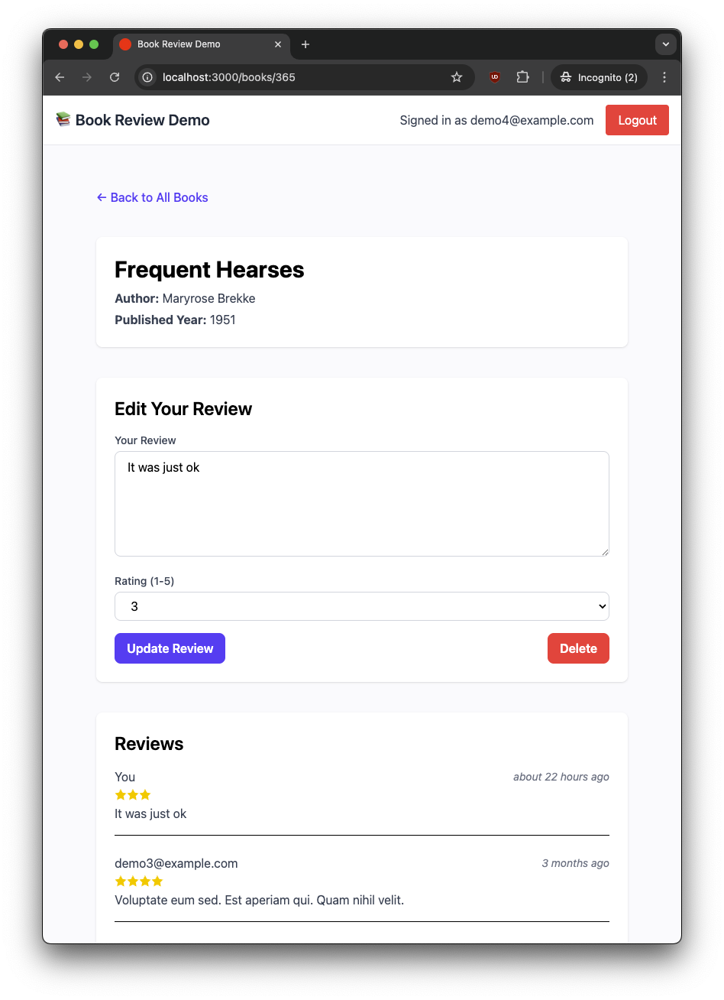

That scenario could be written like this:

```gherkin
Feature: Book reviews

  Background:
    # data creation...
    And I am signed in as "user1@example.com"

  Scenario: User adds a review
    # steps we saw earlier...

  Scenario: User edits their review
    Given User "user1@example.com" has left a review for "Book One" with rating 3 and body "It was ok."
    When I visit the book show page for "Book One"
    Then I should see 3 stars for my review
    And I enter a review with body "Actually, I loved it!" and rating 5
    And I click "Update Review"
    Then I should see "Review was successfully updated."
    And I should see "Actually, I loved it!" in my review
    And I should see 5 stars for my review
```

The step implementations are similar to what we've already seen. The only point of interest is rather than navigating the UI again to create a new review, that data is created with the `Given` step:

```ruby
# features/step_definitions/review_steps.rb
Given("User {string} has left a review for {string} with rating {int} and body {string}") do |email, book_title, rating, body|
  book = Book.find_by(title: book_title)
  user = User.find_by(email: email)
  create(:review, book: book, user: user, rating: rating, body: body)
end
```

Alternatively the original scenario "User adds a review" could be renamed to "User manages their reviews", then more steps added showing how a user can at first create a review, edit it, then even delete it.

## Steps Organization

You may have noticed from the examples so far, that there were multiple step definition files in the book review demo app:

```
features
├── authentication.feature
├── book_reviews.feature
├── other feature files...
├── step_definitions
│   ├── authentication_steps.rb
│   ├── common_steps.rb
│   ├── review.rb
│   └── other step files...
└── support
    ├── env.rb
    └── other support files...
```

How you organize your Cucumber step definitions can make a big difference as your test suite grows. While it's technically possible to keep all your steps in a single file, this quickly becomes unwieldy. A more sustainable approach is to group step definitions by domain concept, such as authentication, books, or reviews, mirroring the main features of your app. For example, in the Book Review Demo, you might have `authentication_steps.rb` for login-related steps, `book_steps.rb` for book setup, and `review_steps.rb` for anything review-related.

As you add more features, you'll notice some steps are used across multiple domains, such as clicking buttons or verifying flash messages. When this happens, extract these into a shared file, such as `common_steps.rb`. For instance, a generic step like:

```ruby
When("I click {string}") do |button|
  click_button button
end
```

is applicable to many scenarios.

There's a tradeoff between writing very generic steps (like checking for text anywhere on the page) and tightly scoped ones (like checking for a message within a specific DOM selector or data test id). Generic steps are easier to reuse but can lead to false positives, while tightly scoped steps are more robust but may break when the markup changes. For example, instead of:

```ruby
Then("I should see {string}") do |text|
  expect(page).to have_content(text)
end
```

you might prefer:

```ruby
Then("I should see {string} in the alert") do |text|
  within(".alert") { expect(page).to have_content(text) }
end
```

See the Cucumber documentation on [Anti Patterns](https://cucumber.io/docs/guides/anti-patterns) for more information.

## Debugging

Browser tests are great when everything is passing, but when something goes wrong, debugging can be a challenge. Unlike unit or integration tests, these tests involve a real browser and a visual UI. This means it's not enough to read the error message; you need to also inspect what's happening on the page.

By default, Capybara runs the tests in headless mode, meaning the browser operates invisibly in the background without displaying any windows. This is fast and convenient for automated runs, but it makes troubleshooting UI issues harder. Fortunately, with a simple environment variable, you can launch the browser in visible mode and watch your tests run just like a real user.

Recall earlier when configuring Cucumber, we added `features/support/cuprite.rb` with the following:

```ruby
Capybara.register_driver(:cuprite) do |app|
  Capybara::Cuprite::Driver.new(
    app,
    window_size: [1920, 1080],
    js_errors: true,
    headless: !ENV["VISIBLE_BROWSER"],
    timeout: 10,
    browser_options: {
      "no-sandbox" => nil # Required if running in Docker
    }
  )
end
```

This means you can set the `VISIBLE_BROWSER` environment variable when running the cucumber command (to any non empty value). When set, Capybara will launch the browser in visible (non-headless) mode, so you can watch the test as it runs. However, if a failure happens quickly, you might still miss it. The solution is to also add a `debugger` statement to pause the test right before the failure.

For example, suppose the edit scenario is failing in not finding the expected validation messages. The output would look something like this:

```
 Scenario: User edits their review                                                                     # features/book_reviews.feature:42
    ...
    And I click "Update Review"                                                                         # features/step_definitions/common_steps.rb:1
    Then I should see the following form validation messages:                                           # features/step_definitions/common_steps.rb:26
      | There were some problems with your submission: |
      | Body can't be blank                            |
      Unable to find css "[data-testid=\"form-validation-error\"]" (Capybara::ElementNotFound)
      ./features/step_definitions/common_steps.rb:27:in 'block in <main>'
      features/book_reviews.feature:48:in `I should see the following form validation messages:'

Failing Scenarios:
cucumber features/book_reviews.feature:42 # Scenario: User edits their review
```

In this case, we can add a `debugger` statement at the beginning of the failing step definition:

```ruby
# features/step_definitions/common_steps.rb

Then("I should see the following form validation messages:") do |table|
  # === ADD DEBUGGER TO MAKE TEST PAUSE HERE ===
  debugger

  within('[data-testid="form-validation-error"]') do
    table.raw.flatten.each do |msg|
      expect(page).to have_content(msg)
    end
  end
end
```

And then run only the failing test, setting the `VISIBLE_BROWSER` environment variable as follows:

```bash
VISIBLE_BROWSER=true bundle exec cucumber features/book_reviews.feature
```

When the test runs, you'll see it pause at the `debugger` line, just like any regular Ruby program:

```
    When I visit the book show page for "Book One"                                                      # features/step_definitions/review_steps.rb:21
    Then I should see 3 stars for my review                                                             # features/step_definitions/review_steps.rb:49
    And I enter a review with body "" and rating 3                                                      # features/step_definitions/review_steps.rb:26
    And I click "Update Review"                                                                         # features/step_definitions/common_steps.rb:1
[22, 31] in ~/projects/book_review_demo/features/step_definitions/common_steps.rb
    26| Then("I should see the following form validation messages:") do |table|
=>  27|   debugger
    28|   within('[data-testid="form-validation-error"]') do
    29|     table.raw.flatten.each do |msg|
    30|       expect(page).to have_content(msg)
    31|     end
=>#0	block {|table=#<Cucumber::MultilineArgument::DataTable:...|} in <main> at ~/projects/book_review_demo/features/step_definitions/common_steps.rb:27
```

Also, a new browser will open and you can see exactly what the UI looks like at the point of failure. In this case, we can see that the error is displayed as expected:

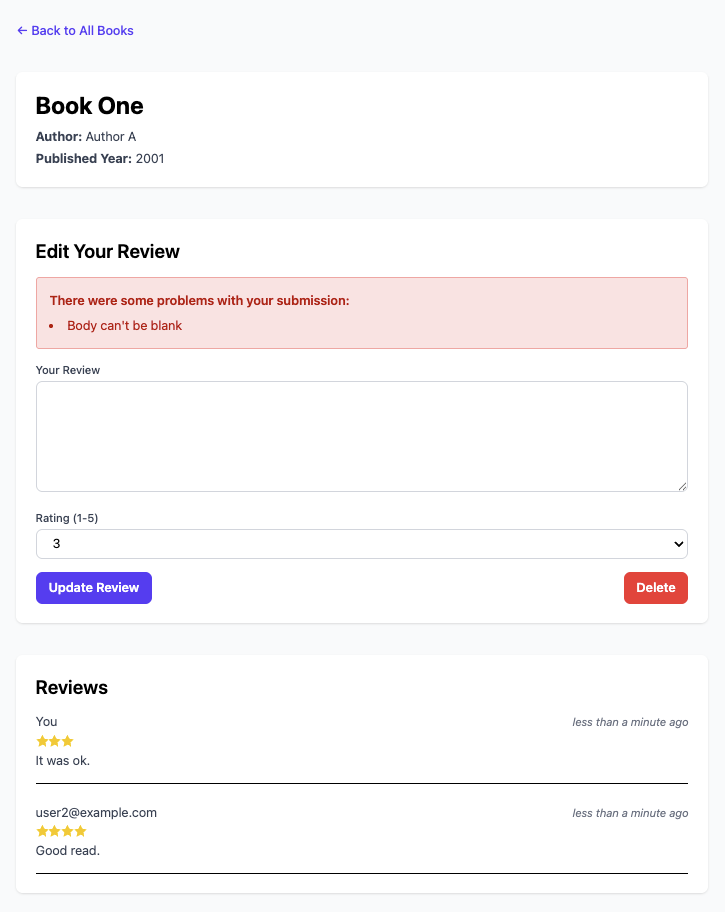

So perhaps the problem lies in the css selector. This is a regular browser so you can open dev tools and inspect elements. And here we see the issue is that the `data-testid` in the markup is `form-validation-errors`:

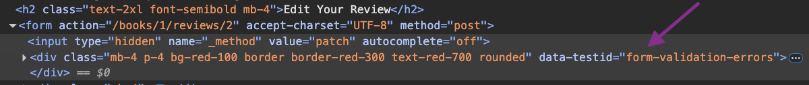

But the step definition is incorrectly looking for a `data-testid` of "form-validation-error" (singular):

```ruby
Then("I should see the following form validation messages:") do |table|
  debugger
  # === FOUND THE BUG HERE! ===
  within('[data-testid="form-validation-error"]') do
    # ...
  end
end
```

So we can fix the selector in the test and run again to confirm it passes.

## Screenshot on Failure

Anytime a test fails, you will almost certainly want to see what the browser looked like at the point of failure. While the debugging steps covered in the previous section can get you there, a more efficient way is to automatically capture a [screenshot on failure](https://cucumber.io/docs/guides/browser-automation/#screenshot-on-failure). The Cucumber docs suggest the following code in an `After` hook:

```ruby
# features/support/hooks.rb
After do |scenario|
  if scenario.failed?
    path = "html-report/#{scenario.__id__}.png"
    page.save_screenshot(path)
    attach(path, 'image/png')
  end
end
```

The generated files will be saved at `tmp/capybara/html-report/`, which should be git ignored. For example `tmp/capybara/html-report/12192.png`. A problem with this is if you're running an entire suite and multiple tests fail, it will be difficult to associate which screenshot is from which test failure because it's not obvious from the scenario ID.

Fortunately Cucumber exposes some more details on the `scenario` object yielded by the `After` block. We can use these attributes to construct a more meaningful file name for the screenshot:

```ruby
# features/support/hooks.rb
After do |scenario|
  if scenario.failed?
    file, line = scenario.location.to_s.split(":")
    feature = File.basename(file, ".feature")
    scenario_name = scenario.name.gsub(/\W+/, "_")
    path = "html-report/#{feature}_#{scenario_name}_line_#{line}.png"
    page.save_screenshot(path)
    attach(path, "image/png")
  end
end
```

Now that failing test for a user editing their review would have its screenshot saved as `tmp/capybara/html-report/book_reviews_User_edits_their_review_line_42.png`, which is much more useful than something like `12192.png`.

<aside class="markdown-aside">
The <code>scenario</code> object yielded by the Cucumber <code>After</code> hook is an instance of <a class="markdown-link" href="https://github.com/cucumber/cucumber-ruby/blob/main/lib/cucumber/running_test_case.rb">Cucumber::RunningTestCase::TestCase</a>, which is defined in the <a class="markdown-link" href="https://github.com/cucumber/cucumber-ruby/tree/main">cucumber-ruby</a> gem. The docs for <code>RunningTestCase</code> state that it wraps <a class="markdown-link" href="https://github.com/cucumber/cucumber-ruby-core/blob/main/lib/cucumber/core/test/case.rb">Cucumber::Core::Test::Case</a>, which is defined in the <a class="markdown-link" href="https://github.com/cucumber/cucumber-ruby-core">cucumber-ruby-core</a> gem. Feel free to peruse the cucumber-ruby and cucumber-ruby-core gems to learn what methods are available for scenarios and other parts of Cucumber.
</aside>

## Developer Tooling

To make working with Cucumber more pleasant, I recommend the [Cucumber extension for VSCode](https://marketplace.visualstudio.com/items?itemName=CucumberOpen.cucumber-official). It adds syntax highlighting, step definition navigation (click a step in a feature file to jump to the corresponding step definition), and helpful autocomplete when writing feature files. The screenshot below shows autocomplete in action from the demo project:

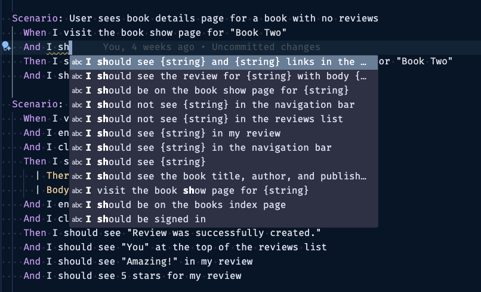

It also warns you if there is no corresponding step definition from a feature file, for example:

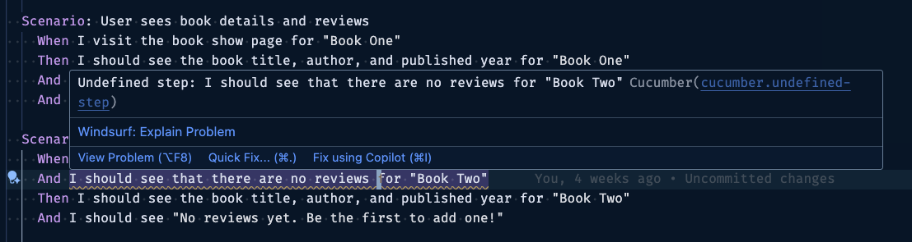

If you're using a different editor, check Cucumber's [editor support page](https://cucumber.io/docs/tools/#editors) for available plugins.

## Continuous Integration

To ensure your Cucumber feature tests run consistently across different environments and automatically catch regressions, it's a good practice to include them in your Continuous Integration (CI) pipeline. Since my project is hosted on GitHub, I use [GitHub Actions](https://docs.github.com/en/actions) to run tests automatically on every push.

To get started, add a workflow YAML file in your project root under `.github/workflows/` as follows:

```yml
# .github/workflows/feature_tests.yml
name: Feature Tests

on:
  push:
    branches: ["*"]

jobs:
  cucumber:
    runs-on: ubuntu-latest

    steps:
      - name: Checkout code
        uses: actions/checkout@v4

      - name: Set up Ruby
        uses: ruby/setup-ruby@v1
        with:
          ruby-version: .ruby-version
          bundler-cache: true

      - name: Install system dependencies
        run: sudo apt-get update && sudo apt-get install --no-install-recommends -y build-essential git pkg-config google-chrome-stable

      - name: Prepare test database
        run: bin/rails db:test:prepare

      - name: Precompile assets
        run: bin/rails assets:precompile

      - name: Run Cucumber features
        env:
          RAILS_ENV: test
        run: bundle exec cucumber

      - name: Upload screenshots from failed tests
        uses: actions/upload-artifact@v4
        if: failure()
        with:
          name: screenshots
          path: tmp/capybara/html-report
          if-no-files-found: ignore
```

Let's break down a few key parts:

* **Checkout & setup:** Pulls down your code and installs the Ruby version from `.ruby-version`.
* **System dependencies:** Installs packages like Chrome for running headless feature tests.
* **Test setup:**
  * `bin/rails db:test:prepare` sets up the test database.
  * `bin/rails assets:precompile` precompiling assets ensures the test browser sees a fully styled, functional site, and any screenshots captured on failure will actually reflect the expected layout and design.
* **Test execution:** Runs your Cucumber features in test mode.
* **Artifacts on failure:** If any test fails, screenshots and HTML reports from Capybara are saved and uploaded as artifacts. You can download them from the GitHub UI to debug what went wrong.

Here's what a successful run looks like:

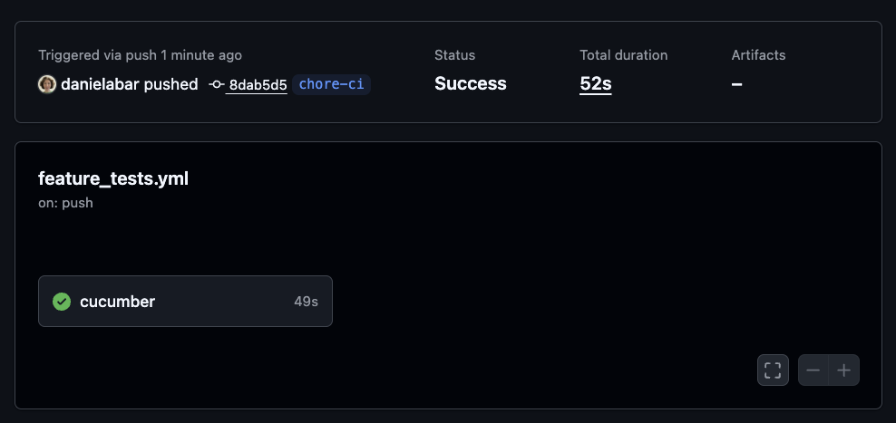

And here's a deliberately failing test, which triggers a red CI run and stores screenshots in the artifacts section. This can be downloaded which will download a zip file containing screenshots of the browser at the point that test(s) failed:

```gherkin
Feature: Book reviews

  Background:
    Given the following books exist:
      | Title      | Author   | Published Year |
      | Book One   | Author A | 2001           |
      | Book Two   | Author B | 2002           |
    And users exist:
      | Email             | Password  |
      | user1@example.com | password1 |
      | user2@example.com | password2 |
    And the following reviews exist:
      | Book     | User Email        | Rating | Body       |
      | Book One | user2@example.com | 4      | Good read. |
    And I am signed in as "user1@example.com"

  Scenario: User sees book details and reviews
    When I visit the book show page for "Book One"
    Then I should see the book title, author, and published year for "Book One DOES NOT EXIST"
    And I should see the review for "user2@example.com" with body "Good read." and 4 stars
    And I should see a submit review button
```

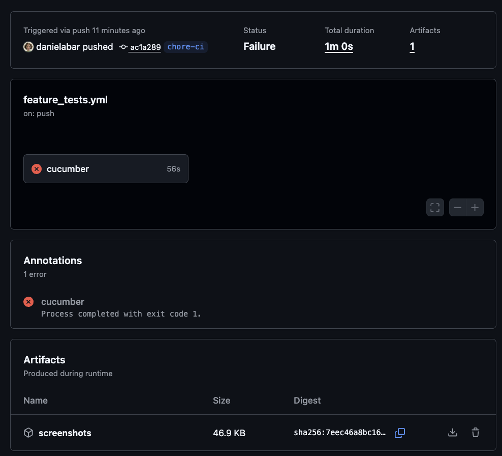

## Conclusion

Cucumber isn't magic, but it does bring structure and sanity to testing complex user flows. It helps you describe what matters in plain language and keeps test code focused on behavior, not plumbing. When paired with Capybara and a CI runner, it becomes a powerful tool for catching regressions before your users do.

For further reading, here are some of the resources mentioned in this post:

* [Cucumber](https://cucumber.io/)
* [Gherkin Reference](https://cucumber.io/docs/gherkin/reference)
* [Installation Options](https://cucumber.io/docs/installation/)
* [Data Tables](https://cucumber.io/docs/cucumber/data-tables/)
* [Cucumber Expressions – Parameter Types](https://github.com/cucumber/cucumber-expressions#parameter-types)
* [Cucumber Expressions – Custom Parameter Types](https://github.com/cucumber/cucumber-expressions#custom-parameter-types)
* [Cucumber Anti-Patterns](https://cucumber.io/docs/guides/anti-patterns)
* [Cucumber::DataTable API Docs](https://www.rubydoc.info/gems/cucumber/Cucumber/MultilineArgument/DataTable)
* [`hashes` Method for Data Tables](https://www.rubydoc.info/gems/cucumber/Cucumber/MultilineArgument/DataTable#hashes-instance_method)
* [`World` Method Source Code](https://github.com/cucumber/cucumber-ruby/blob/2cf3a61802cc36cbca6bf3eed666b3a4a90f77a3/lib/cucumber/glue/dsl.rb#L58)
