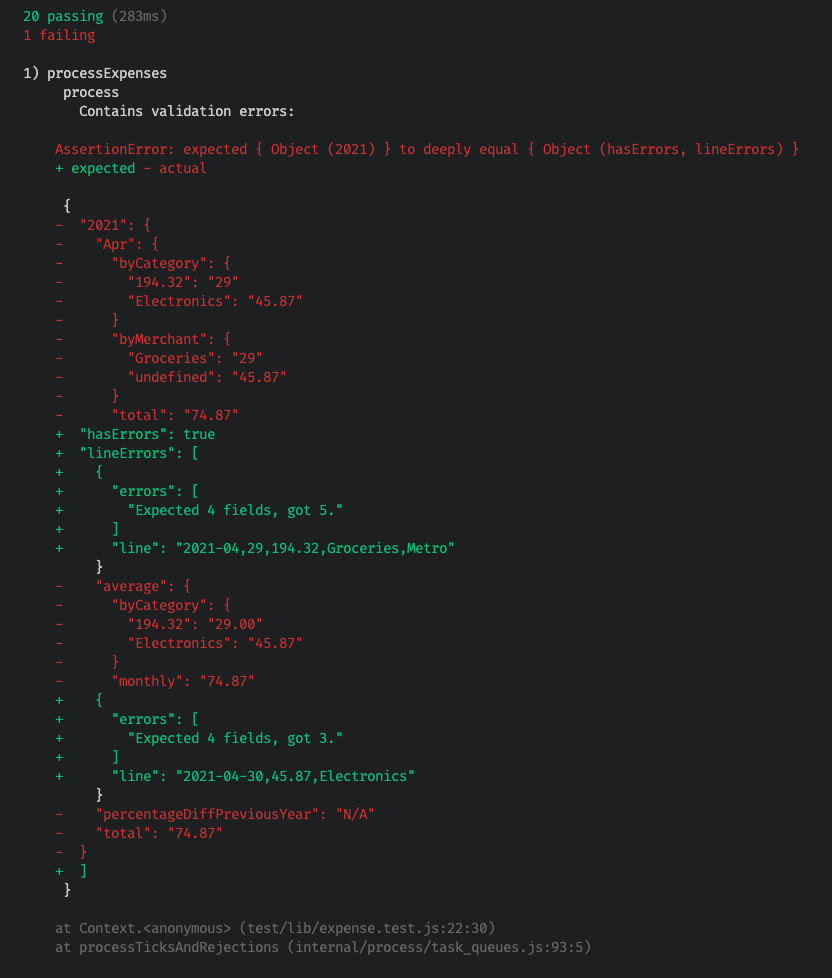
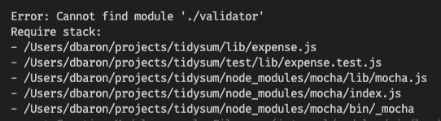
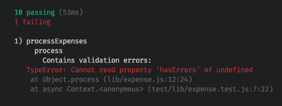
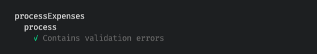
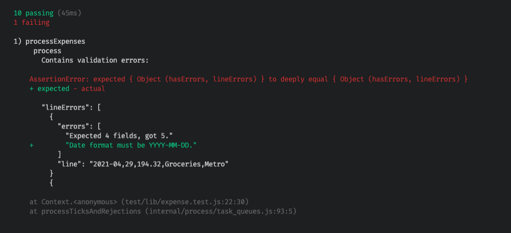
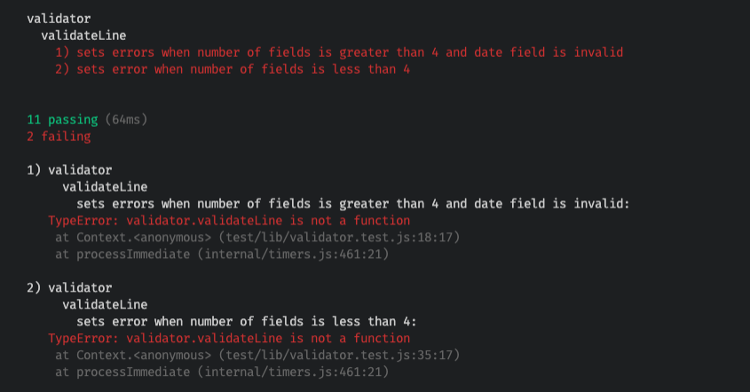
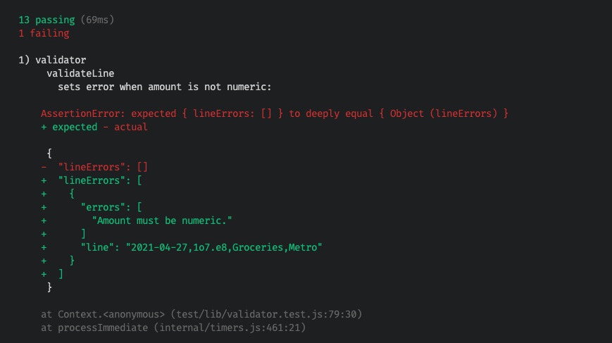

This post will demonstrate an example of using TDD (test driven development) to fix a bug on an existing project. If you're not familiar with TDD, see an [earlier post](/blog/tdd-by-example/) I wrote on this topic.

## Discovering the Problem

Last month when running my monthly expense report with [Tidysum](https://github.com/danielabar/tidysum) (a Node.js command line program I wrote that processes a csv list of daily expenses and outputs a summary json with year and month breakdowns of expenses by category, and makes savings/spending recommendations and calculates a personal rate of inflation), it seemed to be under-reporting April's spending by roughly $200. Although my spending has been lower during Covid times because, you know, there's nothing to do, nevertheless the total amount for April seemed unusually low.

Digging into the input `expenses.csv` file, I found the issue - notice the second line in this snip from the file:

```
...
2021-04-11,131.32,Groceries,Metro
2021-04,24,194.87,Groceries,Metro <-- BUG HANDLING THIS LINE
2021-04-25,20.00,Gas,Shell
...
```

The expected format for the input csv is: `date in YYYY-MM-DD format,numeric spending amount,category,store`. However, the second line has a typo in the date, there's a `,` where the second `-` should be. But, `2021-04` is a valid date. So what the program did is take the first field `2021-04` as the date, then the second "field", which was really the date portion of `24` as the amount field, then the amount field of `194.87` which was now the third field got tracked as a category, and the actual category `Groceries` was now the fourth field and got tracked as the store. The final field `Metro` which is the actual store ended up in the fifth position and was ignored entirely. This is how the spending of `$194.87` got incorrectly recorded as `$24.00` and that's how total spending for April was under-reported.

Normally when a developer discovers a bug in their code, there's an instinct to dive in, figure out what's wrong and fix it as quickly as possible. But with TDD, the approach is different. After figuring out where in the code the problem lies, you first write a failing test. That is, a test that exercises the buggy portion of the code, and makes assertions assuming the bug has already been fixed. This test will fail because you haven't actually fixed it yet. Then you go in and fix the code, run the test again, and this time it should pass.

The benefit of this approach is it forces you to first think about how the code should behave under the bug circumstances by documenting it in a test. Then having the test ensures that this bug will never creep into your code again.

So first things first, let's figure out where in the code this problem with processing potentially invalid data occurs.

<aside class="markdown-aside">
Some of you may be wondering why write a custom program for expense tracking when there's Excel and countless free apps out there, a <a class="markdown-link" href="https://github.com/danielabar/tidysum#why-not-use-excel">short explanation here</a>.
</aside>

## Analysis

Looking at the code, I realized there was no validation of the input file. It's read in via a csv stream library and processed one line at a time, assuming each line is in the expected format. Here's the relevant code starting from the command line entrypoint:

```js
// index.js (entrypoint)
const expense = require('./lib/expense');

// Left out some code for brevity - that grabs the command line arguments
// including `argv.e` which is path to expense file
// ...

(async () => {
  const result = await expense.process(argv.e);
  fs.writeFileSync('expenses.json', JSON.stringify(result, null, 2), 'utf8');
})();
```

```js
// lib/expense.js
const csv = require('csv-streamify');
const fs = require('fs');

async function process(inputFile) {
  // No validation, inputFile is passed as is to processFile function.
  const expenseSummary = await processFile(inputFile);
  return expenseSummary;
}

async function processFile(file) {
  return new Promise(resolve => {
    const output = {};
    const parser = csv();
    parser.on('data', line => {
      // csv-streamify exposes the data as an array of values from csv line
      // eg: 2020-04-29,194.23,Groceries,Metro turns into:
      // ['2020-04-29', '194.23', 'Groceries', 'Metro']
      processLine(line, output);
    });
    parser.on('end', () => {
      resolve(output);
    });
    fs.createReadStream(file, { encoding: 'utf8' }).pipe(parser);
  });
}

function processLine(line, output) {
  // Use destructuring assignment to unpack values out of array that csv-streamify generated from line in csv file
  const [dateStr, amountStr, category, merchant] = line;
  processEntry({ dateStr, amountStr, category, merchant }, output);
}

function processEntry(data, output) {
  // Begin calculations...
}
```

The critical part is this line that uses `csv-streamify` to stream in the csv file one line at a time:

```js
parser.on('data', line => {
```

At this point, `line` is an array of values from the line in the csv file that was just read. There will be one entry in the array for each value in the csv line. Then this array `line` gets passed to the `processLine` function which uses [destructuring assignment](https://developer.mozilla.org/en-US/docs/Web/JavaScript/Reference/Operators/Destructuring_assignment) to unpack the values in the `line` array into individual values:

```js
function processLine(line, output) {
  // Use destructuring assignment to unpack values out of array that csv-streamify generated from line in csv file
  const [dateStr, amountStr, category, merchant] = line;
  ...
}
```

This is where the bug occurs because if the csv line had a comma instead of an expected dash in date such as `2021-04,24,194.87,Groceries,Metro`, then the variables will be assigned as follows:

```js
line = ['2021-04', '24', '194.87', 'Groceries', 'Metro']
dateStr = '2021-04'
amountStr = '24'
category = '194.87'
merchant = 'Groceries'
// Metro is ignored
```

## Define Expectations

Now that the analysis has revealed how the bug occurs, the next step is to determine how the program *should* behave when given invalid data. This "should" behaviour will then get encoded into a test.

If this was a work project, the decision as to how the program should behave usually goes to the product manager/owner. But in this case, it's a side project which makes me the product owner so I need to decide. Given that this is a financial application, it doesn't make sense to perform *any* calculation if even a single record is invalid. This is because all the numbers get added, averaged, and compared. So even one number being off could throw off all the results.

What this means is that there should be a validation step *before* the file is processed for calculation. This validation should read in all lines of the file and for each line, check that it has exactly 4 fields. Any more or less is a sign that the data is probably incorrect. There's other things that could be validated like the date format and numeric spending amount, but will get to that later. It's easier to start with just a single validation and then add in more.

As the program finds invalid lines, it should accumulate these. For each invalid line it should record all the things that are wrong with it. For now there will only be one thing its checking (number of values), but there could be more.

Then before the program goes into the calculation step, it should check if any validation errors occurred, stop and return these instead of going into the calculation step.

## Write a Failing Test

Since the bug can be observed from the results of the `process` function in `lib/expense.js`, I will start with writing a test for this function. The test will provide an invalid input file to the `process` function, and expects some validation errors returned instead of the usual calculations that `process` would return.

It's very likely that the validation implementation won't go in the `process` function itself because the `lib/expense.js` module is about calculating expenses. Keeping with the [single responsibility principle](https://en.wikipedia.org/wiki/Single-responsibility_principle), the actual validation will be performed by another module, and `process` will just call out to it before proceeding with calculation. However, I don't want to get into any implementation details before having at least one failing test in place, and since I can see the buggy behaviour from `process`, this is where I'm starting with a (failing) test.

This project uses the [Mocha](https://mochajs.org/) testing library with [Chai](https://www.chaijs.com/) expect-style assertions, but the same TDD principles would apply to any test framework/library.

The `process` function is asynchronous because it reads in a file, so the test will also be asynchronous. As for the input file for the test, this project already has a `test/fixtures` directory, so will first write an `invalid-data.csv` test file and place it in the fixtures directory:

```
// test/fixtures/invalid-data.csv
2021-04,29,194.32,Groceries,Metro
2021-04-30,45.87,Electronics
```

This input file has two invalid lines. The first one has 5 fields and the second one has 3 fields. Recall the expectation is each line should have exactly 4 fields. The first line has an additional problem that the date format is incorrect, but for now we're only interested in the "number of fields" validation.

The test will pass the invalid file from the `test/fixtures` directory to the `process` function, then define an expected result object containing the line errors, then use chai's `deep.equal` assertion to verify that the actual result returned from `process` matches the expected result.

Where does the expected result object come from? That's my requirements that I decided on what would be a nice easy way to show the errors to the user. Remember, this isn't implemented yet, the test is how you can express the thought - "I wish the program worked like this"...

```js
// test/lib/expense.test.js
const { expect } = require('chai');
const expense = require('../../lib/expense');

describe('processExpenses', function() {
  describe('process', function() {
    it('Contains validation errors', async function() {
      const result = await expense.process(`${process.cwd()}/test/fixtures/invalid-data.csv`);

      const expectedResult = {
        hasErrors: true,
        lineErrors: [
          {
            line: '2021-04,29,194.32,Groceries,Metro',
            errors: ['Expected 4 fields, got 5.'],
          },
          {
            line: '2021-04-30,45.87,Electronics',
            errors: ['Expected 4 fields, got 3.'],
          },
        ],
      };
      expect(result).to.deep.equal(expectedResult);

      // Doesn't process year results from file due to validation errors
      expect(result).not.to.have.any.keys('2021');
    });
  });
});
```

Run `npm test` in a terminal to run the tests, and as expected, this new test fails because validation has not yet been implemented.

You can see the bug in action here because the code is attempting to run calculations on invalid data. There's a category of `194.32` due to the date parsing error on the first invalid line. Also there's a Merchant of `undefined` which comes from the second invalid line that only has 3 fields (missing Merchant field). And the total spending is incorrect, it should be `194.32` + `45.87` = `240.19` (the intended amounts from input data if it were valid), but instead the total is `29` (from incorrectly parsed date in ine 1) + `45.87` = `74.87`.



## Make the Test Pass

Finally, it's time to implement some validation!

Looking again at the `process` function, it needs to read the entire file for validation purposes *before* going into the calculations, and if any validation errors are found, return them instead of going on to perform calculations. Since I know the actual validation logic doesn't belong here, I will introduce a new `validator` module and call out to it. Will get to writing this shortly. Since reading a file is an asynchronous operation in Node.js, the function to be exposed by the validator module must also be asynchronous.

```js
// lib/expense.js
const csv = require('csv-streamify');
const fs = require('fs');
// NEW MODULE (not written yet)
const validator = require('./validator');

async function process(inputFile) {
  // NEW CODE ADDED HERE: Call validator module to process file, if any errors, return immediately
  const validationResult = await validator.processFile(inputFile);
  if (validationResult.hasErrors) return validationResult;

  const expenseSummary = await processFile(inputFile);
  return expenseSummary;
}

async function processFile(file) {
  ...
}
```

Since some implementation code has been added, `npm test` to run tests again. Not surprisingly, the expense test fails because the new `validator` module cannot be found:



To fix this, need to add the validator module and expose a `processFile` function:

```js
// lib/validator.js
async function processFile(file) {
  // TODO: Stream in csv file and validate each line
}

module.exports = {
  processFile
}
```

This time when running the tests, get a failure about being unable to read property `hasErrors` of undefined, which makes sense since the `processFile` function of the `validator` module doesn't return anything yet:



Next step, need to fill in that `processFile` function for validation. I'm using the same [csv-streamify](https://github.com/klaemo/csv-stream) library already used in the project to process the file for calculations. The basic skeleton for reading in a file via streams with this library is like this:

```js
// lib/validator.js
const csv = require('csv-streamify');
const fs = require('fs');

async function processFile(file) {
  return new Promise(resolve => {
    const parser = csv();
    parser.on('data', line => {
      // will receive the `data` event for every line read from csv file
      // `line` is an array of values from the current line in csv
      // TODO: Validate `line` array size
    });
    parser.on('end', () => {
      // will receive the `end` event when entire csv file has been read
      // result is returned to caller by resolving the promise
      // TODO: Return validation results
      resolve('finished');
    });
    // Start reading the file
    fs.createReadStream(file, { encoding: 'utf8' }).pipe(parser);
  });
}
```

**Aside:** Why use a streaming approach to read in the expense file? While certainly the code would be easier to read by reading the entire file into memory in a single operation, this won't scale. If the user has been diligently tracking their every single expense for many years, the expense file could grow too large to fit into memory and then the program would crash. A full discussion of Node.js streams is outside the scope of this article, but if you'd like to learn more about this topic, see the [Streams](https://nodejs.dev/learn/nodejs-streams) documentation.

Back to implementation. Since the csv input file is being read one line at a time, an object is needed to accumulate the results of validation. What should this object look like? This is the expected result specified in the test (that is currently failing), recall the expected object to be returned from this function looks like this:

```js
const expectedResult = {
  hasErrors: true,
  lineErrors: [
    {
      line: '2021-04,29,194.32,Groceries,Metro',
      errors: ['Expected 4 fields, got 5.'],
    },
    {
      line: '2021-04-30,45.87,Electronics',
      errors: ['Expected 4 fields, got 3.'],
    },
  ],
};
```

There's two levels of accumulation that can be happening with this object. First is the `lineErrors` array, which should contain an entry for each line that has a problem. Then each line could potentially have more than one thing wrong with it, so the `errors` property within each `lineErrors` entry is an array to record *all* the issues with this line.

To build up this object, will initialize an `output` object with `false` for `hasErrors` property (being optimistic, start with assumption that nothing is wrong unless proven otherwise), and an empty array for `lineErrors`.

```js
// lib/validator.js
const csv = require('csv-streamify');
const fs = require('fs');

async function processFile(file) {
  return new Promise(resolve => {
    // Accumulator object to record all validation errors and be returned to caller
    const output = {
      hasErrors: false,
      lineErrors: [],
    };
    const parser = csv();
    parser.on('data', line => {
      // will receive the `data` event for every line read from csv file
      // `line` is an array of values from the current line in csv
      // TODO: Validate `line` array size and record results in `output` object
    });
    parser.on('end', () => {
      // will receive the `end` event when entire csv file has been read
      // result is returned to caller by resolving the promise
      // TODO: Return validation results
      resolve('finished');
    });
    // Start reading the file
    fs.createReadStream(file, { encoding: 'utf8' }).pipe(parser);
  });
}
```

Next need to populate the `output` object `lineErrors` array for each line that doesn't have exactly 4 fields. This logic will go on the `.on('data')` event since this is where the line value is available. The line will be collapsed back to a comma separated string to make it easier to read, and a helpful error message is set stating the expected number of fields, and how many were actually in this line:

```js
// lib/validator.js
const csv = require('csv-streamify');
const fs = require('fs');

async function processFile(file) {
  return new Promise(resolve => {
    // Accumulator object to record all validation errors and be returned to caller
    const output = {
      hasErrors: false,
      lineErrors: [],
    };
    const parser = csv();
    parser.on('data', line => {
      if (line.length != 4) {
        output.lineErrors.push({
          // collapse the array back into a comma separated string to make the result easy to read
          line: line.join(','),
          errors: [`Expected 4 fields, got ${line.length}.`],
        });
      }
    });
    parser.on('end', () => {
      // will receive the `end` event when entire csv file has been read
      // result is returned to caller by resolving the promise
      // TODO: Return validation results
      resolve('finished');
    });
    // Start reading the file
    fs.createReadStream(file, { encoding: 'utf8' }).pipe(parser);
  });
}
```

But this still won't make the test pass because the `output` object isn't yet being returned. Since this is an asynchronous function, to "return" a value is to pass it to the `resolve` function of the `Promise`. This means some logic needs to be added to the `.on('end')` event which is called when the entire file has been read. Currently its resolving with a string `finished`. This needs to be modified to first set `hasErrors` property of object if there's at least one entry in its `lineErrors` array, and then resolve it:

```js
// lib/validator.js
const csv = require('csv-streamify');
const fs = require('fs');

async function processFile(file) {
  return new Promise(resolve => {
    // Accumulator object to record all validation errors and be returned to caller
    const output = {
      hasErrors: false,
      lineErrors: [],
    };
    const parser = csv();
    parser.on('data', line => {
      if (line.length != 4) {
        output.lineErrors.push({
          // collapse the array back into a comma separated string to make the result easy to read
          line: line.join(','),
          errors: [`Expected 4 fields, got ${line.length}.`],
        });
      }
    });
    parser.on('end', () => {
      // will receive the `end` event when entire csv file has been read
      // result is returned to caller by resolving the promise
      if (output.lineErrors.length > 0) {
        output.hasErrors = true;
      }
      resolve(output);
    });
    // Start reading the file
    fs.createReadStream(file, { encoding: 'utf8' }).pipe(parser);
  });
}
```

And finally, the test passes!



## Refactoring: Extract Method

There's still more work to be done though. Remember the number of fields is not the only thing that could be wrong with a line in the input file. The program should also validate that the date is in expected `YYYY-MM-DD` format and that the amount field is numeric.

However, looking at the `processFile` function in the `validator` module currently, it's getting messy. There's the complexity of streaming the csv file to read it, which needs to respond to the `data` and `end` events, and the validation is implemented inside the `data` event handling. Adding more validation rules here will only make the code messier.

It would be cleaner to extract a `validateLine` function that will perform all the validation rules on a given line, accumulating the `errors` array for this line, and have the `.on('data')` event handler call out to this new `validateLine` function to perform the validation. Let's get this refactoring done before adding any further validation rules.

Often when refactoring, new bugs can be introduced, which can make developers hesitant to try and improve existing code. This is where TDD really shines. A test has already been written to verify the expected behaviour. If the test fails after refactoring, then it will be obvious that the refactor broke something and needs to be fixed. In other words, TDD allows you to refactor with confidence.

Here is the refactored `validator` module with a new `validateLine` function. This function receives as arguments the `line` array from the csv file, and the `output` object for accumulating `lineError` entries. It then builds up a `lineErrorEntry` object with an `errors` array. For now only one message can be pushed to the `errors` array about the number of fields.

```js
const csv = require('csv-streamify');
const fs = require('fs');

async function processFile(file) {
  return new Promise(resolve => {
    const output = {
      hasErrors: false,
      lineErrors: [],
    };
    const parser = csv();
    parser.on('data', line => {
      // Rather than doing validation right here in event handler,
      // call out to validateLine function to do the work.
      validateLine(line, output);
    });
    parser.on('end', () => {
      if (output.lineErrors.length > 0) {
        output.hasErrors = true;
      }
      resolve(output);
    });
    fs.createReadStream(file, { encoding: 'utf8' }).pipe(parser);
  });
}

function validateLine(line, output) {
  // Build an entry to record everything that might be wrong with this line.
  const lineErrorEntry = {
    line: line.join(','),
    errors: [],
  };

  // Validate number of fields
  if (line.length != 4) {
    lineErrorEntry.errors.push(`Expected 4 fields, got ${line.length}.`);
  }

  // If found at least one thing wrong with this line, add it to the output
  if (lineErrorEntry.errors.length > 0) {
    output.lineErrors.push(lineErrorEntry);
  }
}

module.exports = {
  processFile,
};
```

And the tests still pass. Good, this refactor didn't break anything, and the code is cleaner.

## More Validation: Date Format

Now we're in a good position to add more validation. Recall that the `invalid-data.csv` being passed to the test had one line with two things wrong with it. The number of fields, and invalid date format of `YYYY-MM` whereas the program is expecting `YYYY-MM-DD`:

```
2021-04,29,194.32,Groceries,Metro  <-- 5 fields should be 4, AND date is YYYY-MM
2021-04-30,45.87,Electronics
```

According to the TDD process, before modifying the validation code to add date format validation, first the test should be updated to expect a new error message for date format. Notice the first `lineErrors` entry now expects 2 error messages in the `errors` array. The first one is for number of fields, the second message is for the date format.

```js
// test/lib/expense.test.js
const { expect } = require('chai');
const expense = require('../../lib/expense');

describe('processExpenses', function() {
  describe('process', function() {
    it('Contains validation errors', async function() {
      const result = await expense.process(`${process.cwd()}/test/fixtures/invalid-data.csv`);

      const expectedResult = {
        hasErrors: true,
        lineErrors: [
          {
            line: '2021-04,29,194.32,Groceries,Metro',
            // NEW ERROR MESSAGE EXPECTATION ADDED HERE:
            errors: ['Expected 4 fields, got 5.', 'Date format must be YYYY-MM-DD.'],
          },
          {
            line: '2021-04-30,45.87,Electronics',
            errors: ['Expected 4 fields, got 3.'],
          },
        ],
      };
      expect(result).to.deep.equal(expectedResult);

      // Doesn't process year results from file due to validation errors
      expect(result).not.to.have.any.keys('2021');
    });
  });
});
```

This time the test will fail because the date format validation has not yet been implemented:



Now let's go back to the `validateLine` function of the `validate` module to add date format validation. The technique used here is to [parse](https://momentjs.com/docs/#/parsing/string-format/) the date using moment.js in strict mode (passing boolean `true` as the third argument), then checking the resulting moment.js object's `isValid()` function to determine if parsing worked as expected.

**Aside:** This program is from a few years ago and already using moment.js for date handling so will continue using that for the validation. However, if starting a new project, there are more lightweight and modern [alternatives](https://momentjs.com/docs/#/-project-status/) available.

Here is the updated `validateLine` function with additional date validation:

```js
const csv = require('csv-streamify');
const fs = require('fs');
const moment = require('moment');

async function processFile(file) {
  // same code as before...
}

function validateLine(line, output) {
  // Build an entry to record everything that might be wrong with this line.
  const lineErrorEntry = {
    line: line.join(','),
    errors: [],
  };

  // Validate number of fields
  if (line.length != 4) {
    lineErrorEntry.errors.push(`Expected 4 fields, got ${line.length}.`);
  }

  // Validate date format
  if (line.length > 0 && !moment(line[0], DATE_FORMAT, true).isValid()) {
    lineErrorEntry.errors.push(`Date format must be ${DATE_FORMAT}.`);
  }

  // If found at least one thing wrong with this line, add it to the output
  if (lineErrorEntry.errors.length > 0) {
    output.lineErrors.push(lineErrorEntry);
  }
}
```

Now the updated test passes.

## From Integration to Unit Test

Up until this point the validation code has been test driven from the `process` function test of the `expense` module. This is an integration test because it's using file I/O and testing the result of multiple modules working together. It was a good place to start with testing because that's where the buggy behaviour was observed. But now that the program is taking shape and we see that the actual validation logic is in a validation module, it's time to move one level lower and unit test just the validation module. While it's great to have higher level integration tests to ensure all the modules work together, these can be slower than unit tests.

I'd like to just test the `validateLine` function of the `validator` module because it doesn't require a file input, allowing the tests to focus on passing it just one invalid line at a time. Here is a skeleton of the `validator` module test and a few tests that cover the existing validation rules for number of fields and date format. A `beforeEach` block is used to reset the `output` accumulator object to an empty state before each test:

```js
// test/lib/validator.test.js
const validator = require('../../lib/validator');
const { expect } = require('chai');

describe('validator', () => {
  describe('validateLine', () => {
    let output;

    beforeEach(() => {
      output = {
        lineErrors: [],
      };
    });

    it('sets errors when number of fields is greater than 4 and date field is invalid', () => {
      // Given
      const line = ['2021-04', '05', '78.34', 'Groceries', 'Metro', 'foo'];
      // When
      validator.validateLine(line, output);
      // Then
      const expectedOutput = {
        lineErrors: [
          {
            line: '2021-04,05,78.34,Groceries,Metro,foo',
            errors: ['Expected 4 fields, got 6.', 'Date format must be YYYY-MM-DD.'],
          },
        ],
      };
      expect(output).to.deep.equal(expectedOutput);
    });

    it('sets error when number of fields is less than 4', () => {
      // Given
      const line = ['2021-04-05', '78.34', 'Groceries'];
      // When
      validator.validateLine(line, output);
      // Then
      const expectedOutput = {
        lineErrors: [
          {
            line: '2021-04-05,78.34,Groceries',
            errors: ['Expected 4 fields, got 3.'],
          },
        ],
      };
      expect(output).to.deep.equal(expectedOutput);
    });
  });
});
```

These tests cover functionality we've already seen working from the `expense` module integration test, so these *should* pass as well. However, they fail with the error `validator.validateLine is not a function`:



The reason for this is the `validator` module currently only exposes the `processFile` method in its exports. Strictly speaking that's the only "public" method needed for the module because it's only used by the `expense` module, which only calls `processFile`:

```js
// lib/validator.js

async function processFile(file) {
  // ...
}

function validateLine(line, output) {
  // ...
}

module.exports = {
  // Only one function is public
  processFile,
}
```

However, in order to unit test the `validateLine` method of the `validator` module, it must also be exposed in the `module.exports` section, effectively making it public. This is one of the few times that I miss Java, where the `default` and `protected` [access modifiers](https://www.programiz.com/java-programming/access-modifiers) are perfect for this purpose. A method can be marked `default` or `protected` to give it package level visibility, which makes it available to the test which lives in the same package, but doesn't make it `public` to the entire program.

One way around this in JavaScript is to extract out the method to be tested into yet another module, say `validator-details.js`, expose that method publicly in the new module, then have the `validator` module call out to `validator-details` module. However, this feels like way too much overhead for this purpose so I'm simply going to add `validateLine` to the list of public methods in the `validator` module:

```js
// lib/validator.js

async function processFile(file) {
  // ...
}

function validateLine(line, output) {
  // ...
}

module.exports = {
  processFile,
  // NOW validateLine can be unit tested
  validateLine,
}
```

And this makes the tests pass, including the new tests in `test/lib/validator.test.js`

## More Validation: Numeric Amount

The last validation to add is to ensure the spending amount provided in each csv line is numeric. Now that we have lower level unit testing set up for the `validator` module, let's add this test:

```js
// test/lib/validator.test.js
const validator = require('../../lib/validator');
const { expect } = require('chai');

describe('validator', () => {
  describe('validateLine', () => {
    let output;

    beforeEach(() => {
      output = {
        lineErrors: [],
      };
    });

    it('sets errors when number of fields is greater than 4 and date field is invalid', () => {
      // existing test...
    });

    it('sets error when number of fields is less than 4', () => {
      // existing test...
    });

    // NEW TEST HERE
    it('sets error when amount is not numeric', () => {
      // Given
      const line = ['2021-04-27', '1o7.e8', 'Groceries', 'Metro'];
      // When
      validator.validateLine(line, output);
      // Then
      const expectedOutput = {
        lineErrors: [
          {
            line: '2021-04-27,1o7.e8,Groceries,Metro',
            errors: ['Amount must be numeric.'],
          },
        ],
      };
      expect(output).to.deep.equal(expectedOutput);
    });
  });
});
```

At this point, the test will fail because numeric amount validation has not yet been implemented. So the `lineErrors` property of the `output` object will be an empty array rather than the expected error:



For implementation, there's plenty of JavaScript [solutions](https://www.wikitechy.com/tutorials/javascript/validate-decimal-numbers) to verify if a given input is a decimal number. Since the Tidysum app is already using [decimal.js](https://github.com/MikeMcl/decimal.js/), I decided to make use of that library's parsing, which throws an error if the input cannot be parsed to a numeric. Note that all values come in as strings from csv parsing, so the solution needs to consider `'123.45'` to be valid, but `'123abc'` is not.

Here is the updated validator module with numeric amount validation added:

```js
// lib/validator.js
const moment = require('moment');
const Decimal = require('decimal.js');

async function processFile(file) {
  // ...
}

function validateLine(line, output) {
  // Build an entry to record everything that might be wrong with this line.
  const lineErrorEntry = {
    line: line.join(','),
    errors: [],
  };

  // Validate number of fields
  if (line.length != 4) {
    lineErrorEntry.errors.push(`Expected 4 fields, got ${line.length}.`);
  }

  // Validate date format
  if (line.length > 0 && !moment(line[0], 'YYYY-MM-DD', true).isValid()) {
    lineErrorEntry.errors.push(`Date format must be YYYY-MM-DD.`);
  }

  // NEWLY ADDED: Validate numeric amount
  if (line.length > 1) {
    try {
      new Decimal(line[1]);
    } catch (_) {
      lineErrorEntry.errors.push('Amount must be numeric.');
    }
  }
}

module.exports = {
  processFile,
  validateLine,
}
```

And now the tests pass.

One last test that should be added is to pass in a valid line, and ensure that no errors are reported. This is to make sure there's no false negative in the validation code - i.e. flagging a valid line as invalid:

```js
// test/lib/validator.test.js
const validator = require('../../lib/validator');
const { expect } = require('chai');

describe('validator', () => {
  describe('validateLine', () => {
    let output;

    beforeEach(() => {
      output = {
        lineErrors: [],
      };
    });

    it('sets errors when number of fields is greater than 4 and date field is invalid', () => {
      // existing test...
    });

    it('sets error when number of fields is less than 4', () => {
      // existing test...
    });

    it('sets error when amount is not numeric', () => {
      // existing test...
    });

    // NEW TEST HERE: Valid scenario
    it('does not report any errors when input line is valid', () => {
      // Given
      const line = ['2021-04-05', '78.34', 'Groceries', 'Metro'];
      // When
      validator.validateLine(line, output);
      // Then
      const expectedOutput = {
        lineErrors: [],
      };
      expect(output).to.deep.equal(expectedOutput);
    });
  });
});
```

And this test passes as well.

Good, all validation is now implemented. But not quite ready to call it a day.
## Refactoring: Extract Validation Methods

It's time to do just a little more refactoring. Looking at the validator module, there's a few things bothering me:

1. The `validateLine` function has gotten too long, it has the details of 3 different validations, and each one has a comment describing what it does. It would be cleaner to extract each of these to a separate method, and name the method to match the comment, then the comments can be removed.
2. There are several hard-coded values: `4` for number of fields, and `YYYY-MM-DD` for date format. It would be cleaner to extract these as constants.

Again we can rely on the tests here. It's safe to re-arrange the code to make any internal improvements, and as long as the tests are still passing, can be confident that the code is still working as expected.

Here is the refactored validation module with individual methods to implement each validation rule, and hard-coded values extracted as constants:

```js
// lib/validator.js
const NUM_FIELDS = 4;
const DATE_FORMAT = 'YYYY-MM-DD';

async function processFile(file) {
  // ...
}

function validateLine(line, output) {
  // Build an entry to record everything that might be wrong with this line.
  const lineErrorEntry = {
    line: line.join(','),
    errors: [],
  };

  // Call out to individual validation methods for each rule
  validateNumFields(line, lineErrorEntry);
  validateDateFormat(line, lineErrorEntry);
  validateNumeric(line, lineErrorEntry);

  // If found at least one thing wrong with this line, add it to the output
  if (lineErrorEntry.errors.length > 0) {
    output.lineErrors.push(lineErrorEntry);
  }
}

function validateNumFields(line, lineErrorEntry) {
  if (line.length != NUM_FIELDS) {
    lineErrorEntry.errors.push(`Expected ${NUM_FIELDS} fields, got ${line.length}.`);
  }
}

function validateDateFormat(line, lineErrorEntry) {
  if (line.length > 0 && !moment(line[0], DATE_FORMAT, true).isValid()) {
    lineErrorEntry.errors.push(`Date format must be ${DATE_FORMAT}.`);
  }
}

function validateNumeric(line, lineErrorEntry) {
  if (line.length > 1) {
    try {
      new Decimal(line[1]);
    } catch (_) {
      lineErrorEntry.errors.push('Amount must be numeric.');
    }
  }
}

module.exports = {
  processFile,
  validateLine,
};
```

And all the tests are still passing, hurray!

## Summary

This post has walked you through a practical example of using TDD to fix a bug, and apply refactoring to improve the design of the code, while relying on the tests to confirm the code still works as expected. In general the process is as follows:

1. Analyze the code to find where/how/why the bug is occurring.
2. Define expectations about how the code should behave.
3. Write a test that fails because of the bug.
4. Write some code to make the test pass.
5. Refactor and re-run tests as needed.

I hope this has inspired you to try out TDD next time you're faced with a bug. Good luck and happy coding!
