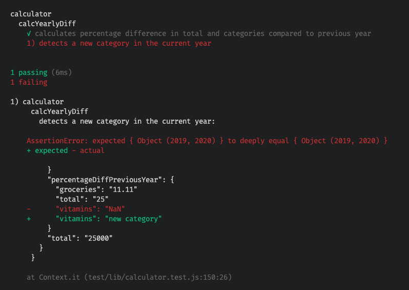

If you've been coding for any length of time, you've probably heard that you should test your code, and by that I mean writing automated tests. This can be challenging at first, but with some practice, it becomes easier. When first learning to write tests, it's easier to have already written the production code, then open up another editor tab side by side with that code, and write some tests against that code. However, there's another approach to writing tests called [Test Driven Development](https://en.wikipedia.org/wiki/Test-driven_development), aka TDD. According to Wikipedia, TDD is:

> A software development process relying on software requirements being converted to test cases before software is fully developed, and tracking all software development by repeatedly testing the software against all test cases. This is opposed to software being developed first and test cases created later.

In practice what this means is, suppose you want to add a new feature to some software. You would first write a test for that feature and run the test. The test would fail since the new feature hasn't been written yet. Then you write just enough code to get that test to pass. When it passes, then you add another test for this feature, run it to see that it fails, write more code to get this to pass, and continue until the feature is complete. Typically the first test you write would be for the "happy path", then next test would be for an edge case such as invalid input and so on.

This is much harder to do because you don't have the actual code to look at, instead you have to picture what the result of the code should be and write a test to expect that result. In fact, this is the benefit of TDD. You end up with tests that verify the results of the code, rather than implementation details. But the first time you try this, it can be difficult to know where to start.

This post will walk you through an example of using TDD that I did recently to add a new feature to [Tidysum](https://github.com/danielabar/tidysum). I will assume that you already know how to write tests generally, but are new to TDD specifically.

First, what is Tidysum? Tidysum is a personal finance app that takes in a list of daily expenses and outputs a summary json file with year and month breakdowns of these expenses by category, showing total and average spending per month and per year, and makes savings and spending recommendations. It's written as an npm module and runs as a CLI. The feature I added was a percentage difference calculation for total and by-category spending year over year. The idea is to calculate a personalized rate of inflation based on your actual spending, rather than some theoretical basket of goods determined by government bureaucrats.

Aside: I was inspired to add this after learning from several finance podcasts that the official government inflation numbers may not reflect reality as they don't include food and energy. As some government benefits are indexed to inflation, as are many employers' annual cost of living increases, it may benefit some to have this number reported as lower than it really is. The inflation number is also used in personal finance for retirement planning and so can be disastrous if incorrect. Of course there's nothing I can do about the big macro, but as a developer, I can improve my software to generate more personalized information to help inform better decision making.

Ok back to TDD. Tidysum reads in a csv file of expenses like this (abbreviated, but imagine this goes on for several years):

```csv
2018-01-01,...
2018-10-01,34.29,Groceries,Loblaws
2018-10-01,133.99,Restaurant,The Keg
2018-10-04,5.99,Entertainment,Amazon
2018-10-15,54.00,Groceries,Loblaws
2018-11-15,11.67,Health,Loblaws
2019-10-15,120,Groceries,Loblaws
2019-10-20,20,Restaurant,Dominos
2019-10-25,10.00,Entertainment,Apple
2019-11-10,12.49,Health,Whole Foods
...
2020-12-24,...
```

And generates a summary json where each key is the year. Each year shows the total spending for that year, and then has another object where each key is the month in that year. Each month shows total spending for that month, as well as the breakdown by category and by merchant.

Each year also has an `average` section, where it shows on average how much was spent each month, and again, an average breakdown by category. The summary looks something like this:

```json
{
  "2018": {
    "total": "239.94",
    "Oct": {
      "total": "228.27",
      "byCategory": {
        "Groceries": "88.29",
        "Restaurant": "133.99",
        "Entertainment": "5.99"
      },
      "byMerchant": {
        "Loblaws": "88.29",
        "The Keg": "133.99",
        "Amazon": "5.99"
      }
    },
    "Nov": {
      "total": "11.67",
      "byCategory": {
        "Health": "11.67"
      },
      "byMerchant": {
        "Loblaws": "11.67"
      }
    },
    "average": {
      "monthly": "119.97",
      "byCategory": {
        "Groceries": "44.15",
        "Restaurant": "67.00",
        "Entertainment": "3.00",
        "Health": "5.84"
      }
    }
  },
  "2019": {
    "total": "162.49",
    "Oct": {
      "total": "150",
      "byCategory": {
        "Groceries": "120",
        "Restaurant": "20",
        "Entertainment": "10.00"
      },
      "byMerchant": {
        "Loblaws": "120",
        "Dominos": "20",
        "Apple": "10.00"
      }
    },
    "Nov": {
      "total": "12.49",
      "byCategory": {
        "Health": "12.49"
      },
      "byMerchant": {
        "Whole Foods": "12.49"
      }
    },
    "average": {
      "monthly": "81.25",
      "byCategory": {
        "Groceries": "60.00",
        "Restaurant": "10.00",
        "Entertainment": "5.00",
        "Health": "6.25"
      }
    }
  }
}
```

What I wanted to add was another per year entry to show the percentage difference in total and per category spending as compared to the previous year, like this:

```json
{
  "2018": {
    "total": "239.94",
    "Oct": {
      "total": "228.27",
      "byCategory": {
        "Groceries": "88.29",
        "Restaurant": "133.99",
        "Entertainment": "5.99"
      },
      "byMerchant": {
        "Loblaws": "88.29",
        "The Keg": "133.99",
        "Amazon": "5.99"
      }
    },
    "Nov": {
      "total": "11.67",
      "byCategory": {
        "Health": "11.67"
      },
      "byMerchant": {
        "Loblaws": "11.67"
      }
    },
    "average": {
      "monthly": "119.97",
      "byCategory": {
        "Groceries": "44.15",
        "Restaurant": "67.00",
        "Entertainment": "3.00",
        "Health": "5.84"
      }
    },
    "percentageDiffPreviousYear": "N/A"
  },
  "2019": {
    "total": "162.49",
    "Oct": {
      "total": "150",
      "byCategory": {
        "Groceries": "120",
        "Restaurant": "20",
        "Entertainment": "10.00"
      },
      "byMerchant": {
        "Loblaws": "120",
        "Dominos": "20",
        "Apple": "10.00"
      }
    },
    "Nov": {
      "total": "12.49",
      "byCategory": {
        "Health": "12.49"
      },
      "byMerchant": {
        "Whole Foods": "12.49"
      }
    },
    "average": {
      "monthly": "81.25",
      "byCategory": {
        "Groceries": "60.00",
        "Restaurant": "10.00",
        "Entertainment": "5.00",
        "Health": "6.25"
      }
    },
    "percentageDiffPreviousYear": {
      "total": "-32.28",
      "Groceries": "35.9",
      "Restaurant": "-85.07",
      "Entertainment": "66.67",
      "Health": "7.02"
    }
  }
}
```

So for the first recorded year, `percentageDiffPreviousYear` would be `N/A` because there's nothing to compare it to. Then for the following year, it should calculate percentage difference in total and by category spending as compared to the previous year.

This kind of problem lends itself very well to TDD because the desired output is exactly known. And this is exactly what goes in the tests.

Ok let's get into the code. Recall this project already exists and most of the code is already written. The processing of the file happens in a function named `processFile` in the `lib/expense.js` module. It first generates the `expenseSummary` by reading the expense csv line by line. then it goes over the expense summary to add in the averages - this part is delegated to a `calculator` module in a method named `calcAvg`.

```js
// lib/expense.js
const csv = require('csv-streamify');
const calculator = require('./calculator');
const recommendation = require('./recommendation');
// other imports...

async function process(inputFile, mothlyIn, fixedExp) {
  // Read input csv of expenses to generate summary json
  const expenseSummary = await processFile(inputFile);
  // Enhance the json summary with averages
  const expenseSummaryWithAvg = calculator.calcAvg(expenseSummary);
  if (mothlyIn && fixedExp) {
    recommendation.determine(expenseSummaryWithAvg, mothlyIn, fixedExp);
  }
  // TODO: Further enhance json summary - Calculate percentage diff year over year
  return expenseSummaryWithAvg;
}

async function processFile(file) {
  // Use csv-streamify to stream in input csv and generate expense summary json object
  // Details are not relevant for this post, see project on github for complete code.
}

// rest of functions...

module.exports = {
  process,
};
```

My thought was after the averages have been added to the expense summary, it would be a good time to further process `expenseSummaryWithAvg` to add the percentage differences. Since the average calculation is delegated to the calculator module, it makes sense to delegate percentage difference calculation to this module as well. So it will look something like this:

```js
async function process(inputFile, mothlyIn, fixedExp) {
  const expenseSummary = await processFile(inputFile);
  const expenseSummaryWithAvg = calculator.calcAvg(expenseSummary);
  if (mothlyIn && fixedExp) {
    recommendation.determine(expenseSummaryWithAvg, mothlyIn, fixedExp);
  }
  // NEW LINE ADDED HERE:
  const withYearlyDiff = calculator.calcYearlyDiff(expenseSummaryWithAvg);
  return withYearlyDiff;
}
```

## Calculator Tests

Now instead of jumping in to add a new method `calcYearlyDiff` to the calculator module and implement it, this is where the TDD approach will come in. Let's first add a test to specify what should be the expected output of this method. This project uses the [Mocha](https://mochajs.org/) test framework and [Chai](https://www.chaijs.com/api/assert/) for assertions, but TDD principles can be used with any testing library.

Here is the existing calculator module:

```javascript
// lib/calculator.js
const decimalUtil = require('./decimal-util');

function calcAvg(expenseSummary) {
  // existing logic...
}

module.exports = {
  calcAvg,
};

```

And the existing calculator tests:

```javascript
// test/lib/calculator.test.js
const calculator = require('../../lib/calculator');
const { expect } = require('chai');

describe('calculator', () => {
  describe('calcAvg', () => {
    // tests for existing calcAvg method
  });
});
```

We know the calculator module needs to have a new method `calcYearlyDiff` so let's add a test for that. The style I'm following is a `describe` block for each method in the module, and an `it` test for each condition of the method to be tested:

```js
// test/lib/calculator.test.js
const calculator = require('../../lib/calculator');
const { expect } = require('chai');

describe('calculator', () => {
  describe('calcAvg', () => {
    // tests for existing calcAvg method
  });

  describe('calcYearlyDiff', () => {
    it('calculates percentage difference in total and categories compared to previous year', () => {
      // do test things here!
    });
  });
});
```

So what should go in the test body? I like to follow the [GivenWhenThen](https://martinfowler.com/bliki/GivenWhenThen.html) approach. Just about every test can be expressed as "Given" a certain set of inputs, "When" the system under test is invoked, "Then" expect certain results.

In this case, the input to the `calcYearlyDiff` method will be the expense summary json object which contains a key for each year, then each year having total and average by category spending. The system under test is the `calcYearlyDiff` method in the calculator module. The expected result is a modified expense summary object having an additional property `percentageDiffPreviousYear`, which itself is an object containing percentage differences for total spending, and for each category.

Let's express this in a test:

```js
describe('calcYearlyDiff', () => {
  it('calculates percentage difference in total and categories compared to previous year', () => {
    // Given total spending increase of 25%, grocery spending increase of 11.11% and gift spending decrease of 20%
    const summary = {
      '2019': {
        total: '20000',
        average: {
          byCategory: {
            groceries: '900',
            gifts: '100',
          },
        },
      },
      '2020': {
        total: '25000',
        average: {
          byCategory: {
            groceries: '1000',
            gifts: '80',
          },
        },
      },
    };
    const expectedSummaryWithDiff = {
      '2019': {
        total: '20000',
        average: {
          byCategory: {
            groceries: '900',
            gifts: '100',
          },
        },
        percentageDiffPreviousYear: 'N/A',
      },
      '2020': {
        total: '25000',
        average: {
          byCategory: {
            groceries: '1000',
            gifts: '80',
          },
        },
        percentageDiffPreviousYear: {
          total: '25',
          groceries: '11.11',
          gifts: '-20',
        },
      },
    };

    // When calculator function calcYearlyDiff is invoked
    const result = calculator.calcYearlyDiff(summary);

    // Then expect result to contain `percentageDiffPreviousYear` as shown in `expectedSummaryWithDiff`
    expect(result).to.eql(expectedSummaryWithDiff);
  });
});
```

The amazing this is all this can be written without knowing yet how the `calcYearlyDiff` function will be implemented. In fact we don't care about implementation at this point, the only thing that matters is expressing what the function should return given a certain input.

Next step is to run the tests, this project uses npm scripts with the test script defined to run mocha as follows:

```json
// package.json
{
  ...
  "scripts": {
    "test": "NODE_ENV=test mocha test/**/*.test.js",
    ...
  }
  ...
}
```

Tests are run by entering the `npm test` command in a terminal. At this point, the newly added test will fail with the following error:

```
1) calculator
  calcYearlyDiff
    calculates percentage difference in total and categories compared to previous year:
TypeError: calculator.calcYearlyDiff is not a function
 at Context.it (test/lib/calculator.test.js:96:33)
```

This is expected as we haven't yet touched the calculator module. Let's change that now by adding an empty function definition and exporting it:

```js
// lib/calculator.js

function calcYearlyDiff(expenseSummary) {
  // TODO...
}

module.exports = {
  calcAvg,
  calcYearlyDiff,
};
```

Running the tests again `npm test` results in a different error:

```
1) calculator
  calcYearlyDiff
    calculates percentage difference in total and categories compared to previous year:
AssertionError: expected undefined to deeply equal { Object (2019, 2020) }
 at Context.it (test/lib/calculator.test.js:98:25)
```

Again, this is expected because the function has no implementation, it implicitly returns `undefined`, which does not match the `expectedSummaryWithDiff` the test expects.

## Calculator Implementation

Ok, NOW we're ready to write some implementation in the calculator module. This solution iterates over each year in the `expenseSummary` using `Object.entries(obj)` which returns an array of key/value pairs of the given object, and then `forEach` to loop over these.

For each year, find the previous year in the object, if it's not found, set the current year's `percentageDiffPreviousYear` to `N/A` because there's nothing to compare to. Otherwise calculate percentage difference between the current year's total spending to previous years total spending and save this in the `percentageDiffPreviousYear.total` property of the current year. And then iterate over each average by category spending for current year, calculate its percentage difference relative to previous year, and save it in the `percentageDiffPreviousYear[curCategory]` property of the current year.

```js
// lib/calculator.js

function calcYearlyDiff(expenseSummary) {
  Object.entries(expenseSummary).forEach(([year, yearSummary]) => {
    const intYear = parseInt(year, 10);
    const prevYear = intYear - 1;
    if (!expenseSummary[prevYear]) {
      yearSummary.percentageDiffPreviousYear = 'N/A';
    } else {
      yearSummary.percentageDiffPreviousYear = {};
      yearSummary.percentageDiffPreviousYear.total =
        ((yearSummary.total - expenseSummary[prevYear].total) / expenseSummary[prevYear].total) * 100 + '';
      Object.entries(yearSummary.average.byCategory).forEach(([curCategory, curAvg]) => {
        const prevAvg = expenseSummary[prevYear].average.byCategory[curCategory];
        yearSummary.percentageDiffPreviousYear[curCategory] = ((curAvg - prevAvg) / prevAvg) * 100 + '';
      }); // for each category average within year
    }
  }); // for each year
  return expenseSummary;
}
```

Now running the test results in a different failure, the returned object is not quite as expected.


Well we've made some progress as the gifts and total percentage calculations are correct. But notice the color coding for expected (green) vs actual (red) results. If the result of the calculation is a decimal, we only want to see two decimals of precision. Currently there's no rounding or truncation so results are not as expected.

Let's fix the code to make the test pass. To get the desired decimal precision, will use `Math.round(num * 100) / 100` where `num` is the percentage difference calculation:

```js
// lib/calculator.js

function calcYearlyDiff(expenseSummary) {
  Object.entries(expenseSummary).forEach(([year, yearSummary]) => {
    const intYear = parseInt(year, 10);
    const prevYear = intYear - 1;
    if (!expenseSummary[prevYear]) {
      yearSummary.percentageDiffPreviousYear = 'N/A';
    } else {
      const totalDiff = ((yearSummary.total - expenseSummary[prevYear].total) / expenseSummary[prevYear].total) * 100;
      const totalDiffRounded = Math.round(totalDiff * 100) / 100;
      yearSummary.percentageDiffPreviousYear.total = totalDiffRounded + '';
      Object.entries(yearSummary.average.byCategory).forEach(([curCategory, curAvg]) => {
        const prevAvg = expenseSummary[prevYear].average.byCategory[curCategory];
        const categoryDiff = ((curAvg - prevAvg) / prevAvg) * 100;
        const categoryDiffRounded = Math.round(categoryDiff * 100) / 100;
        yearSummary.percentageDiffPreviousYear[curCategory] = categoryDiffRounded + '';
      }); // for each category average within year
    }
  }); // for each year
  return expenseSummary;
}
```

And now the test passes - yay!

At this point, you may have noticed two things: 1) The percentage difference calculation is repeated in two places - once for the total difference, and again in the loop for each category. And 2) this code is getting messy, especially once the rounding logic is added. At this point, it might be tempting to refactor, but let's hold off for now until all the tests are in place. The goal here is to get all the functionality working, then we can refactor to make improvements.

## Detect New Categories

One more feature this code needs to support is detection of new categories. For example, suppose you purchased some vitamins in 2020, but didn't purchase any in 2019. In this case we can't calculate the percentage difference in vitamin spending because there's nothing to compare it to.  In this case, the code should simply display `new category`. Let's define this behavior in a new test. Again, this is TDD, we write the test before implementing the requirement:

```js
// test/lib/calculator.test.js

const calculator = require('../../lib/calculator');
const { expect } = require('chai');

describe('calculator', () => {
  describe('calcAvg', () => {
    // existing tests for calcAvg function...
  });

  describe('calcYearlyDiff', () => {
    it('calculates percentage difference in total and categories compared to previous year', () => {
      // test we just wrote...
    });

    // Our new test here:
    it('detects a new category in the current year', () => {
      // Given
      const summary = {
        '2019': {
          total: '20000',
          average: {
            byCategory: {
              groceries: '900',
            },
          },
        },
        '2020': {
          total: '25000',
          average: {
            byCategory: {
              groceries: '1000',
              vitamins: '90',
            },
          },
        },
      };
      const expectedSummaryWithDiff = {
        '2019': {
          total: '20000',
          average: {
            byCategory: {
              groceries: '900',
            },
          },
          percentageDiffPreviousYear: 'N/A',
        },
        '2020': {
          total: '25000',
          average: {
            byCategory: {
              groceries: '1000',
              vitamins: '90',
            },
          },
          percentageDiffPreviousYear: {
            total: '25',
            groceries: '11.11',
            vitamins: 'new category',
          },
        },
      };
      // When
      calculator.calcYearlyDiff(summary);
      // Then
      expect(summary).to.eql(expectedSummaryWithDiff);
    });
  });
});
```

Now when we run the calculation tests, the first test that we wrote earlier passes, but the newly added test fails:



Again this makes sense because vitamin spending for 2019 doesn't exist therefore the line to retrieve the previous years category average will return `undefined`. Then trying to use `undefined` in a calculation results in `NaN`:

```js
// When `curCategory` is 'vitamins', `prevAvg` will be undefined
const prevAvg = expenseSummary[prevYear].average.byCategory[curCategory];
const categoryDiff = ((curAvg - prevAvg) / prevAvg) * 100;    // NaN
const categoryDiffRounded = Math.round(categoryDiff * 100) / 100;   // NaN
```

Now that the test is in place, we can enhance the code to handle this case. The solution is to first check if the previous years average exists. If it doesn't, then output `new category`, otherwise, go ahead and run the percentage difference calculation:

```js
// lib/calculator.js

function calcYearlyDiff(expenseSummary) {
  Object.entries(expenseSummary).forEach(([year, yearSummary]) => {
    const intYear = parseInt(year, 10);
    const prevYear = intYear - 1;
    if (!expenseSummary[prevYear]) {
      yearSummary.percentageDiffPreviousYear = 'N/A';
    } else {
      const totalDiff = ((yearSummary.total - expenseSummary[prevYear].total) / expenseSummary[prevYear].total) * 100;
      const totalDiffRounded = Math.round(totalDiff * 100) / 100;
      yearSummary.percentageDiffPreviousYear.total = totalDiffRounded + '';
      Object.entries(yearSummary.average.byCategory).forEach(([curCategory, curAvg]) => {
        const prevAvg = expenseSummary[prevYear].average.byCategory[curCategory];
        if (!prevAvg) {
          yearSummary.percentageDiffPreviousYear[curCategory] = 'new category';
        } else {
          const categoryDiff = ((curAvg - prevAvg) / prevAvg) * 100;
          const categoryDiffRounded = Math.round(categoryDiff * 100) / 100;
          yearSummary.percentageDiffPreviousYear[curCategory] = categoryDiffRounded + '';
        }
      }); // for each category average within year
    }
  }); // for each year
  return expenseSummary;
}
```

This time both tests should pass.

But we're not done yet. Remember earlier I pointed out several issues with this code - the same percentage difference calculation is written twice, and overall code is getting messy. This code is both iterating the expense summary and doing some mathematical calculations. Now that we've got all the percentage difference feature covered by tests, we can tackle a refactor to fix these issues.

## Refactoring Calculation

This project actually has another module `lib/decimal-util.js` to perform all numeric calculations. This module uses the [decimal.js](https://github.com/MikeMcl/decimal.js/) library. I was looking for something similar to [BigDecimal](https://docs.oracle.com/en/java/javase/15/docs/api/java.base/java/math/BigDecimal.html) in Java to avoid some Javascript known issues with decimal calculations. The decimal-util module would be a perfect place for the percentage difference calculation to live. Then the calculator module could simply make use of it wherever needed. Here's what I'm picturing:

```js
// lib/calculator.js

// This module is already imported because its used in other functions in the calculator module
const decimalUtil = require('./decimal-util');
// other imports and functions...

function calcYearlyDiff(expenseSummary) {
  Object.entries(expenseSummary).forEach(([year, yearSummary]) => {
    const intYear = parseInt(year, 10);
    const prevYear = intYear - 1;
    if (!expenseSummary[prevYear]) {
      yearSummary.percentageDiffPreviousYear = 'N/A';
    } else {
      yearSummary.percentageDiffPreviousYear = {};
      // NEW: Use decimal-util module for percentage diff calculation
      yearSummary.percentageDiffPreviousYear.total = decimalUtil.percentDiff(expenseSummary[prevYear].total, yearSummary.total);
      Object.entries(yearSummary.average.byCategory).forEach(([curCategory, curAvg]) => {
        const prevAvg = expenseSummary[prevYear].average.byCategory[curCategory];
        if (!prevAvg) {
          yearSummary.percentageDiffPreviousYear[curCategory] = 'new category';
        } else {
          // NEW: Use decimal-util module for percentage diff calculation
          yearSummary.percentageDiffPreviousYear[curCategory] = decimalUtil.percentDiff(prevAvg, curAvg);
        }
      }); // for each category average within year
    }
  }); // for each year
  return expenseSummary;
}
```

Now running the tests will fail:


The reason both tests are failing now is because it's trying to invoke a function `decimalUtil.percentDiff(...)` that doesn't exist. The solution to this is to add the `percentDiff` function to the `decimal-util` module, write the implementation and export it. But wait, we're doing this TDD style. So before writing any implementation, let's write a test, this time for the decimal util module.

Here's the existing decimal util module:

```js
// lib/decimal-util.js
const Decimal = require('decimal.js');

function divideAndRound(numeratorIn, denominatorIn) {
  const numerator = new Decimal(numeratorIn);
  const denominator = new Decimal(denominatorIn);
  return numerator
    .dividedBy(denominator)
    .toFixed(2)
    .toString();
}

function sum(in1, in2) {
  const in1Dec = new Decimal(in1);
  const in2Dec = new Decimal(in2);
  return in1Dec.plus(in2Dec).toString();
}

// more functions...

module.exports = {
  divideAndRound,
  sum,
  // other functions...
};
```

And the existing decimal util tests:

```js
// test/lib/decimal-utils.test.js
const decimalUtil = require('../../lib/decimal-util');
const { expect } = require('chai');

describe('decimalUtil', () => {
  describe('divideAndRound', () => {
    // tests for divideAndRound function...
  });
  // tests for other functions...
});
```

Looking at the refactored calculator module, we need a method in decimal util `percentDiff` that takes two numbers - a previous and current, and returns the percentage difference between them. If the current value is greater than previous, we expect a percentage increase. If current value is less than previous, we expect a percentage decrease. If they are the same, then percentage difference should be 0. Finally, if the result is not an integer, it should round to two decimal places. That's 4 different requirements, let's define all of these as tests:

```js
// test/lib/decimal-utils.test.js
const decimalUtil = require('../../lib/decimal-util');
const { expect } = require('chai');

describe('decimalUtil', () => {
  describe('divideAndRound', () => {
    // tests for divideAndRound function...
  });

  // NEW: Tests for percentDiff function
  describe('percentDiff', () => {
    it('Returns percentage increase when current is greater than previous', () => {
      // Given
      const prev = '80';
      const cur = '100';
      // When
      const result = decimalUtil.percentDiff(prev, cur);
      // Then
      expect(result).to.equal('25');
    });

    it('Returns percentage decrease when current is less than previous', () => {
      // Given
      const prev = '100';
      const cur = '80';
      // When
      const result = decimalUtil.percentDiff(prev, cur);
      // Then
      expect(result).to.equal('-20');
    });

    it('Returns 0 when current is the same as previous', () => {
      // Given
      const prev = '80';
      const cur = '80';
      // When
      const result = decimalUtil.percentDiff(prev, cur);
      // Then
      expect(result).to.equal('0');
    });

    it('Rounds to 2 decimal places', () => {
      // Given
      const prev = '900';
      const cur = '1000';
      // When
      const result = decimalUtil.percentDiff(prev, cur);
      // Then
      expect(result).to.equal('11.11');
    });
  });
});
```

Running the decimal util tests now will result in all of them failing because we haven't yet defined the function:


Same drill as last time, first step to fix this is to define the function in the decimal util module and export it so it's visible:

```js
// lib/decimal-util.js
const Decimal = require('decimal.js');

// other functions

function percentDiff(prev, cur) {
  // Implementation TBD...
}

module.exports = {
  // other functions...
  percentDiff,
};
```

Results of running the tests again at this point should surprise no one - they all fail comparing `undefined` to the expected calculation. Just like when we started the TDD process in the calculator module, an empty function implicitly returns undefined:


Now we can solve this by filling in the implementation for the `percentDiff` function:

```js
// lib/decimal-util.js
const Decimal = require('decimal.js');

// other functions

function percentDiff(prev, cur) {
  const prevDec = new Decimal(prev);
  const curDec = new Decimal(cur);
  const diff = curDec.minus(prevDec);
  return diff
    .dividedBy(prevDec)
    .mul(100)
    .toDecimalPlaces(2, Decimal.ROUND_HALF_UP)
    .toString();
}

module.exports = {
  // other functions...
  percentDiff,
};
```

And now all the decimal util tests pass:


Now let's turn our attention back to the calculator module, recall we had changed it to use the decimal util module to clean up the percentage difference calculation.

```js
// lib/calculator.js

// This module is already imported because its used in other functions in the calculator module
const decimalUtil = require('./decimal-util');
// other imports and functions...

function calcYearlyDiff(expenseSummary) {
  Object.entries(expenseSummary).forEach(([year, yearSummary]) => {
    const intYear = parseInt(year, 10);
    const prevYear = intYear - 1;
    if (!expenseSummary[prevYear]) {
      yearSummary.percentageDiffPreviousYear = 'N/A';
    } else {
      yearSummary.percentageDiffPreviousYear = {};
      // NEW: Use decimal-util module for percentage diff calculation
      yearSummary.percentageDiffPreviousYear.total = decimalUtil.percentDiff(expenseSummary[prevYear].total, yearSummary.total);
      Object.entries(yearSummary.average.byCategory).forEach(([curCategory, curAvg]) => {
        const prevAvg = expenseSummary[prevYear].average.byCategory[curCategory];
        if (!prevAvg) {
          yearSummary.percentageDiffPreviousYear[curCategory] = 'new category';
        } else {
          // NEW: Use decimal-util module for percentage diff calculation
          yearSummary.percentageDiffPreviousYear[curCategory] = decimalUtil.percentDiff(prevAvg, curAvg);
        }
      }); // for each category average within year
    }
  }); // for each year
  return expenseSummary;
}
```

At this point the calculator tests should pass since we've finished implementing the decimal util `percentDiff` function:


A quick note about the calculator module - since it's now delegating some of the functionality to the decimal-util module, the calculator tests function more like integration tests than unit tests because they're not isolated to just the one module. If this bothers you, you can introduce a mock to mock out the behavior of the decimal util module. I'm not a huge fan of this approach as it results in testing the implementation details rather than the actual output of the function. This is not strictly related to TDD so won't go into any more detail here, other than to say, I'm fine with having some of the tests more like integration tests. If in the future a bug gets introduced into decimal util that affects the calculator result, the calculator tests will fail which would be a good warning.

One more quick note about the calculator - eagle eyed readers may have observed that the `calcYearlyDiff` function modifies its input. Normally I wouldn't do this, especially in a large application where there could be many callers of this function and modifying the input would be unexpected. But for a small side project where the input is actually running through a series of transformations and isn't used anywhere else, I decided this was fine. A future refactor could first make a deep copy of the input, and then operate only on the copy. Since the test makes assertions on the returned result, it would still be expected to pass.
## Conclusion

I hope this post has given you some ideas about how to get started with TDD. The TDD approach lends itself really well to cases where the exact requirements are known. I've found this to especially be the case with calculations, validations and transformation type code. Next time you're adding a new feature to a project, if you know exactly how the new feature should behave, try to write a test for it first.

## Related Content

The following section contains affiliate links for related content you may find useful. I get a small commission from purchases which helps me maintain this site.

You've seen a few simple examples of refactoring in this blog post. Martin Fowler's [Refactoring: Improving the Design of Existing Code](https://amzn.to/2RFC0Xn) is the go-to book to learn all about this topic.

Working on a large legacy code base? This book [Working Effectively with Legacy Code](https://amzn.to/3accwHF) is a must read.

Is your organization introducing microservices? This book [Building Event-Driven Microservices: Leveraging Organizational Data at Scale](https://amzn.to/3uSxa87) is a fantastic resource on this topic.

Looking to level up on Rails 6? You might like this book: [Agile Web Development with Rails 6](https://amzn.to/3wS8GNA).