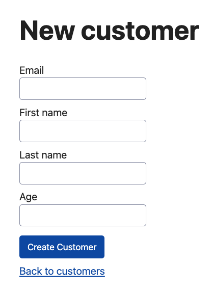

Rails makes it easy (relative to other web frameworks) to go from an idea to a working web application. If you follow along with the [Getting Started with Rails](https://guides.rubyonrails.org/getting_started.html) guide, you can see how straightforward it is to go from an idea of a blog application with articles that have that have a title and body text, to creating a database table that stores articles, a model to represent the articles and validation rules, views that render HTML to initiate CRUD operations on articles, and a controller to handle http request/responses, and delegate to the model to perform the CRUD operations.

There's also plenty of online tutorials and courses that will cover creating a Rails application from start to finish for other domains besides a blogging application. Going through any of these will give you a sense of how Rails can be used to represent just about any domain where you want to build a web app to expose CRUD operations on a relational data model.

However, all of the learning materials that I have seen make an assumption that there is always a one to one relationship between each form field that will be displayed in the web view, and the underlying database table that will be persisted. For example...

TODO: Maybe visual from one of my Pluralsight courses? eg: Company/Stock Prices https://github.com/danielabar/user-resource-rails-pluralsight#identifying-entities

This symmetry between the UI form and the underlying table is very nice for learning. But what I've found in the "real world", is that the interface presented in the web view does not exactly match the database table, due to complex business requirements. Then it's not obvious how to make use of all the Rails niceties around form binding to the model, validations and saving. This post will show a technique that can be used anytime you encounter a mismatch between a form presented to a user, and what needs to be persisted in the database.

## Example

Consider an example of a back office for some application where administrators will fill out a form to create new customers. The `customers` table will persist email, first and last names. However, the form also has a field for the customers age. It's used for validation where customer must be greater than a certain age, but it will not be persisted to table, therefore its not part of customer model. A more complex case might be that the form asks for SIN/SSN to validate against an external service, but this value is not required to be persisted.

Here is the migration that creates the `customers` table:

```ruby
class CreateCustomers < ActiveRecord::Migration[7.0]
  def change
    create_table :customers do |t|
      t.string :email, null: false, index: { unique: true }
      t.string :first_name, null: false
      t.string :last_name, null: false

      t.timestamps
    end
  end
end
```

Here is the corresponding `Customer` model (I'm using the [annotate](https://github.com/ctran/annotate_models) gem to get schema information outputted as comments at the top of the model class):

```ruby
# == Schema Information
#
# Table name: customers
#
#  id         :integer          not null, primary key
#  email      :string           not null
#  first_name :string           not null
#  last_name  :string           not null
#  created_at :datetime         not null
#  updated_at :datetime         not null
#
# Indexes
#
#  index_customers_on_email  (email) UNIQUE
#
class Customer < ApplicationRecord
  validates :email, presence: true, uniqueness: true, format: { with: URI::MailTo::EMAIL_REGEXP }
  validates :first_name, presence: true
  validates :last_name, presence: true
end
```

And here is the required form to create a new customer that the back office admin application will use. Notice the `age` field that isn't present in the `customers` table or `Customer` model:



## First Attempt

Suppose in this hypothetical app, that the customer's age must be greater than 18. If you were to attempt to implement this in the standard Rails way as per the getting started guide and common tutorials, you might add the validation rule to the `Customer` model such as:

```ruby
class Customer < ApplicationRecord
  # other validation rules...

  # this won't work as we'll see because `age` is not a column on the `customers` table
  validates :age, presence: true, numericality: { only_integer: true, greater_than: 18 }
end
```

And update the `CustomersController` to permit `:age` as a parameter for creation:

```ruby
class CustomersController < ApplicationController

  # standard CRUD methods...

  # POST /customers or /customers.json
  def create
    @customer = Customer.new(customer_params)

    respond_to do |format|
      if @customer.save
        format.html { redirect_to customer_url(@customer), notice: "Customer was successfully created." }
        format.json { render :show, status: :created, location: @customer }
      else
        format.html { render :new, status: :unprocessable_entity }
        format.json { render json: @customer, status: :unprocessable_entity }
      end
    end
  end

  private

  def customer_params
    # try to let `age` field through from the UI form
    params.require(:customer).permit(:email, :first_name, :last_name, :age)
  end
end
```

And add the `age` field to the customer creation form in the view:

```html
<%= form_with(model: customer) do |form| %>
  <!-- other customer fields -->

  <!-- try to bind the `age` field even though it does not exist on customer model -->
  <div>
    <%= form.label :age, style: "display: block" %>
    <%= form.number_field :age %>
  </div>

  <div>
    <%= form.submit %>
  </div>
<% end %>
```

When attempting to save a new customer, the following error will result, indicating that the record could not be saved due to unknown attribute `age`:

```
ActiveModel::UnknownAttributeError (unknown attribute 'age' for Customer.
  raise UnknownAttributeError.new(self, k.to_s)
^^^^^):
```

## Solution

This type of problem can be solved with [ActiveModel](https://guides.rubyonrails.org/active_model_basics.html). This is a module in Rails that provides a way to create model-like objects that have many of the same features as traditional Rails models, but are not necessarily backed by a database table. This is useful when modeling data that is not directly related to the application's database, which is exactly what we need to solve this example.

### CustomerForm

Start by introducing a `CustomerForm` model. This will uses instead of the `Customer` model to bind to the form that admin users fill out to create a customer. This class lives in the same `models` directory as all the other Rails models, but rather than inheriting from `ApplicationRecord` as the other models that are backed by a database table, it includes the `ActiveModel::Model` module:

```ruby
# app/models/customer_form.rb
class CustomerForm
  include ActiveModel::Model
end
```

To make this class useful, define attributes for all the fields that are needed for the customer form. Unlike with an ActiveRecord model, Rails doesn't create these automatically because there is no backing database table:

```ruby
# app/models/customer_form.rb
class CustomerForm
  include ActiveModel::Model

  attr_accessor :email, :first_name, :last_name, :age
end
```

Including `ActiveModel::Model`, provides access to the validation methods that are available with ActiveRecord, let's add these, including validating that age must be numeric and greater than 18:

```ruby
# app/models/customer_form.rb
class CustomerForm
  include ActiveModel::Model

  attr_accessor :email, :first_name, :last_name, :age

  validates :email, presence: true, format: { with: URI::MailTo::EMAIL_REGEXP }
  validates :first_name, presence: true
  validates :last_name, presence: true
  validates :age, presence: true, numericality: { only_integer: true, greater_than: 18 }
end
```

This is a good place to pause, launch a Rails console (`bin/rails c`), and play around with this model to see some of the behaviour that's now available to the `CustomerForm` model, as a result of including `ActiveModel::Model`:

WIP...

The final class:

```ruby
# app/models/customer_form.rb
class CustomerForm
  include ActiveModel::Model

  attr_accessor :email, :first_name, :last_name, :age
  attr_reader :customer

  validates :email, presence: true, format: { with: URI::MailTo::EMAIL_REGEXP }
  validates :first_name, presence: true
  validates :last_name, presence: true
  validates :age, presence: true, numericality: { only_integer: true, greater_than: 18 }

  validate :email_available?

  def email_available?
    errors.add(:email, "already taken") if Customer.find_by(email:)
  end

  def save
    return false unless valid?

    @customer = Customer.new
    @customer.email = email
    @customer.first_name = first_name
    @customer.last_name = last_name
    @customer.save
  end
end
```

## TODO
* link CRUD to good definition, wikipedia if exists
* link to few other courses I've taken with example other domains
* create some visual showing UI of Article with title and body, Model with the same fields, and database table with same fields
* WIP create similar visual for Customer model showing `age` field in UI does not exist in database but need to perform validations on it.
* WIP build companion project `not_all_activerecord` and push to Github
* WIP Start from Rails generated scaffold (`bin/rails generate scaffold customer email:string first_name:string last_name:string`), them modifying it to introduce CustomerForm model that includes ActiveModel::Model
* WIP Explain CustomerForm model, controller changes, erb changes for new scenario (leaving edit alone)
* Rails console examples demonstrating CustomerForm validations
* show that the PORO model can be tested, even with shoulda matchers
* mention Rails version and link to companion project on Github when ready
* Conclusion para
* Add assumption that reader knows Rails basics, if not, point them to the getting started guide
* Maybe only need [ActiveModel::Validations](https://guides.rubyonrails.org/active_model_basics.html#validations)
