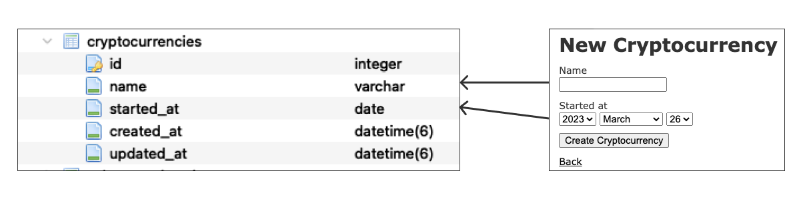
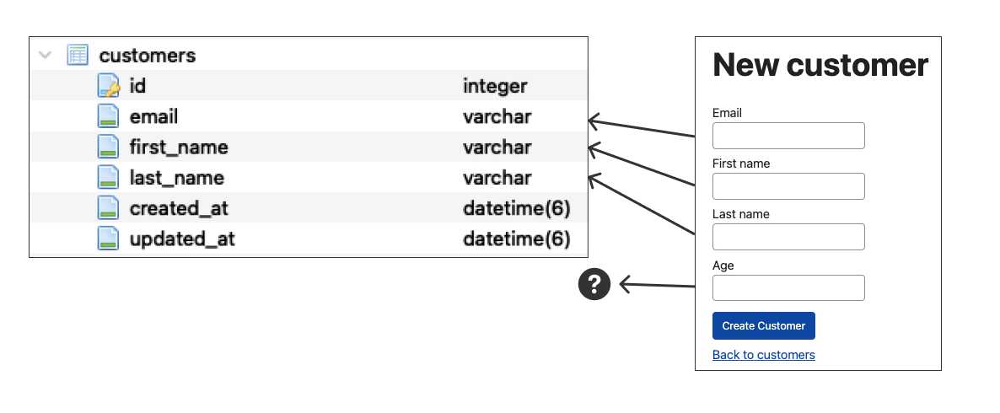
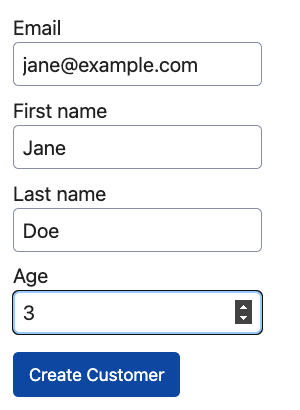
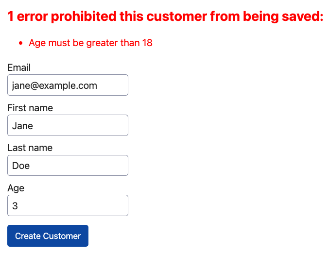
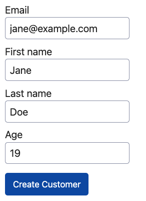
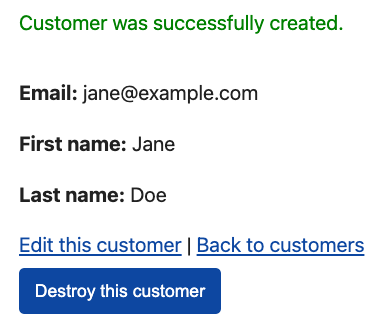

Rails makes it relatively easy to go from an idea to a working web application. If you follow along with the [Getting Started with Rails](https://guides.rubyonrails.org/getting_started.html) guide, you can see how straightforward it is to go from an idea of a blog application with articles that have that have a title and body text, to creating a database table that stores articles, a model to represent the articles and validation rules, views that render HTML to display articles, and a controller to handle http request/responses, and delegate to the model to perform the [CRUD](https://en.wikipedia.org/wiki/Create,_read,_update_and_delete) operations.

There's also plenty of online tutorials and courses that cover creating a Rails application from start to finish for other domains besides a blogging application. Going through any of these will give you a sense of how Rails can be used to represent just about any domain where you want to build a web app to expose CRUD operations on a relational data model.

However, all of the learning materials that I have seen make an assumption that there is always a one to one relationship between each form field that will be displayed in the web view, and the underlying database table that will be persisted. For example a Pluralsight course I took on [Adding Resources to a Rails Application](https://www.pluralsight.com/courses/adding-user-resource-rails-application) covered building a cryptocurrency tracking application. Here's the new cryptocurrency creation form from the course, notice that the fields shown in the form map neatly to the underlying table:



This symmetry between the UI form and the underlying table is very nice for learning. But what I've found in the "real world" is that often, the interface presented in the web view does not exactly match the database table, due to complex business requirements. Then it's not obvious how to make use of all the Rails niceties around form binding to the model, validations and saving. This post will show a technique that can be used when there's a mismatch between a form presented to a user, and what needs to be persisted in the database.

<aside class="markdown-aside">
A quick note before moving on - this post assumes you already have a basic understanding of Rails fundamentals including how to build a simple web application with models, views, and controllers. If you don't, checkout the <a class="markdown-link" href="https://guides.rubyonrails.org/getting_started.html">Getting Started with Rails Guides</a>.
</aside>

## Example

Consider an example of a back office for some application where administrators will fill out a form to create new customers. The `customers` table will persist email, first and last names. However, the form also has a field for the customers age. It's used for validation where customer must be greater than a certain age, but it will not be persisted to table, therefore its not part of customer model. A more complex case might be that the form asks for SIN/SSN to validate against an external service, but this value is not required to be persisted.

Here's a visual, notice that most of the fields in the new customer creation form map to the `customers` table, but the "age" field does not, because the requirements are that it should not be persisted in the database:



If we ignore the complexity of the "age" field for the moment, the majority of this requirement could be implemented with the [scaffold](https://www.rubyguides.com/2020/03/rails-scaffolding/) generator. This will create a migration, model, controller, and all the CRUD views for the Customer model, specifying the fields that should be persisted for each customer:

```
bin/rails generate scaffold customer email:string first_name:string last_name:string
```

Here is the migration that creates the `customers` table. Notice there is no `:age` column because the requirements are that it should not be persisted. I've added not null constraints on all the fields, and a unique constraint on the `:email` field:

```ruby
class CreateCustomers < ActiveRecord::Migration[7.0]
  def change
    create_table :customers do |t|
      t.string :email, null: false, index: { unique: true }
      t.string :first_name, null: false
      t.string :last_name, null: false

      t.timestamps
    end
  end
end
```

Here is the corresponding `Customer` model. I've added some validations for the email, first, and last name fields. I'm also using the [annotate](https://github.com/ctran/annotate_models) gem to get schema information outputted as comments at the top of the model class:

```ruby
# == Schema Information
#
# Table name: customers
#
#  id         :integer          not null, primary key
#  email      :string           not null
#  first_name :string           not null
#  last_name  :string           not null
#  created_at :datetime         not null
#  updated_at :datetime         not null
#
# Indexes
#
#  index_customers_on_email  (email) UNIQUE
#
class Customer < ApplicationRecord
  validates :email, presence: true, uniqueness: true, format: { with: URI::MailTo::EMAIL_REGEXP }
  validates :first_name, presence: true
  validates :last_name, presence: true
end
```

## First Attempt

Suppose in this hypothetical app, that the customer's age must be greater than 18. If you were to attempt to implement the age requirement in the standard Rails way as per the getting started guide and common tutorials, you might add the validation rule to the `Customer` model such as:

```ruby
class Customer < ApplicationRecord
  # validation rules based on fields in the `customers` table
  validates :email, presence: true, uniqueness: true, format: { with: URI::MailTo::EMAIL_REGEXP }
  validates :first_name, presence: true
  validates :last_name, presence: true

  # this won't work as we'll see because `age` is not a column on the `customers` table
  validates :age, presence: true, numericality: { only_integer: true, greater_than: 18 }
end
```

Add the `age` field to the customer creation form in the view:

```html
<%= form_with(model: customer) do |form| %>
  <!-- other customer fields -->

  <!-- try to bind the `age` field even though it does not exist on customer model -->
  <div>
    <%= form.label :age, style: "display: block" %>
    <%= form.number_field :age %>
  </div>

  <div>
    <%= form.submit %>
  </div>
<% end %>
```

Update the `CustomersController` to permit `:age` as a parameter for creation:

```ruby
class CustomersController < ApplicationController

  # standard CRUD methods...

  # POST /customers or /customers.json
  def create
    @customer = Customer.new(customer_params)

    respond_to do |format|
      if @customer.save
        format.html { redirect_to customer_url(@customer), notice: "Customer was successfully created." }
        format.json { render :show, status: :created, location: @customer }
      else
        format.html { render :new, status: :unprocessable_entity }
        format.json { render json: @customer, status: :unprocessable_entity }
      end
    end
  end

  private

  def customer_params
    # try to let `age` field through from the UI form
    params.require(:customer).permit(:email, :first_name, :last_name, :age)
  end
end
```

When attempting to save a new customer, the following error will result, indicating that the record could not be saved due to unknown attribute `age`:

```
ActiveModel::UnknownAttributeError (unknown attribute 'age' for Customer.
  raise UnknownAttributeError.new(self, k.to_s)
^^^^^):
```

## Solution

This type of problem can be solved with [ActiveModel](https://guides.rubyonrails.org/active_model_basics.html). This is a module in Rails that provides a way to create model-like objects that have many of the same features as traditional Rails models, but are not necessarily backed by a database table. This is useful when modeling data that is not directly related to the application's database, which is exactly what we need to solve this example.

The steps in this section will explain what needs to be changed from the scaffolded code to implement the requirement of having a field in the create form that is used for validation, but not persisted. You can also check out this [project](https://github.com/danielabar/not_all_activerecord) that demonstrates the complete solution.

### CustomerForm

Start by introducing a `CustomerForm` model. This will be used instead of the `Customer` model to bind to the form that admin users fill out to create a customer. This class lives in the same `models` directory as all the other Rails models, but rather than inheriting from `ApplicationRecord` as the other models that are backed by a database table, it includes the `ActiveModel::Model` module:

```ruby
# app/models/customer_form.rb
class CustomerForm
  include ActiveModel::Model
end
```

Next, define attributes for all the fields that are needed for the customer form. Unlike with an ActiveRecord model, Rails doesn't create these automatically because there is no backing database table. Notice the attributes don't necessarily have to match columns in the `customers` table because this model is not attached to any table:

```ruby
# app/models/customer_form.rb
class CustomerForm
  include ActiveModel::Model

  attr_accessor :email, :first_name, :last_name, :age
end
```

Including `ActiveModel::Model`, provides access to the validation methods that are available with ActiveRecord. Let's specify that all the fields are required, email must be a valid (according to the format defined in the RFC 6068 standard for the "mailto" URI scheme), and that age must be numeric and greater than 18:

```ruby
# app/models/customer_form.rb
class CustomerForm
  include ActiveModel::Model

  attr_accessor :email, :first_name, :last_name, :age

  validates :email, presence: true, format: { with: URI::MailTo::EMAIL_REGEXP }
  validates :first_name, presence: true
  validates :last_name, presence: true
  validates :age, presence: true, numericality: { only_integer: true, greater_than: 18 }
end
```

This is a good place to pause, launch a Rails console (`bin/rails c`), and play around with this model to see some of the behaviour that's now available to the `CustomerForm` model, as a result of including `ActiveModel::Model`. Note that `CustomerForm` can be initialized with a hash of attributes, just like an Active Record object, and the same validation methods are available as with Active Record:

```ruby
customer_form = CustomerForm.new
# => #<CustomerForm:0x0000000112e41408>

customer_form.valid?
# => false

customer_form.errors.full_messages
# => [
#       "Email can't be blank",
#       "Email is invalid",
#       "First name can't be blank",
#       "Last name can't be blank",
#       "Age can't be blank",
#       "Age is not a number"
#     ]

customer_form = CustomerForm.new(
  email: "sarah@example.com",
  first_name: "Sarah",
  last_name: "Smith",
  age: 46
)
# => #<CustomerForm:0x000000011496b878 @age=46, @email="sarah@example.com", @first_name="Sarah", @last_name="Smith">

customer_form.valid?
# => true

customer_form.age = 6
customer_form.valid?
# => false

customer_form.errors.full_messages
# => ["Age must be greater than 18"]
```

Nice, so we can have (nearly) all the validations that are on the `Customer` model, plus some additional ones that aren't backed by a table column. The `uniqueness: true` validation isn't available on ActiveModel because that requires access to a database table to verify a unique value among all the existing records. Since email should be unique across all customers, this can be implemented  with a custom `validate` method. The API is the same as adding custom validation methods to an ActiveRecord object:

```ruby
class CustomerForm
  include ActiveModel::Model

  attr_accessor :email, :first_name, :last_name, :age

  validates :email, presence: true, format: { with: URI::MailTo::EMAIL_REGEXP }
  validates :first_name, presence: true
  validates :last_name, presence: true
  validates :age, presence: true, numericality: { only_integer: true, greater_than: 18 }

  validate :email_available?

  def email_available?
    errors.add(:email, "already taken") if Customer.find_by(email:)
  end
end
```

Let's try this version of `CustomerForm` in a Rails console to see how the custom uniqueness validation works:

```ruby
# First save a customer to the database
customer = Customer.create(email: "alice@example.com", first_name: "Alice", last_name: "Jones")
# ... TRANSACTION (1.7ms)  commit transaction

# Create a CustomerForm object with an email that has already been taken
customer_form = CustomerForm.new(email: "alice@example.com", first_name: "Alice", last_name: "Parker", age: 41)

# Checking if its valid queries the customer table by email
customer_form.valid?
# Customer Load (0.2ms)  SELECT "customers".* FROM "customers" WHERE "customers"."email" = ? LIMIT ?  [["email", "alice@example.com"], ["LIMIT", 1]]
# => false

# Error message indicates email is already taken
customer_form.errors.full_messages
# => ["Email already taken"]
```

The last thing we'll need on the `CustomerForm` model is the ability to save a customer to the database. The `save` method should return false if the model is invalid, otherwise create and save an instance of the `Customer` model. Let's also make the saved `Customer` model an instance variable so that it can be accessed by the controller to populate the `show` view.

The final `CustomerForm` class:

```ruby
# app/models/customer_form.rb
class CustomerForm
  include ActiveModel::Model

  attr_accessor :email, :first_name, :last_name, :age
  attr_reader :customer

  validates :email, presence: true, format: { with: URI::MailTo::EMAIL_REGEXP }
  validates :first_name, presence: true
  validates :last_name, presence: true
  validates :age, presence: true, numericality: { only_integer: true, greater_than: 18 }

  validate :email_available?

  def email_available?
    errors.add(:email, "already taken") if Customer.find_by(email:)
  end

  def save
    return false unless valid?

    @customer = Customer.new
    @customer.email = email
    @customer.first_name = first_name
    @customer.last_name = last_name
    @customer.save
  end
end
```

### CustomersController New

Now that we have the `CustomerForm` class that implements all the required validations and the ability to save a `Customer` record, it needs to be integrated into the customer creation workflow. The first step is to modify the `CustomersController#new` method to make a `CustomerForm` instance variable available to the new view instead of a `Customer` instance variable:

```ruby
class CustomersController < ApplicationController
  # GET /customers/new
  def new
    # This line is the standard Rails way to make the Active Record model instance available to the view:
    # @customer = Customer.new

    # Instead, let's make our ActiveModel model available:
    @customer_form = CustomerForm.new
  end
end
```

### New View and Form

The next step is to modify the `new` view to use the `CustomerForm` object instead of a `Customer` object, and pass it to a new form partial that will render the customer creation form. Note that the scaffold command used earlier generated a `_form.html.erb` partial to be used for both creating and editing customer instances. We're changing this to introduce a `_form_new.html.erb` partial since the customer creation requirements are different from editing:

```html
<!-- app/views/customers/new.html.erb -->
<h1>New customer</h1>

<%= render "form_new", customer_form: @customer_form %>

<br>

<div>
  <%= link_to "Back to customers", customers_path %>
</div>
```

Here is the form that binds the form fields to the `@customer_form` instance variable passed to it by the `new` view. Notice the `url: customers_path` is specified for the `form_with` helper, otherwise the view will attempt to render a url `customer_forms_path` by convention of the model name, but this does not exist. Note also we pass the label "Create Customer" to the `form.submit` helper, otherwise by convention of the model name, it would render a label "Create Customer form".

```html
<!-- app/views/customers/_form_new.html.erb -->
<%= form_with(model: customer_form, url: customers_path) do |form| %>
  <% if customer_form.errors.any? %>
    <div style="color: red">
      <h2><%= pluralize(customer_form.errors.count, "error") %> prohibited this customer from being saved:</h2>

      <ul>
        <% customer_form.errors.each do |error| %>
          <li><%= error.full_message %></li>
        <% end %>
      </ul>
    </div>
  <% end %>

  <div>
    <%= form.label :email, style: "display: block" %>
    <%= form.text_field :email %>
  </div>

  <div>
    <%= form.label :first_name, style: "display: block" %>
    <%= form.text_field :first_name %>
  </div>

  <div>
    <%= form.label :last_name, style: "display: block" %>
    <%= form.text_field :last_name %>
  </div>

  <div>
    <%= form.label :age, style: "display: block" %>
    <%= form.number_field :age %>
  </div>

  <div>
    <%= form.submit "Create Customer" %>
  </div>
<% end %>
```

### CustomersController Create

When the "Create Customer" button is clicked from the new form, it will submit a POST request to the `CustomersController#create` method. This method must be modified to use the `CustomerForm` model instead of `Customer`. We also need to define a `customer_form_params` method to specify the allowed fields for customer creation.

If the customer is saved successfully, the `create` method should redirect to the show view, providing the `customer` instance variable of the `customer_form` object. Otherwise, render the `new` view with a 422 Unprocessable Entity HTTP response code. Since the `@customer_form` instance variable has been set, the `new` view will be able to iterate over its `errors` property and display them:

```ruby
# app/controllers/customers_controller.rb
class CustomersController < ApplicationController

  # POST /customers or /customers.json
  def create
    # Initialize the ActiveModel with form parameters from the view
    @customer_form = CustomerForm.new(customer_form_params)

    respond_to do |format|
      # `save` is a custom method defined in `CustomerForm` that first calls `valid?`
      if @customer_form.save
        # If `save` returns true, redirect to `show` view passing in the saved customer
        format.html { redirect_to customer_url(@customer_form.customer), notice: "Customer successfully created." }
        format.json { render :show, status: :created, location: @customer }
      else
        # If `save` returns false, render the `new` view to display the errors in `customer_form`:
        format.html { render :new, status: :unprocessable_entity }
        format.json { render json: @customer_form.errors, status: :unprocessable_entity }
      end
    end
  end

  private

  # Specify allowed fields for the CustomerForm model
  def customer_form_params
    params.require(:customer_form).permit(:email, :first_name, :last_name, :age)
  end
end
```

### Try It

Putting all of these code changes together, we can now navigate to the new customer create form at `http://localhost:3000/customers/new`, and fill it in with an age that is invalid:



Here is the rendered HTML form, notice the `name` attributes of the input fields are like `customer_form[field]` rather than `customer[field]`. This is because we're binding to the `CustomerForm` ActiveModel rather than the  `Customer` Active Record model:

```html
<form action="/customers" method="post">
  <input type="hidden" name="authenticity_token" value="Lda1K...">

  <div>
    <label for="customer_form_email">Email</label>
    <input type="text" name="customer_form[email]" id="customer_form_email">
  </div>

  <div>
    <label for="customer_form_first_name">First name</label>
    <input type="text" name="customer_form[first_name]" id="customer_form_first_name">
  </div>

  <div>
    <label for="customer_form_last_name">Last name</label>
    <input type="text" name="customer_form[last_name]" id="customer_form_last_name">
  </div>

  <div>
    <label for="customer_form_age">Age</label>
    <input type="number" name="customer_form[age]" id="customer_form_age">
  </div>

  <div>
    <input type="submit" name="commit" value="Create Customer">
  </div>
</form>
```

After clicking the "Create Customer" button, the request and response is logged to the Rails server output. Notice the `customer_form` parameter rather than `customer` due to the use of the `CustomerForm` ActiveModel.

```
Started POST "/customers"
Processing by CustomersController#create as TURBO_STREAM
  Parameters: {
    "authenticity_token"=>"[FILTERED]",
    "customer_form"=>{
      "email"=>"jane@example.com",
      "first_name"=>"Jane",
      "last_name"=>"Doe",
      "age"=>"3"
    },
    "commit"=>"Create Customer"
  }
  Customer Load (0.5ms)
    SELECT "customers".* FROM "customers" WHERE "customers"."email" = ? LIMIT ?
    [["email", "jane@example.com"], ["LIMIT", 1]]
  ↳ app/models/customer_form.rb:15:in `email_available?'
  Rendering customers/new.html.erb within layouts/application
  Rendered customers/_form_new.html.erb
Completed 422 Unprocessable Entity
```

Since there is an error with the `age` attribute in the `customer_form` instance variable set by the `CustomersController`, it will be displayed in the new form:



Let's correct the error by setting an age greater than 18 and submitting the form again:



This time, the Rails server output shows a new `customers` record being inserted into the database, then redirecting to the customers show view at `http://localhost/customers/{id}`:

```
Started POST "/customers"
Processing by CustomersController#create as TURBO_STREAM
  Parameters: {
    "authenticity_token"=>"[FILTERED]",
    "customer_form"=>{
      "email"=>"jane@example.com",
      "first_name"=>"Jane",
      "last_name"=>"Doe",
      "age"=>"19"
    },
    "commit"=>"Create Customer"
  }
  Customer Load (9.8ms)
    SELECT "customers".* FROM "customers" WHERE "customers"."email" = ? LIMIT ?
    [["email", "jane@example.com"], ["LIMIT", 1]]
  ↳ app/models/customer_form.rb:15:in `email_available?'
  TRANSACTION (0.1ms)  begin transaction
  Customer Create (3.3ms)  INSERT INTO "customers"
    ("email", "first_name", "last_name", "created_at", "updated_at")
    VALUES (?, ?, ?, ?, ?)
    [["email", "jane@example.com"], ["first_name", "Jane"], ["last_name", "Doe"],
    ["created_at", "2023-03-24 11:22:45"], ["updated_at", "2023-03-24 11:22:45"]]
  ↳ app/models/customer_form.rb:25:in `save'
  TRANSACTION (1.7ms)  commit transaction
  ↳ app/models/customer_form.rb:25:in `save'
Redirected to http://localhost:3000/customers/12
Completed 302 Found
```

And here is the customer show view with the flash message that it was successfully created (this portion is directly from the scaffolded code):



### Tests

Before we can conclude that we're done, the `CustomerForm` model should have automated tests. I'm using [RSpec](https://rspec.info/) on this project. A really nice feature of including the ActiveModel module is the validation rules can be tested with [shoulda matchers](http://matchers.shoulda.io/), just like an Active Record model. Here are the tests for the validation rules, and the `save` method:

```ruby
require "rails_helper"

RSpec.describe CustomerForm, type: :model do
  subject(:customer_form) { described_class.new }

  describe "validations" do
    it { should validate_presence_of(:email) }
    it { should allow_value("email@example.com").for(:email) }
    it { should_not allow_value("email").for(:email) }
    it { should validate_presence_of(:first_name) }
    it { should validate_presence_of(:last_name) }
    it { should validate_presence_of(:age) }
    it { should validate_numericality_of(:age).only_integer.is_greater_than(18) }

    context "when email is already taken" do
      let!(:customer) { create(:customer, email: "email@example.com") }

      before { customer_form.email = "email@example.com" }

      it { should_not be_valid }
      it "has an error on email" do
        customer_form.valid?
        expect(customer_form.errors[:email]).to include("already taken")
      end
    end
  end

  describe "#save" do
    context "when form is valid" do
      before do
        customer_form.email = "this_is_good@test.com"
        customer_form.first_name = "Fred"
        customer_form.last_name = "Flinstone"
        customer_form.age = 44
      end

      it "creates a new customer" do
        expect { subject.save }.to change(Customer, :count).by(1)
      end

      it "returns true" do
        expect(subject.save).to be_truthy
      end

      it "sets the customer attribute" do
        subject.save
        expect(subject.customer).to be_a(Customer)
      end
    end

    context "when form is invalid" do
      before do
        allow(subject).to receive(:valid?).and_return(false)
      end

      it "does not create a new customer" do
        expect { subject.save }.not_to change(Customer, :count)
      end

      it "returns false" do
        expect(subject.save).to be_falsey
      end

      it "does not set the customer attribute" do
        subject.save
        expect(subject.customer).to be_nil
      end
    end
  end
end
```

<aside class="markdown-aside">
If you're setting up a new Rails project, it defaults to minitest rather than RSpec for automated testing. See this post I wrote on <a class="markdown-link" href="https://danielabaron.me/blog/start-rails-6-project-with-rspec/">Starting a Rails Project with RSpec</a> for how to switch from minitest to RSpec.
</aside>

## Conclusion

This post has demonstrated how to use Active Model in a Rails application when the form presented to the user does not exactly match what should be persisted in the database. We just scratched the surface of what's available from the ActiveModel module with regards to validation. Be sure to check out the [Active Model Basics Rails Guides](https://guides.rubyonrails.org/active_model_basics.html) to learn about all the available features.
