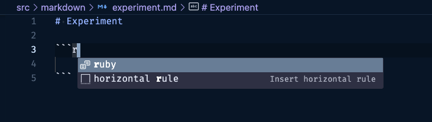

VSCode is a great editor for authoring markdown documents. I use it frequently for writing engineering documentation and blog posts. VSCode comes bundled with some Markdown extensions that make authoring easier, such as including snippets to generate markdown syntax such as images, links, bold, etc. For technical writing, a commonly used feature is to generate a block of code that is syntax highlighted according to the language (Ruby, Python, JavaScript, etc.). This is provided through the `fen` (fenced code block) snippet. However, I ran into a limitation of this snippet where it didn't support all the languages I needed to include in my docs. This post will explain a solution to customizing the list of languages provided by the built-in Markdown extension.

## Fenced Code Block Overview

Before getting into the solution, here's a quick overview of the fenced code block snippet that ships with VSCode. To see it in action, open or create a new markdown file such as "experiment.md". Then anywhere in the markdown file, type the letters `fen` and hit <kbd class="markdown-kbd">Ctrl</kbd> + <kbd class="markdown-kbd">Space</kbd>. The following intellisense menu will pop up:


Notice that some of the options have help text beside them such as `Insert fenced code block` and `Insert fenced math`. These are snippets, a snippet is a reusable and customizable code fragment that can be quickly inserted into a file to facilitate code writing and save time on boilerplate.

If you go ahead and select the option for `fenced codeblock`, then it will insert a markdown fenced code block in your document. You'll see two lines of three backticks each, with an empty line between them, and the language `python` selected by default. A new intellisense menu is now displayed where you can select the language for the code block. This will control what syntax highlighting gets applied when the markdown is rendered. It looks like this:


Now you can use the arrow keys to select a language, or just start typing for whichever language you want, for example, to select `ruby`, start typing <kbd class="markdown-kbd">r</kbd>. This will narrow down the selection like this:



When the language you want is highlighted, hit <kbd class="markdown-kbd">Enter</kbd> to select it, this will result in a new fenced code block added to the markdown document, with your language selected, and the cursor inside the code block ready for you to type in code:


## Where is the Language List Defined?

The built-in fenced code snippet is great if you only need the list of languages provided by VSCode. At the time of this writing, these are: python, c, c++, c#, ruby, go, java, php, htm, css, javascript, json, markdown, and console.

However, I found myself needing more such as `erb` and `yml`. A search through all the VSCode settings didn't reveal any way to customize this list. You can of course hit <kbd class="markdown-kbd">esc</kbd> when the intellisense list of languages pops up to close it, and then hit <kbd class="markdown-kbd">delete</kbd> to remove the default `python` language selection, then type in your own. But I wanted a more efficient solution where all my frequently used languages would show up in the intellisense list for easy selection.

VSCode does support creating your own [custom snippets](https://code.visualstudio.com/docs/editor/userdefinedsnippets), and this is the solution here. However, the key is to get the syntax correct so that the language list will pop up. In order to do this, we first need to find where the built-in snippet is located. Since it's part of the Markdown Basics extension that ships with VSCode, we can find the snippet definition here:

```bash
# This is the extension path on a Mac,
# It may be different for Windows:
cd ~/Applications/Visual\ Studio\ Code.app/Contents/Resources/app/extensions

# Just take a look at it, do not edit it!
vim markdown-basics/snippets/markdown.code-snippets
```

The contents of the `markdown.code-snippets` file have been condensed into a single line so it's difficult to read, but this actually is a VSCode json file. In the version below, I've applied some formatting to make it easier to read. The entry we're interested in is `Insert fenced code block`:

```json
{
  "Insert bold text": {...},
  "Insert italic text": {...},
  ...
  "Insert fenced code block": {
    "prefix":"fenced codeblock",
    "body":["```${1|python,c,c++,c#,ruby,go,java,php,htm,css,javascript,json,markdown,console|}","${TM_SELECTED_TEXT}$0","```"],
    "description":"Insert fenced code block"
  },
  ...
}
```

Now we can see where the list of languages comes from: It's defined as a comma separated list between pipe symbols `|...|` in the `body` entry of the fenced code block snippet. Here's an explanation of what the `Insert fenced code block` snippet does:

**prefix:** Specifies the trigger word or phrase that activates the snippet. In this case, typing "fenced codeblock" followed by  <kbd class="markdown-kbd">Ctrl</kbd> + <kbd class="markdown-kbd">Space</kbd> will insert this code block.

**body**: Defines the content of the snippet, i.e. what will be rendered into the document when the snippet is actioned. It can contain any mix of literals and special symbols. The first line uses a special syntax with `${1|python,c,c++,c#,ruby,go,java,php,htm,css,javascript,json,markdown,console|}`. This creates a dropdown menu with the listed languages, and the user can choose one. The selected language will replace the placeholder `${1}`, which is the first tab stop.

`$0` is the final tab stop, indicating where the cursor will be placed after the user has filled in the necessary information.

**description:** Provides a brief description of the snippet. In this case, it describes the purpose of the snippet, which is to insert a fenced code block with syntax highlighting for a chosen programming language.

Here's some visuals of this snippet in action, pointing out each part of it. Starting in any Markdown document:


One final detail about this snippet - the `body` contains another special symbol after the language list: `${TM_SELECTED_TEXT}`. This is a placeholder that represents the currently selected text in the editor. If there's any text selected when the snippet is triggered, it will be inserted at this position. This is useful when you've already written some code in your markdown document, and you want to highlight it and then insert the fenced codeblock snippet *around* the code.

Here is `${TM_SELECTED_TEXT}` in action:


Use <kbd class="markdown-kbd">Command</kbd> + <kbd class="markdown-kbd">Shift</kbd> + <kbd class="markdown-kbd">P</kbd> to bring up the Command Palette (or <kbd class="markdown-kbd">ctrl</kbd> for Windows). Type `snippets`, then select `Snippets: Insert Snippet` as shown below:


Then start typing to find the `fenced codeblock` snippet, and hit <kbd class="markdown-kbd">Enter</kbd> to action it:


Then the line you highlighted will be wrapped in the fenced code block, with the language list selection open:


Now that we've found where the language list is defined, it may be tempting to simply edit the snippets file in the `~/Applications/Visual\ Studio\ Code.app/Contents/Resources/app/extensions` directory to add more languages here. But I don't recommend this solution. Why? Because the next time VSCode updates, if there are any changes to the Markdown Language Basics extension, your custom edits will be lost.

## Customizing the Language List

A more durable solution is to create your own snippets file for Markdown content. This gets saved in your home directory, and gets backed up if you have Sync settings enabled, so it will survive application updates.

Start by opening the Command Palette, on a Mac, the keyboard shortcut is <kbd class="markdown-kbd">Cmd</kbd> + <kbd class="markdown-kbd">Shift</kbd> + <kbd class="markdown-kbd">P</kbd>. Search and select the option: `Snippets: Configure User Snippets`. If it's your first time creating custom snippets, select select `markdown` from the list of languages. If you've created markdown snippets before, then there will be an option for `markdown.json`, select that.

This will open a `markdown.json` file in VSCode, the path will be in your home directory, although the details could be different depending on Mac vs Windows installation. It will look something like this:

```json
// ~/Library/Application Support/Code/User/snippets/markdown.json
{
	// Place your snippets for markdown here. Each snippet is defined under a snippet name and has a prefix, body and
	// description. The prefix is what is used to trigger the snippet and the body will be expanded and inserted. Possible variables are:
	// $1, $2 for tab stops, $0 for the final cursor position, and ${1:label}, ${2:another} for placeholders. Placeholders with the
	// same ids are connected.
	// Example:
	// "Print to console": {
	// 	"prefix": "log",
	// 	"body": [
	// 		"console.log('$1');",
	// 		"$2"
	// 	],
	// 	"description": "Log output to console"
	// }
}
```

Now we can add an entry in this file for the fenced code block snippet. We start with a copy of the original found earlier in the VSCode extensions directory, then make our customizations. Here is what I changed:
1. Updated the prefix to `fenc` (for fenced custom but you can use whatever you like)
2. Added `erb,bash,yml,mermaid` in the language list.
3. Updated the description to indicate this is a custom block.

The resulting custom markdown snippets file looks like this:

```json
// ~/Library/Application Support/Code/User/snippets/markdown.json
{
  "Custom Fenced Code Block": {
    "prefix": "fenc",
    "body": [
        "```${1|python,sql,c,c++,c#,ruby,go,java,php,htm,css,javascript,json,markdown,console,erb,bash,yml,mermaid|}",
        "${TM_SELECTED_TEXT}$0",
        "```"
    ],
    "description": "Insert custom fenced code block with languages"
  }
}
```

Save your changes.

## Using Custom Snippet

Now that our custom snippet is in place, we can try it out in any markdown file. For example, to add a fenced code block for `erb` language, start typing `fen`, then <kbd class="markdown-kbd">ctrl</kbd> + <kbd class="markdown-kbd">space</kbd>. This time you should see the "Custom Fenced Code Block" option show up in the intellisense. This is coming from the custom snippet file created earlier:


After selecting the custom option, you should see the new languages you added show up in the languages menu. For example, given that I added `erb`, I can just type <kbd class="markdown-kbd">e</kbd> to see that option show up:


## TODO
* Be consistent with command vs cmd in keyboard shortcuts, and mention Windows versions
* conclusion para
* edit
