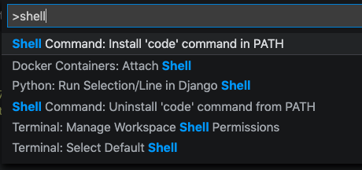

Today I'm going to share a simple technique for making it easier and faster to open projects or individual files with [VS Code](https://code.visualstudio.com/), using your terminal instead of the VS Code editor. By default, the process for opening a folder or file goes something like this:

1. Launch VS Code (clicking on it from Desktop, Dock, Applications Folder or Alfred)
2. Click on `File` -> `Open` from the menu
3. Navigate the folder structure in the resulting popup window until the desired file or folder is reached
4. Double-click on the file/folder
5. The content is now displayed in VS Code

Phew, that's actually a lot of work - all that mouse movement is tedious and slow. Fortunately there is a faster and simpler way by enabling Shell Integration. Here's how to do it:

Enter <kbd>Cmd</kbd> + <kbd>Shift</kbd> + <kbd>P</kbd> (or <kbd>Ctrl</kbd> for Windows users) to bring up the Command Palette. Start typing in the word "shell" and select the option `Shell Command: Install 'code' command in PATH`, it should look something like this:



Then, quit VS Code, and open a terminal (if terminal was already open, it may need to be closed and restarted or source your profile for the changes to take effect).

Now in your terminal, you can type in `code .` in any directory and it will open VS Code with that folder open. You can also type `code /path/to/file` and it will open just that file in VS Code. For example:

```bash
pwd # /some/folder
code . # open /some/folder in VS Code
code ~/projects/meblog # open my blog project in VS Code
code ~/.zshrc # open my profile in VS Code
code # open an "empty" VS Code
```

If VS Code is already open at the time the `code` command is used, there's a few more options available:

```bash
code -n /path/to/file_or_folder # open file_or_folder in a NEW VS Code window
code -r /path/to/file_or_folder # open file_or_folder in a EXISTING VS Code window
```

Also, the `code` command supports a number of other options, to see them all:

```bash
code -h # list all options
```

As for how this works under the hood, the implementation details may vary by OS and VS Code version. On my computer, it adds a symlink `/usr/local/bin/code` to the Application folder where the VS Code binary is located. And since `/usr/local/bin` is in the `$PATH` environment variable defined in my profile, then typing `code` in a shell will automatically launch VS Code.