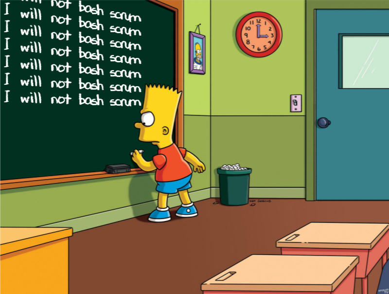

I was inspired to write this after reading a post about how big tech companies organize their software engineering processes and the [curious absence of scrum](https://blog.pragmaticengineer.com/project-management-at-big-tech/) at these companies. While I don't work at a FAANG (or MAANA given some company renames!), I am fortunate to be working on a team where engineers are empowered to be self organizing, and try different ways of working to optimize for results, developer productivity, and overall quality of life.

To this end, our team has moved increasingly to an asynchronous work style and the results have been fantastic. This post will walk through why we decided to try this, how we're doing it, and address some common concerns.

## Background

But first, a little background. Our team is composed of three engineers (looking for a fourth at the time of this writing), and a product manager. We also have an engineering manager who manages several teams. There is no QA as the product has a thorough suite of end-to-end tests that cover just about every feature and workflow.

The product consists of several publicly accessible web apps, built with Rails and MySQL. Our team is in full control over the product direction, features to be added and tech debt that should be addressed. The code base is very large, having been developed and iterated on over 10 years.

We're part of a mid-sized company that delivers a number of other products and services. Prior to the pandemic, most people worked in office, with occasional work-from-home days. After the pandemic, the company went fully remote and will remain that way going forward.

Our team has never been big fans of the official scrum methodology, preferring a more kanban/flow approach to delivering features. So we were fairly light on the ceremonial meetings, but we did have some regular meetings including a daily standup and some planning meetings. We were also in the habit of "let's hop on a call" type meetings, for example to deal with a tricky production bug or figure out how a new feature should be integrated into the existing product.

This all came to a head one day when our manager seemed really stressed out in standup and remarked that he was in too many meetings. Since none of us were fans of meetings to start with (is any engineer really??), we decided right there and then to move standup to an async channel using Slack and to generally try and work more asynchronously.

## Remote !== Async

Some terminology to clarify before moving on. Sometimes the terms remote working and asynchronous working get used interchangeably but there's an important difference.

Remote working is when the entire team is not co-located in a physical office, and instead is working from home or some other location. However, they are still required to all be online and working during official business hours, typically 9am - 5pm. Some companies may have a variation on this where everyone is required to be online during "core hours", say 10am - 4pm, with a little flexibility for those that wish to start and finish earlier or later by about an hour. This results in the majority of the teams' work hours overlapping which makes it easy to book meetings or impromptu calls because there's an expectation that every one is available at the same time.

Asynchronous working takes this to another level. In addition to the team not being co-located, there is no expectation of overlapping work hours at all. Each team member picks their own working hours that suit them best. Furthermore, these hours don't have to be contiguous or the same times each day. For example, someone may find their optimal focus time is in the very early hours of the morning, then take the afternoon off for exercise, running errands, picking up kids from school etc. and then log back in later in the evening to complete some tasks. Someone else may prefer to start around midday or later, and work late into the night because that's when they're at their most productive.

<aside class="markdown-aside">
If you'd like to learn more about planning your day for optimal focus time, and when you'll get the best results from focusing on certain kinds of problems, the book <a class="markdown-link"href="https://www.danpink.com/books/when/">When: The Scientific Secrets of Perfect Timing</a> presents compelling research and stories on this. I also gave a <a class="markdown-link" href="https://danielabar.github.io/when/#/">presentation</a> on this topic.
</aside>

There can also be a spectrum, where a team may want some real-time meetings such as weekly one on ones with managers, but the rest of the week everyone is free to manage their time however suits them. This is where our team has landed.

Now that the definitions are out of the way, how does a team go from everyone working pretty much the same hours to async?

## Communication

One thing we realized in moving to async is that we would all have to hone our written communication skills, since this would be taking the place of verbal communication. Not only can effective writing replace a lot of meetings, there's also a benefit to the company in that decisions and discussions in a written format are easily accessible to everyone, not just whoever happened to participate in the meeting that day. This is also helpful to the team in an environment of shifting priorities, where people may not remember what was discussed in a meeting several months ago. When decisions are written down, this is no longer a problem.

Here are a few examples of the type of writing our team has been doing to reduce the need for all of us to be online at the same time. We try as much as possible to choose writing tools that support markdown, which is more developer friendly than WYSIWG editors, but that's just our team preference.

<aside class="markdown-aside">
The topic of documentation, such as how to write it, what should get documented, how to maintain it etc. is enough for a whole blog post on its own. See this excellent <a class="markdown-link" href="https://chelseatroy.com/2021/09/14/the-art-of-documentation/">post</a> for thorough coverage of this topic.
</aside>

### Pull Requests

When a pull request is submitted for review, the developer writes a detailed description including what the new code does, what areas of the project were modified, and most importantly, step by step instructions for the reviewer to exercise the code. Our review process includes not just providing feedback on the code, but also having the reviewer check out the branch and try out the new feature or bug fix on their laptops.

This level of detail in the PR description eliminates the need for real-time discussion about what the PR does. Having the reviewer try it out means at least one other person besides the original developer gains an understanding of this feature beyond what merely scanning the code can provide.

### Project Docs

The main project `README.md` file contains project setup instructions which we strive to maintain whenever there's a change, such as some new configuration or external dependency required. The idea being that a new developer should be able to spin up a working dev environment without getting stuck and needing real time help from someone else on the team. If something is discovered that's missing from the setup instructions, that's a great first PR for the new developer to submit to update the readme.

When a new feature is added such as a third party integration, we add or update the project documentation as part of the PR. This takes the form of markdown files in a `/docs` directory of the project, and a link to this doc from the `Further Reading` section of the main project `README.md` file. The benefit of maintaining these docs is it spreads the knowledge of each feature so if someone has a question, they can find the answer in the docs rather than requiring the original developer to be online to answer. Keeping the docs with the project source means they're more likely to turn up in a search when someone is making a change, and therefore get maintained along with the code as it evolves.

<aside class="markdown-aside ">
Even for a non async team, maintaining docs along with the code is helpful because the original developer may be on vacation or have left the company, and this knowledge could otherwise be forever lost.
</aside >

### Jira

Hear me out, please don't close this tab. Jira is painful when used as a management tool. Like those dreaded sprint review meetings where the scrum master is closing out the sprint, and there's one lonely ticket in the Done column and all the others are scattered throughout the Not Started, In Progress, and In Review columns. Or when developers have to track actual hours vs estimate hours in Jira, shudder!

But our use of Jira is simply to use the epics to write down an overall goal, and the individual tickets within an epic serve as our todo list. We write detailed descriptions in each ticket, including context and scope. Links are used to identify dependencies between tickets. Bug reports include steps to reproduce and actual vs expected results. This way everyone knows the big picture, what everyone else is working on, and can pick up work without a planning meeting or any other real-time coordination.

### Slack Async

For simple question and answer communication, we use Slack but in an async fashion. Effectively this means there's no expectation of an immediate reply and we don't monitor whether someone's dot is green on Slack. We mostly disable notifications to make this type of communication less disruptive to focus time.

<aside class="markdown-aside">
Regardless of your team being async or not, it's a good idea to minimize notifications and other <a class="markdown-link" href ="https://danielabaron.me/blog/off-with-the-digital-distractions/">digital distractions</a> to get the most out of your focus time.
</aside>

### Wiki Adhoc Discussions

We use Github to host our project source, which also has a Wiki. If a team member has something they'd like to discuss that is a little more involved than a Slack question, they can add a page and write up a discussion topic in markdown, and then share it with the team via Slack. Then team members can update the document with their thoughts on the topic on their own time. This replaces the "let's hop on a call" type of meetings and has helped us resolve a number of issues. The benefit of this written approach over a real-time meeting is each developer can do some analysis on the code before piping in to the "conversation". This results in more accurate and thoughtful points being made.

The meeting equivalent of this is where some participants say "umm... let me check...", clackety clack of keyboards, while other participants watch and wait. The async version of this has been more effective for our team and leaves a searchable artifact for ourselves and future team members.

### Architecture Decision Records

[ADR](https://adr.github.io/) is a more formal written document to be used when someone would like to propose a significant architectural change to the project. It gets submitted as a markdown document in a PR, then team members can discuss via PR comments. This is a new format we're experimenting with so it's too early to report on its effectiveness.

What brought this about is since the project code is ~10 years old, we sometimes come across areas of the code where the original developer is long gone and it's not well understood why that particular implementation was chosen. There may have been a meeting at that time to discuss the approach, but of course, the conclusions of that meeting are forever lost. The idea with ADR docs is to generate discussion about proposed changes *and* have the reasoning and final decisions captured in writing for posterity.

## Ownership

In addition to effective writing, another thing that's required to make async work is that each engineer has full ownership of their tasks. This means they are responsible for the entire feature end to end and have freedom to make all implementation decisions. This minimizes real time coordination with other engineers. For example, rather than splitting a feature into back end assigned to one engineer, and another gets the front end, one person would be responsible for the entire vertical slice.

This doesn't mean "cowboy" style coding, there's still room for questions and discussion as described in the previous section on writing. But it's left to the engineer's judgement as to whether something is significant enough to require team input, or if it's something they can make an "executive" decision on.

<aside class="markdown-aside">
Having every engineer on the team be an equal and effective owner is easy to accomplish when the size of the team is small relative to the size of the code base. This allows each person to work independently, minimizing the chance of stepping on someone else's toes.
</aside>

## Trust

Related to the ownership point, is trust. I don't think it would be possible for a team to work asynchronously without a high degree of trust. We trust that each team member is intrinsically motivated to move the project forward without any monitoring of their online status and that they can manage their time effectively to complete their tasks. We also trust that if someone is stuck on something, they'll reach out for help, or if they finish a task, they'll take the initiative to go into the epic list and pick up another one rather than waiting to be assigned.

## Objections

This post is not to suggest that everyone should stop what they're doing and switch to this approach. If your team feels happy and productive working fixed hours and having regular meetings, then by all means, continue.

But for those feeling burned out by all the meetings or open to exploring a more flexible way of working, there may be concerns like "what about..." or "our team could never...". This next section will address some common concerns with async working.

### But our team does Scrum

I'm going to tread carefully here as this post is not intended as a scrum good or bad discussion.

If your team believes that scrum is the best thing since sliced bread and you're all feeling happy and healthy doing it, then by all means, keep on scrumming! However, strict adherence to the [scrum methodology](https://scrumexplainer.com/scrum/scrum-methodology/) is incompatible with asynchronous work. This is due to the numerous ceremonial meetings required every week or other week.

Our team intentionally rejects scrum in favour of a flow approach. Our PM  has a strong sense of product direction and is able to express this well in writing. We break down tasks as small as possible, putting them behind feature flags where appropriate. This allows us to deliver small increments of value continuously, without any big bang planning meetings.

For estimates, we use the T-shirt sizing approach. For tricky problems requiring team input, we use the writing approaches described earlier in this post. This eliminates the need for backlog grooming meetings and [planning poker](https://www.simplilearn.com/what-is-planning-poker-article) games.

We use a slack channel to post our daily updates. This has worked out better than real-time standup because seeing the updates in writing is easier to absorb and reply if someone is having a blocker, without holding up the whole team. How often has it happened that you're trying to remember your tasks so that you can recite them when it's your turn, so much so that you miss what others are saying.

Finally, if there's a process improvement someone would like to explore, for example, turning on auto-merge on PR's, we just try it, no need to wait for official "end of sprint" retrospective meeting. We provide each other feedback continuously which eliminates that ceremony as well.

<aside class="markdown-aside">
I started my career before Scrum, when Waterfall was the only option. Over the years as Scrum became increasingly trendy, I've noticed some surprising similarities between the two. This post on <a class="markdown-link" href="https://medium.com/serious-scrum/the-unmistakable-signs-you-are-participating-in-fake-agile-theater-a7d1bd6a5dbc">Agile Theatre</a> takes a fascinating look at that.
</aside>

### We don't have time for all that writing

This reminds me of a similar argument against automated testing. It goes something like this:

*"We don't have time to write tests, we're too rushed meeting the deadlines".*

To which my answer is:

*"Then there must be plenty of time for fixing bugs and putting out production fires".*

In a similar way, if a team doesn't have time to write, then there must be plenty of time for developers to sit around in endless meetings rather than focusing on their work.

Take an example of a single developer stuck on a problem. The seemingly quick approach is to reach out to the team, i.e. "let's hop on a call". Let's say there's 4 engineers on the team and they all get caught up in real time trying to solve this problem. I've seen these types of meetings run on for 3 hours or even more. That's at least 12 hours of people time!

Now, imagine the original developer taking the time to articulate the problem in a wiki discussion doc or ADR. This could include a description of the problem, approaches that have been tried and didn't work, and consideration of a few alternatives with their pros and cons. A practiced writer may be able to accomplish this in about an hour. Then the doc is shared with the team where others who have knowledge in this area can share their feedback in the document. Since the problem is now well laid out, let's say the 3 other engineers on the team take an hour each to provide feedback. Then the original developer can review this for another hour to arrive at the solution. That's 5 hours rather than 12, *and* there's a written artifact for anyone else that may later want to understand why that particular solution was chosen.

The effects compound further when considering that many initiatives get put on the back burner for some other higher priority, then get restarted in 6 months to a year. Even if by some good fortune, the original engineers that had that meeting are still at the company, what are the chances anyone will remember the details and outcome of a meeting from about a year ago? This can lead to yet another meeting and the original 12 hours were wasted.

<aside class="markdown-aside">
One "solution" I've seen to the forgotten outcome of meetings problem, is to designate one participant to take notes. The problem with this is that when someone is tasked with note taking, it's difficult to be an active participant in the technical problem solving. This results in highly skilled, highly paid engineers doing secretarial duties. Not only can it create resentment if the same person tends to be selected for this task (especially insidious if assigned to the only female engineer), but it's not the most effective use of engineering time.
</aside>

### I'm not a good writer

Notice the emphasis has been on *effective* writing rather than *good* writing. This isn't about making the New York Times bestseller list or being nominated for a [Pulitzer Prize](https://en.wikipedia.org/wiki/Pulitzer_Prize). The goal is to make yourself understood to the rest of the team. Yes this takes some practice, but so does anything worth doing. Just as it takes time to develop effective programming skills, so too does it take time to develop writing skills.

As long as everyone on the team is willing to work on this, it shouldn't be a blocker. Also those team members that are stronger writers should remember to be kind to others with respect to spelling and grammar errors. Personally I don't think this matters much for internal docs as long as the overall meaning of the document is clear.

### What about Onboarding?

Full disclosure: Since going asynchronous, our team has not yet on-boarded a new team member, so this process may need some work. There are three aspects to consider here:

**Technical Setup:** The project `README.md` should be sufficiently detailed and up to date so that a new team member can install all dependencies they need, get the project running and tests passing without getting on a call with another engineer. Ideally, the project docs also contain some "What's next" steps like how to run through a typical workflow in the application.

**Domain Knowledge:** It's not enough to have knowledge of the tech stack and familiarity with the code. An engineer also needs to understand the business domain. In my experience, this has been done by having the new person book 1-1 meetings with various domain experts in the company. This hasn't been a good experience because I've found myself furiously scribbling (or typing) notes trying to absorb all the important information being given and missing about half of it due to talking speed being faster than note taking speed. It's also sub-optimal for the domain experts because they need to spend this time repeating the same things every time a new person starts.

This process would be more optimal if the domain experts would write down their knowledge such as what the products are doing, critical workflows, business rules, what are the primary sources of revenue etc. Then the new person could review these and reach out to each expert with follow-on questions. The answers to these questions could then be used to update the business docs, leaving them improved for everyone.

**Team Introduction:** The initial introduction to the team might be a case where it's nice to have a real time meeting. No specific agenda other than for everyone to introduce themselves and "shoot the breeze" a bit. In the event that it's not possible to get everyone online all at the same time, this could be scheduled as individual 1-1 short meetings with team members.

### What about human connection?

Connection with others is an important part of being human, we are social creatures. Having said that, different people vary in the amount of social connections they need to feel fulfilled and function effectively. This can depend on introversion/extroversion and other dimensions of personality. Some people thrive on socializing at work and developing friendships with colleagues, while others may prefer to keep emotional distance between their work and social lives. There is no right or wrong here, and I don't think this is something that companies can mandate. The role a company can play is to provide some social opportunities (such as in-person or virtual events, depending on where things land with the pandemic and [variants](https://www.who.int/westernpacific/emergencies/covid-19/information/covid-19-variants)), while keeping attendance optional.

Another way of thinking of this is how connected do you really feel to your colleagues from attending scrum ceremonies and other work-related meetings? I don't believe even daily stand-ups are meaningfully connecting people. If you want to try an experiment with this - next time your spouse or a good friend asks you how was your day, try responding with: Yesterday I... Today I'm planning to... Blockers are...

### How do I know people are working?

This is a question some managers might have, and it goes back to the point about [trust](#Trust). I would argue that without trust, it's going to be difficult for any team to effectively deliver software, whether asynchronous or not.

There may be an old school approach among some managers that they feel the need to "see" the team at all times at their desk either physically, or virtually with surveillance software. There are many ways that managers can have visibility into engineering *output* including git commits, pull requests, and jira. Slack integration with these tools can make it even easier to see what's going on. There is absolutely no need to monitor anyone's *input* (i.e. time spent on laptop).

Another angle on the trust issue - many engineers are put on a rotating on-call schedule to handle production issues. So think about that for a moment - an organization trusts someone with access to production but not with the ability to get their work done on their own schedule?

### What if there's an emergency?

This is the situation where everyone needs to get on a real-time call to resolve some urgent issue. I like to answer this concern with another question: What is the team doing if there's an emergency *outside* of standard business hours? A well organized team will have:

* A rotating on-call schedule, ideally with a primary and secondary person to take the calls.
* A monitoring and alerting system to inform the on-call person of an issue.
* A playbook/troubleshooting guide for common problems.
* A maintenance procedure where if the on-call person encounters a new problem, they add the solution to the troubleshooting guide after it's resolved. This increases the body of knowledge for everyone.
* Compensation for people when they're on call.

Given that the above is in place, then that's the same procedure to follow if there's an emergency at any time. It's not sustainable to require the entire team to be in potential emergency mode, even for a standard workday.

## Who does this work best for?

To wrap this up, here are some attributes of a team for whom this style of working may be best:

- A team of effective writers, or at the very least, everyone's willing to spend time developing this skill.
- Small team size *relative* to size of code base. The project should be large enough that every developer can work independently on a feature without requiring real time coordination.
- It's not necessary that all team members be senior, but a recent graduate or junior developer may require some real time guidance and mentoring.
- Great for product and SAAS companies where teams have full control over the product or service. May be more challenging to implement with project based consulting as it would require "selling" each client on the idea.

## Final Thoughts

Our team has found a great deal of benefits from working asynchronously. The individual benefits include freedom to manage your own time, and arrange work around life rather than the other way around. Having a nearly clear calendar allows everyone to do their most important work whenever is optimal for them. The benefits also extend to the company. When everything important about a project is written down, it eliminates the "single point of failure" where all knowledge about a given area is in a single person's head. If that person goes on vacation or leaves the company, the rest of the team or even new team members can get up to speed.

I would love to hear your thoughts on this - has your team tried asynchronous work? What has worked well? What have been some challenges?