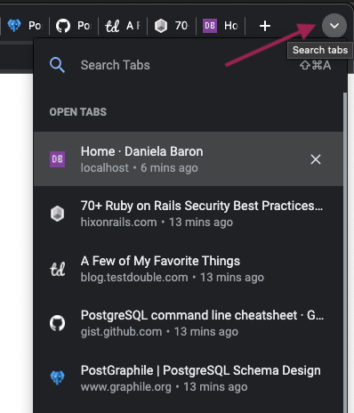

I decided to write this after hearing a discussion about the difficulties of managing multiple browser tabs on one of the programming podcasts I listen to. The idea being that during web development, you'd have one tab open for the app you're building, something like `http://localhost:8000`, and then numerous other tabs for every problem you encounter. If you're doing fullstack development, this can get especially large as you may have run into issues with the database, server side framework/language, client side JavaScript, CSS, etc. The tendency is not to close these tabs just in case they're needed again. But after a while, the tab icons become so small and so numerous, it can get difficult to navigate to the one you want and will inevitably click on the wrong one, wasting some time.

On the podcast I was listening to, the hosts suggestion was to close the tabs when you're done with them as you can always find them again later if they're really needed. In this post, I'd like to suggest an alternative solution that supports managing as many tabs as you'd like to have open, while being able to easily and accurately navigate to them. Note that I'm using the Chrome browser.

## A Mess of Tabs

To start, suppose you currently have a `localhost` tab open for development, with many other tabs that you've opened for various research and problem solving. The top of your browser will look something like this - a whole mess of tiny tabs, the more you open, the "squishier" they appear to try and fit in:

## Search Tabs

One of these tabs is for some GraphQL documentation and now you'd like to switch to that one. Instead of mousing over the tiny icons trying to guess which tab it is, you can use a feature called "Search Tabs". The keyboard shortcut is: <kbd class="markdown-kbd">Cmd</kbd> + <kbd class="markdown-kbd">Shift</kbd> + <kbd class="markdown-kbd">A</kbd>, or <kbd class="markdown-kbd">Ctrl</kbd> for Windows users.

After using this shortcut, you will see a selection menu open up at the top right of the browser window, containing a vertical listing all the open tabs. The tab you're currently on will appear at the very end of the list. Each selection in the menu displays the tab title, url, and when it was last accessed (eg: 5 minutes ago or 2 days ago). Tabs are listed in order of most recent use. For example:

For those that don't want to memorize yet another keyboard shortcut, you can also click the down caret icon at the top right of the browser window to open the Search Tabs feature:

## Select Tabs

To make use of the tab selection menu, you can use the mouse to click on the tab title you want to open from this menu, *or* simply start typing. Your text will appear next to the magnifying glass icon. For example typing "graph" will filter the list down to tab titles or urls that match what you typed in:

In the example above, two results are matched. At this point, you can either keep typing, for example "ql" to match exactly, or use the down arrow and hit <kbd class="markdown-kbd">Enter</kbd> to action the selection:

At this point, the browser will switch to the tab you selected from the Search Tabs menu.

## Most Recent Tab

Suppose you want to switch back to the `localhost` tab. This is a very common workflow toggling between localhost and several other tabs for research. Hit the Search Tabs shortcut again <kbd class="markdown-kbd">Cmd</kbd> + <kbd class="markdown-kbd">Shift</kbd> + <kbd class="markdown-kbd">A</kbd>. Notice now `localhost` is at the top. Chrome remembers the most recently used tab, as that's where you're most likely to want to go back to:

Simply hit <kbd class="markdown-kbd">Enter</kbd> to action the highlighted tab. This will switch the browser back to the `localhost` tab.

## Close Tabs Or Not

Hovering over any tab listing in the Search Tabs menu will display an `X` icon beside it, clicking this will close the tab. If you accidentally close a tab that you still needed, hit <kbd class="markdown-kbd">Cmd</kbd> + <kbd class="markdown-kbd">Shift</kbd> + <kbd class="markdown-kbd">T</kbd> to re-open it.

## Other Tab Management

There are some other ways to manage browser tabs including [tab groups](https://www.lifewire.com/group-tabs-in-chrome-5221144), [vertical tabs](https://www.digitaltrends.com/computing/why-every-browser-needs-veritcal-tabs/), or [tree tabs](https://www.howtogeek.com/207887/HOW-TO-USE-VERTICAL-TREE-STYLE-TABS-IN-YOUR-WEB-BROWSER/). What works best for each person will be a matter of preference.

I find tab groups too much overhead as it requires use of the mouse and manual management. Such as thinking about what to name the tab groups, what tab belongs in what group, and then remembering what I put where! The kind of research required for fullstack dev is too fluid to fit into the group model.

As for vertical or tree style tabs, while this improves the ability to visually scan a list of tabs, I find the search feature more useful than being concerned about how the tabs are laid out.

## Conclusion

This post has covered how to use Chrome's Search Tabs feature to manage multiple tabs. I've found this to be an optimal solution as it requires zero mental overhead. Just open as many tabs as you want, don't worry about organizing them or how they're laid out, then use a simple keyboard shortcut to access any of them nearly instantaneously.